<a id="top"></a>

<p align="center">
  
</p>

<h1 align="center">TrayBuddy</h1>

<p align="center">
  本项目所有功能均支持 i18n 多语言。
  <br>
  All features of this project support i18n localization.
  <br>
  本プロジェクトの全機能は i18n による多言語対応です。
</p>

<p align="center">
  <a href="#简体中文">简体中文</a> ｜ <a href="#English">English</a> ｜ <a href="#日本語">日本語</a>
</p>

<p align="center">
  
  
  
  
  
  
</p>

<br>

<!-- ======================================================= -->
<!-- 简体中文-->
<!-- ======================================================= -->

<a id="简体中文"></a>

**TrayBuddy** 是一款支持 **多种动画类型、包加密、高度自定义** 的桌宠应用，致力于让用户 **用任何动画格式快速制作桌宠**

我们希望能提供一个通用的方案，类似于做桌宠的 Wallpaper Engine，使得更多的人能更简单的使用更丰富的桌宠

> [!WARNING]<br>
> 当前项目仅支持Windows<br>
> 理论上Tauri是支持跨平台的，代码内也预留了其他平台的占位函数<br>
> 但是作者既没有Mac也没有Linux设备，所以没法做，以后再看<br>
> 如果有大佬有对应的设备愿意补齐对应平台的支持，我们会感激不尽 **orz**

下载：<br>
纯净版（pure）仅包含教程mod，体积更小<br>
标准版（standard）包含了所有默认mod，内容更多<br>
mod包（mods）包含所有没有被加入exe的mod<br>
<a href="https://pan.baidu.com/s/5xPn--lWTiKHAfBCB5gta3Q" target="_blank" rel="noopener noreferrer">百度网盘</a>&nbsp;&nbsp;&nbsp;
<a href="https://pan.quark.cn/s/6c6c08b57fba?pwd=CiSm" target="_blank" rel="noopener noreferrer">夸克网盘</a>&nbsp;&nbsp;&nbsp;
<a href="https://github.com/cafel176/TrayBuddy/releases" target="_blank" rel="noopener noreferrer">github releases</a>

鸣谢：
<a href="https://b23.tv/K9ceDZ8" target="_blank" rel="noopener noreferrer">INORGANIC_盐</a>&nbsp;&nbsp;&nbsp;
<a href="https://b23.tv/cTCT0hn" target="_blank" rel="noopener noreferrer">Snoworld_</a>&nbsp;&nbsp;&nbsp;
<a href="https://b23.tv/5gVvCq9" target="_blank" rel="noopener noreferrer">拉特兰的莫斯提马本人</a>&nbsp;&nbsp;&nbsp;

演示素材作者：
<a href="https://b23.tv/W95QcGZ" target="_blank" rel="noopener noreferrer">露姆娅</a>&nbsp;&nbsp;&nbsp;
<a href="https://b23.tv/vuFXqCX" target="_blank" rel="noopener noreferrer">dazeroyuu</a>&nbsp;&nbsp;&nbsp;
<a href="https://b23.tv/eOCGgIs" target="_blank" rel="noopener noreferrer">宇痕冫</a>&nbsp;&nbsp;&nbsp;

<br>

<a id="zh-适用人群"></a>

## 适用人群

如果你：

- **喜欢不同类型桌宠来回换，又不想装很多软件**

- **想做桌宠，有动画，或有配音，或有文本，但不想写代码**

- **只想展示自己的动画模型，但又不想被别人滥用**

- **是专业桌宠作者，用惯用的工具做完后，可以顺手打个包给用户多一种选择**

那么这个项目可能会适合你

用任何动画资源快速开始：
<a href="docs/tutorial/NewMod.md" target="_blank" rel="noopener noreferrer">快速 迁移/制作 桌宠</a>

<br>

<a id="zh-效果展示"></a>

## 效果展示

陈列的Mod仅用于效果演示，来源请见对应链接

如果内容出现 许可/版权 问题，请联系我们更换或删除

后续会增加更多的样例

<br>

<a href="" target="_blank" rel="noopener noreferrer"><b>序列帧 半身</b></a>

**请打开声音播放**

https://github.com/user-attachments/assets/a9be1963-3ac6-46ea-82e1-1c3c9543b5a8

<br>

<a href="" target="_blank" rel="noopener noreferrer"><b>序列帧 全身</b></a>

https://github.com/user-attachments/assets/209e9368-a991-46c4-b602-bebdad07f821

<br>

<a href="" target="_blank" rel="noopener noreferrer"><b>序列帧 物体</b></a>

**请打开声音播放**

https://github.com/user-attachments/assets/7309ee75-d941-432f-8123-ba25004da64b

<br>

<a href="https://github.com/MMmmmoko/Bongo-Cat-Mver" target="_blank" rel="noopener noreferrer"><b>Live2D BongoCat</b></a>

**请打开声音播放**

https://github.com/user-attachments/assets/0b6ebd52-8cd1-4c37-8f86-1a9f6ba8a479

<br>

<a href="https://www.bilibili.com/video/BV1MM4m1z7Dy/?vd_source=1f5e08d6a2e054c354714c7090aed591" target="_blank" rel="noopener noreferrer"><b>Live2D BongoCat (@宇痕冫)</b></a>

https://github.com/user-attachments/assets/9a804437-6597-4fb3-8d60-b958ab5ec740

<br>

<a href="https://www.live2d.com/zh-CHS/learn/sample/" target="_blank" rel="noopener noreferrer"><b>Live2D 人物</b></a>

https://github.com/user-attachments/assets/180419f4-1567-4a44-85e1-29fdb8e8bde0

<br>

<a href="https://www.bilibili.com/video/BV1pbxnz5EvD/?share_source=copy_web&vd_source=83959be6660f3ec16d301ccce33457e7" target="_blank" rel="noopener noreferrer"><b>PngRemix (@dazeroyuu)</b></a>

**请打开声音播放**

https://github.com/user-attachments/assets/bea1138b-0468-40e5-b116-fd5c13b8c6e6

<br>

<a href="https://booth.pm/en/items/3226395" target="_blank" rel="noopener noreferrer"><b>3D 模型 VRM</b></a>

https://github.com/user-attachments/assets/bbf1eda6-fe6b-4234-b364-d7daaf01c90b

<br>

<a id="zh-简介"></a>

## 简介

1. 支持 4 种动画格式：<a href="#zh-动画格式">**序列帧(视频，差分图，gif)、Live2D、PngRemix、3D模型(vrm/pmx)**</a>

2. 支持对mod进行 <a href="#zh-包加密">**包加密**</a>

3. 内存占用优化：<a href="#zh-内存占用优化">**纹理降采样、帧率限制 等**</a>

4. 支持复杂的 <a href="#zh-对话事件链">**对话事件链**</a> 和语音配置

5. 支持多种事件：<a href="#zh-系统事件">**键盘鼠标、播放音乐、电脑解锁、工作程序启动、拖拽、全屏应用启动、天气变换、时间变化、长时间使用电脑、生日问候 等**</a>

6. 完整的<a href="#zh-Mod编辑器">**Mod 创作工具链**</a>，填表式编辑器不需要写代码

7. 支持<a href="#zh-Mod切换和多版本管理">**多种 Mod 切换和单一 Mod 的多版本管理**</a>

8. AI小工具：<a href="#zh-AI小工具">**AI小工具，提供忙碌时陪伴**</a>

9. 辅助功能：<a href="#zh-辅助功能">**备忘录和定时提醒**</a>

10. 多语言：<a href="#zh-多语言">**简体中文/English/日本語**</a>

<br>

> [!WARNING]<br>
> 本项目仍处于早期阶段，如果您发现问题，欢迎反馈给我们<br>
> 联系我们：QQ群：<a href="docs/imgs/QQ群.jpg" target="_blank" rel="noopener noreferrer">578258773</a>   Bilibili: <a href="https://b23.tv/ZKVKHH0" target="_blank" rel="noopener noreferrer">_Cafel_</a>

<br>

<a id="zh-功能特性"></a>

## 功能特性

<a id="zh-动画格式"></a>

### 1. 动画格式

TrayBuddy 统一管理 4 种不同的动画格式：

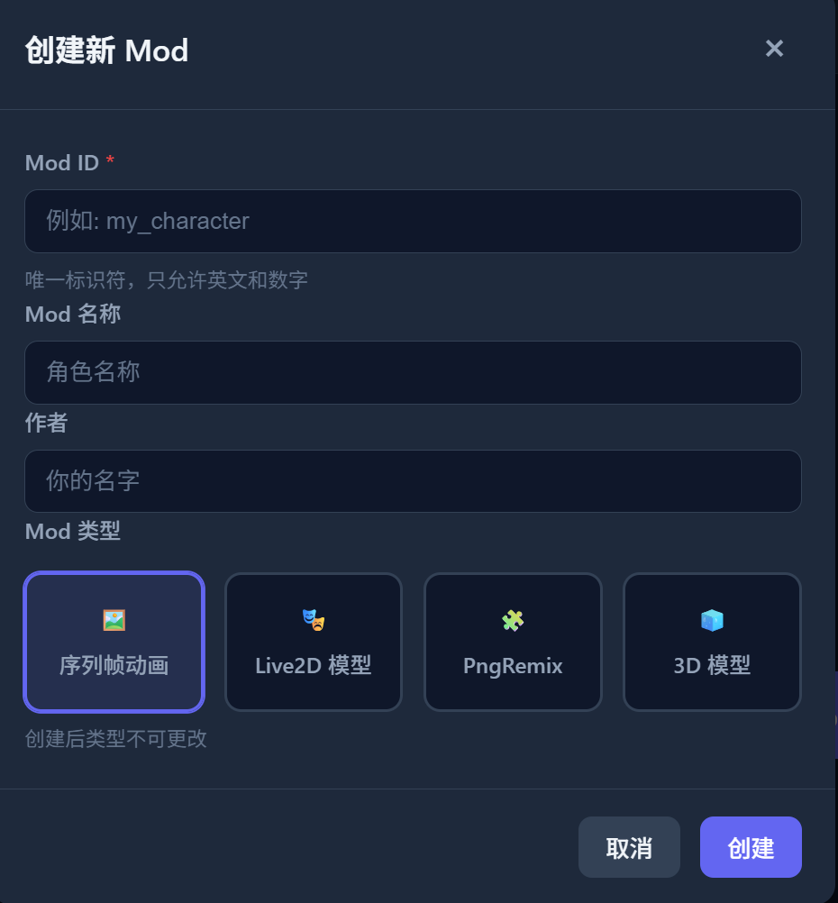

<br>

我们提供一整套 <a href="#zh-辅助工具集">**工具链**</a> 用于将 视频/差分图/gif 处理成spritesheet用于程序内动画，其他三种格式直接使用原本文件，编辑器内支持对文件进行解析

| 格式         | 资源类型               | 说明                                                       |
| ------------ | ---------------------- | ---------------------------------------------------------- |
| **序列帧**   | WebP / PNG             | 支持差分图/gif/视频/spritesheet，有一整套工具链处理动画       |
| **Live2D**   | live2d资源包           | live2d动画格式，支持物理/表情/动作                            |
| **PngRemix** | pngRemix文件           | pngtuber remix的自定义格式                                   |
| **3D**       | vrm / pmx + 动作文件   | 支持 VRM 和 MMD PMX 3D 模型                                 |

<br>

> [!TIP]<br>
> 如果您有更多希望支持的格式，欢迎反馈给我们<br>
> 联系我们：QQ群：<a href="docs/imgs/QQ群.jpg" target="_blank" rel="noopener noreferrer">578258773</a>   Bilibili: <a href="https://b23.tv/ZKVKHH0" target="_blank" rel="noopener noreferrer">_Cafel_</a>

<br>

<a id="zh-包加密"></a>

### 2. 包加密

我们的程序支持将您的作品打包为一个 **加密文件sbuddy**，这种格式只能被程序本身使用，编辑器无法打开，也无法被简单的解包拿到内部的资源

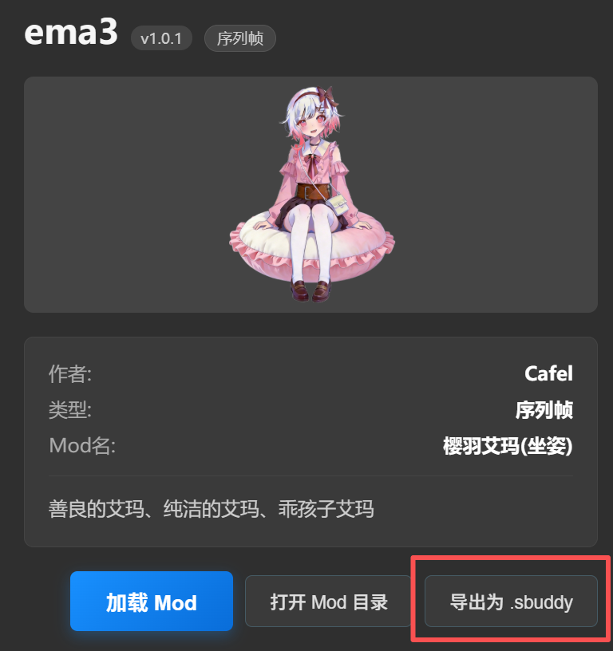
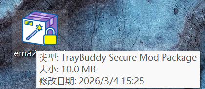

如果您发现我们的加密解密存在漏洞，欢迎反馈给我们，我们将会非常感激

<br>

> [!TIP]<br>
> 开源代码内不包括加密解密的部分，因此使用源码版将无法打包和加载sbuddy<br>
> 如果您有相关的需求，请使用我们的release版本

<br>

<a id="zh-内存占用优化"></a>

### 3. 内存占用优化

基于webgl的程序，贴图资源如果尺寸过大，会占用大量内存，这一直以来都是一个难以解决的问题

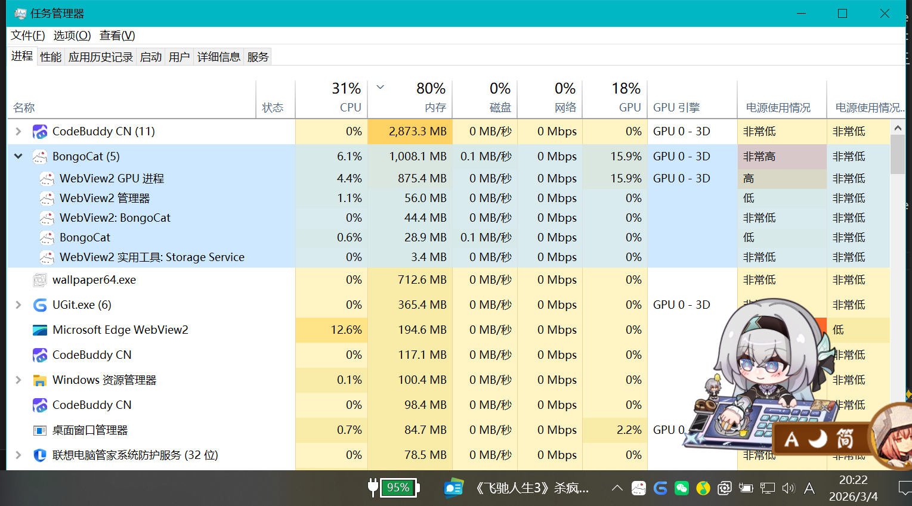

<br>

为了尽量减少内存占用，我们支持webgl渲染时贴图降采样<br>
只要在mod内根据常用的缩放值配置合适的降采样尺寸，即可开启贴图降采样<br>
尺寸合适的话，就可以在保证合适清晰度的前提下，有效减少内存占用


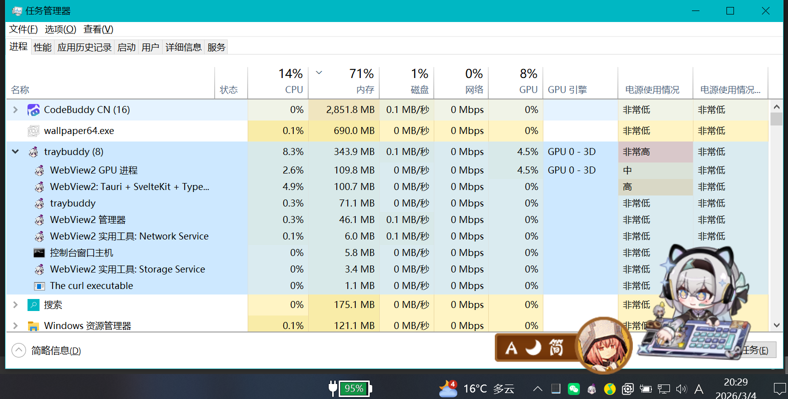

<br>

同时，我们支持通过自定义配置调整最大帧率<br>
过高的帧率会导致GPU占用增加，适当降低帧率可以减少GPU占用<br>
应用安装后，您可修改安装目录内 **Config** 文件夹下的 **render_tuning.json** 文件来自定义优化行为

<br>

<a id="zh-对话事件链"></a>

### 4. 对话事件链

我们的程序支持复杂的对话事件链和每句对话的语音配置，您可以使用我们的 Mod编辑器 轻易的填表式完成这一目标

- **文本语音** — 支持配置复杂的文本和语音，支持多语言
  - 

- **对话事件链** — 支持文本事件链，包括直接链接，对话分支，随机触发等
  - 

- **条件触发** — 按日期/时间/计数器/气温/天气/运行时长等条件限制触发
  - 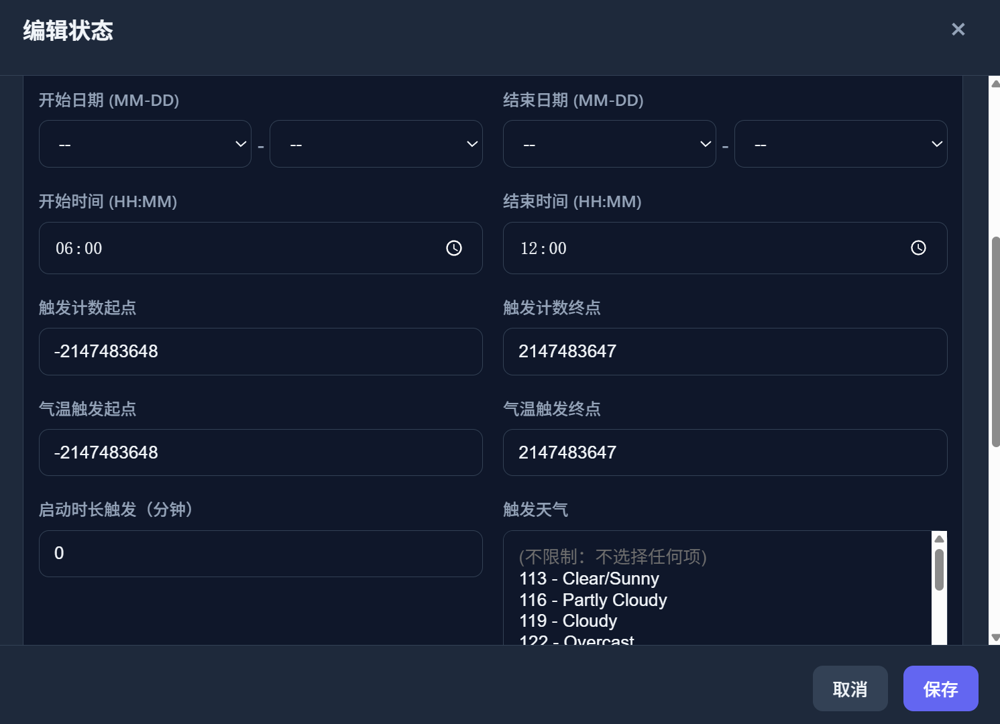

<br>

<a id="zh-系统事件"></a>

### 5. 系统事件

我们的程序支持多种系统事件，桌宠会根据您当前的行为或您现实中的日期或天气做出不同的反应，为您的桌宠营造更好的陪伴感。您可以使用我们的 Mod编辑器轻易的填表式完成这一目标

- **键盘鼠标** — 根据键盘鼠标按键做出反馈

- **播放音乐** — 当您使用音乐播放器时，桌宠可以做出反馈
- **拖拽** — 每次拖拽桌宠时，桌宠可以做出反馈
- **全屏应用启动** — 当您打开某些全屏应用时，桌宠可以做出反馈

- **电脑解锁** — 每次电脑结束锁屏，做出打招呼的行为
- **工作程序启动** — 当您打开某些工作软件时，做出问候的行为
- **长时间使用电脑** — 当您使用电脑达到一定时长时，做出问候的行为

- **天气变换** — 某些对话只有在某些天气下才会出现
- **时间变化** — 某些对话只有在某些日期时间下才会出现
- **生日问候** — 某些对话只有在您填写的生日那一天才会出现

未完待续，更多事件支持中

<br>

<a id="zh-Mod编辑器"></a>

### 6. Mod编辑器

教程：
<a href="docs/tutorial/NewMod.md" target="_blank" rel="noopener noreferrer">快速 迁移/制作 桌宠</a>

我们的程序支持完善的填表式Mod编辑器，您可以在不写任何代码的情况下完成大部分的配置


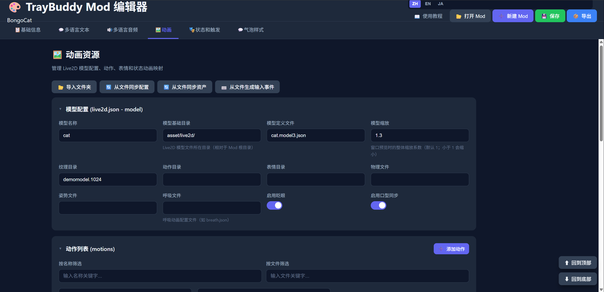


<br>

> [!TIP]<br>
> 后续会出一系列官方教程视频<br>
> 如果您在使用中出现疑问，可以联系我们获取帮助

> [!WARNING]<br>
> 工具仍处于早期阶段，如果您发现问题，欢迎反馈给我们<br>
> 联系我们：QQ群：<a href="docs/imgs/QQ群.jpg" target="_blank" rel="noopener noreferrer">578258773</a>   Bilibili: <a href="https://b23.tv/ZKVKHH0" target="_blank" rel="noopener noreferrer">_Cafel_</a>

<br>

<a id="zh-Mod切换和多版本管理"></a>

### 7. Mod切换和多版本管理

程序内置了Mod切换和多版本管理功能，您可以便捷的在多个Mod之间切换，同时，您也可以为程序导入同一个Mod的不同版本

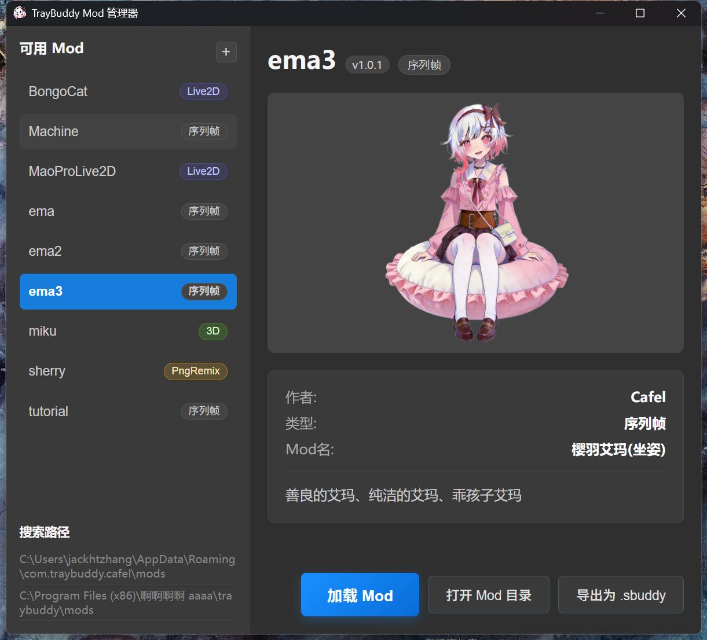
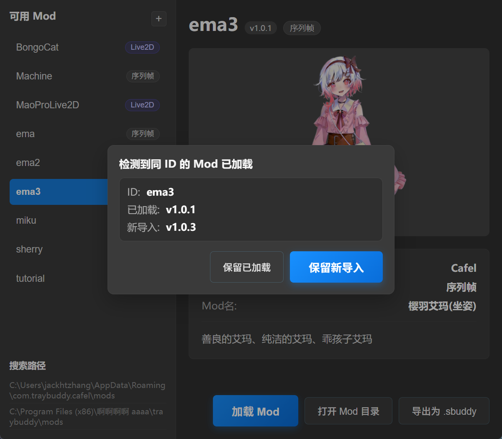

<br>

<a id="zh-AI小工具"></a>

### 8. AI小工具

本程序提供自定义AI小工具，可以检测您当前使用的软件或游戏，并对支持的软件或游戏提供反馈

主要效果取决于您的提示词和AI的智力

<br>

<a href="https://www.bilibili.com/video/BV1idwczDE41" target="_blank" rel="noopener noreferrer"><b>演示视频</b></a>

<a href="https://www.bilibili.com/video/BV1idwczDE41" target="_blank" rel="noopener noreferrer"></a>

<br>

<a id="zh-辅助功能"></a>

### 9. 辅助功能

- **备忘录** — 每次解锁屏幕时自动弹出，也可手动查看
  - 
- **定时提醒** — 设置指定时间的弹窗提醒
  - 

<br>

<a id="zh-多语言"></a>

### 10. 多语言

本项目支持i18n实时多语言切换，您可以在 **右键菜单-设置-界面语言** 内进行调整

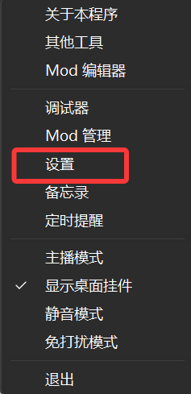
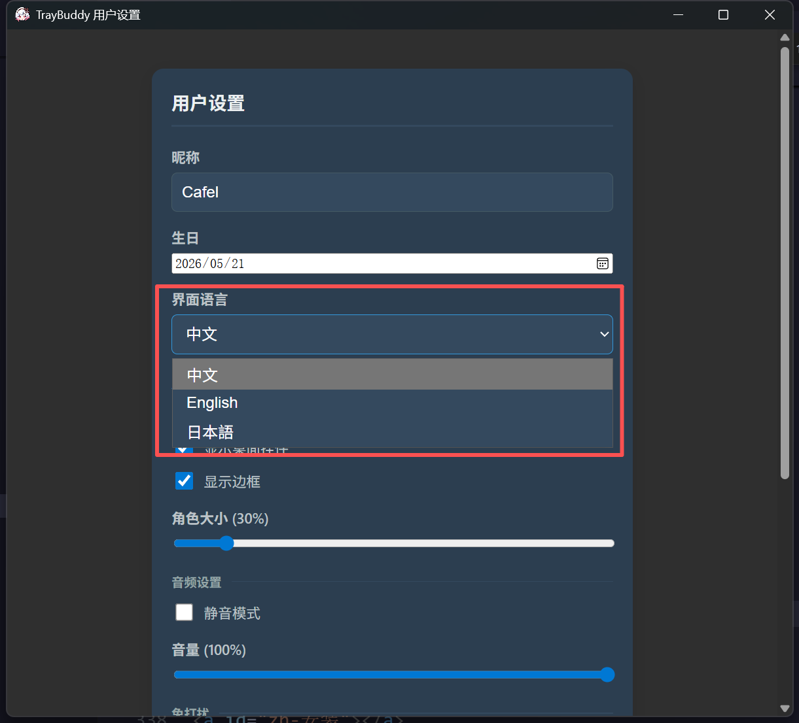

<br>

<a id="zh-安装"></a>

## 安装

### 1. 安装主程序

纯净版仅包含教程Mod，标准版则包含一些默认Mod

1. 下载最新版安装程序
2. 运行安装程序，选择安装语言和目录
3. 安装完成后启动 TrayBuddy，角色将出现在桌面上
4. 右键系统托盘图标可访问设置和功能菜单

<br>

### 2. 安装 Mod

- **双击 `.tbuddy` 或 `.sbuddy` 文件**即可自动导入（已关联文件类型）
  - 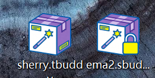
- 或通过 Mod 管理器左上角的**加号按钮**手动浏览、导入
  - 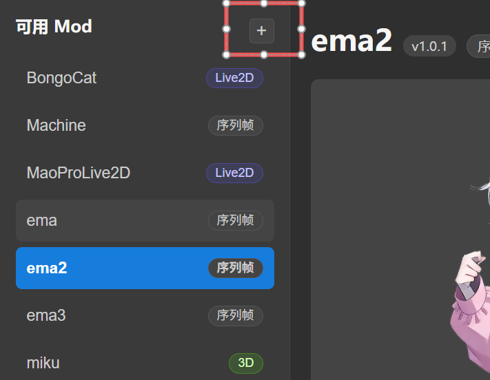

<br>

> [!TIP]<br>
> 有时在切换Mod时会出现角色状态卡住的情况，此时请重新加载Mod

<br>

### 3. 自定义配置

应用安装后，用户可修改安装目录内Config文件夹下的配置文件来自定义行为：

| 配置文件                               | 说明                                               |
|----------------------------------------|----------------------------------------------------|
| `config/media_observer_keywords.json`  | 媒体应用进程名关键词（Spotify、QQ 音乐、网易云等）  |
| `config/process_observer_keywords.json` | 工作应用进程名关键词（VS Code、Photoshop、Unity 等） |
| `config/render_tuning.json` | 优化相关配置，帧率限制 |

<br>

<a id="zh-工具链"></a>

## 工具链

TrayBuddy 提供完整的 Mod 创作工具链：

<br>

### 1. Mod 打包格式

| 格式   | 扩展名    | 说明                     |
|--------|-----------|--------------------------|
| tbuddy | `.tbuddy` | ZIP 归档，双击自动导入   |
| sbuddy | `.sbuddy` | 加密归档，保护 Mod 资源  |

系统通过 `tbuddy-asset://` 自定义协议从内存中的归档流式加载资源，无需解压到磁盘。

详细的 Mod 开发指南请参阅 `mods/mod-guide.md`

<br>

### 2. Mod 编辑器 (`mod-tool/`)

可视化编辑 Mod 配置的独立 Web 应用：
- 动画/文本/音频 配置和组合
- 事件触发配置
- 内置教程

直接双击启动：

```bash
打开-mod编辑器.bat
```

<br>

> [!WARNING]<br>
> 工具仍处于早期阶段，如果您发现问题，欢迎反馈给我们<br>
> 联系我们：QQ群：<a href="docs/imgs/QQ群.jpg" target="_blank" rel="noopener noreferrer">578258773</a>   Bilibili: <a href="https://b23.tv/ZKVKHH0" target="_blank" rel="noopener noreferrer">_Cafel_</a>

<br>

<a id="zh-辅助工具集"></a>

### 3. 辅助工具集 (`other-tool/`)

13 个独立 Web 工具，覆盖 Mod 制作全流程：

| 工具 | 功能 |
|------|------|
| GIF 提取序列帧 | 从 GIF 动图提取帧序列 |
| 视频提取序列帧 | 从视频文件提取帧序列 |
| Spritesheet 生成 | 将差分图组合并为精灵图 |
| Spritesheet 切分 | 将精灵图拆分为单帧 |
| Spritesheet 压缩 | 精灵图体积优化 |
| 序列帧预览 | 预览 差分图组/Spritesheet 动画效果 |
| 序列帧对齐工具 | 帧对齐和偏移调整 |
| 批量裁切缩放 | 批量图片处理 |
| PNG 转 ICO | 图标格式转换 |
| Live2D 预览 | Live2D 模型预览 |
| PngRemix 预览 | PngRemix 模型预览与调试 |
| 模型预览 | 3D VRM/PMX 模型预览 |

直接双击启动对应的bat即可

<br>

<a id="zh-从源码构建"></a>

## 从源码构建

> [!WARNING]<br>
> 因为工作繁忙时间不多，作者在编写本项目时大量使用了Claude-Opus和GPT-Codex<br>
> 如果您发现项目中存在任何代码问题，请反馈给我们，我们深表感谢<br>
> 如果您不喜欢AI相关内容，请直接忽略本项目，我们也表示抱歉

<br>

### 1. 技术栈

| 层级       | 技术                        | 说明                                          |
|------------|-----------------------------|-----------------------------------------------|
| 前端框架   | SvelteKit 5 + TypeScript    | Svelte 5 响应式系统                           |
| 后端框架   | Tauri 2 (Rust)              | 桌面应用容器，提供系统级 API                  |
| 3D 渲染    | Three.js + @pixiv/three-vrm  | VRM / PMX 3D 模型渲染                         |
| 构建工具   | Vite 6 + pnpm               | 前端构建，`@sveltejs/adapter-static` 静态适配 |
| 打包分发   | NSIS                        | Windows 安装程序，支持 4 种安装界面语言       |
| Windows API | windows-rs 0.58            | 媒体控制、音频、进程、钩子、锁屏检测等        |
| 测试框架   | Vitest + Cargo Test         | 前端单元/组件测试 + 后端 Rust 测试            |

<br>

### 2. 环境准备

直接双击运行一键环境安装脚本（需要管理员权限）：

```bash
setup-windows-build-env.bat
```

该脚本将自动安装：
- Node.js LTS
- Rust (via rustup)
- Visual Studio 2022 Build Tools (C++ workload)
- NSIS
- WebView2 Runtime

或手动安装：

| 依赖 | 最低版本 |
|------|---------|
| [Node.js](https://nodejs.org/) | 18+ |
| [Rust](https://rustup.rs/) | 1.75+ |
| [pnpm](https://pnpm.io/) | 8+ |
| [Visual Studio Build Tools](https://visualstudio.microsoft.com/visual-cpp-build-tools/) | 2022 |

<br>

### 3. 开发模式

```bash
# 安装前端依赖
pnpm install

# 手动执行
pnpm tauri dev
```

或者直接双击运行一键开发脚本（需要管理员权限）：

```bash
dev.bat
```

<br>

### 4. 构建发布版

直接双击运行一键打包脚本（需要管理员权限）：

```bash
release.bat
```

该脚本会：
1. 清理 release mods 目录
2. 打包 Mod 为 `.tbuddy` 格式
3. 执行 `pnpm tauri build` 生成 NSIS 安装程序

构建产物输出到 `src-tauri/target/release/bundle/nsis/`。

<br>

### 5. 自动化测试

```bash
# 运行全部前端测试
pnpm test:run

# 前端测试（Watch 模式）
pnpm test:watch

# 前端测试覆盖率
pnpm test:coverage

# 运行后端 Rust 测试
cd src-tauri && cargo test
```

一键全部测试（前端 + 后端 + 覆盖率）

```bash
test.bat
```
<br>

### 6. 项目结构

```
TrayBuddy/
├── src/                        # 前端源码（SvelteKit + TypeScript）
│   ├── routes/                 # 页面路由（11 个页面）
│   │   ├── +page.svelte        #   调试主页面（9 个 Tab）
│   │   ├── animation/          #   序列帧渲染窗口
│   │   ├── live2d/             #   Live2D 渲染窗口
│   │   ├── pngremix/           #   PngRemix 渲染窗口
│   │   ├── threed/             #   3D 渲染窗口
│   │   ├── mods/               #   Mod 管理器
│   │   ├── settings/           #   用户设置
│   │   ├── memo/               #   备忘录
│   │   └── reminder/           #   定时提醒
│   ├── lib/                    # 前端核心模块
│   │   ├── animation/          #   动画播放器（4 种格式）+ 窗口核心
│   │   ├── audio/              #   音频管理
│   │   ├── bubble/             #   对话气泡系统
│   │   ├── trigger/            #   前端触发器
│   │   ├── i18n/               #   国际化
│   │   ├── types/              #   类型定义
│   │   ├── utils/              #   工具函数
│   │   └── components/         #   调试面板组件
│   └── test/                   # 前端测试
├── src-tauri/                  # 后端源码（Rust / Tauri 2）
│   └── src/
│       ├── lib.rs              #   应用入口、命令注册、自定义协议
│       ├── app_state.rs        #   全局状态管理
│       ├── modules/            #   核心功能模块
│       │   ├── resource.rs     #     Mod 资源管理
│       │   ├── state.rs        #     状态机引擎
│       │   ├── media_observer  #     媒体播放监听
│       │   ├── process_observer#     进程检测
│       │   ├── system_observer #     系统事件监听
│       │   ├── environment.rs  #     环境信息（天气/位置）
│       │   ├── trigger.rs      #     事件触发处理
│       │   ├── storage.rs      #     持久化存储
│       │   ├── mod_archive.rs  #     Mod 包读取层
│       │   └── utils/          #     工具函数
│       └── commands/           #   Tauri 命令（前后端通信）
├── config/                     # 运行时配置（媒体/进程关键词）
├── i18n/                       # 国际化资源
├── mods/                       # Mod 目录（仅含教程 Mod）
├── mod-tool/                   # Mod 编辑器
├── other-tool/                 # 辅助工具集（13 个）
└── tools-common/               # 工具共享代码
```

<br>

<p align="right"><a href="#top">⬆ 返回顶部</a></p>

<!-- ============================================================ -->
<!-- English                                                       -->
<!-- ============================================================ -->

<a id="English"></a>

**TrayBuddy** is a desktop pet application that supports **multiple animation types, package encryption, and high customizability**, dedicated to enabling users to **quickly create desktop pets with any animation format**

We hope to provide a universal solution, like a Wallpaper Engine for desktop pets, so that more people can more easily enjoy a richer variety of desktop pets

> [!WARNING]<br>
> This project currently only supports Windows<br>
> In theory, Tauri supports cross-platform, and placeholder functions for other platforms are included in the code<br>
> However, the author has neither a Mac nor a Linux device, so it cannot be done for now<br>
> If anyone with the corresponding devices is willing to add support for other platforms, we would be extremely grateful **orz**

Download:<br>
Pure version includes only the tutorial mod, smaller in size<br>
Standard version includes all default mods, more content<br>
mod pack contains all mods that are not included in the executable file.<br>
<a href="https://pan.baidu.com/s/5xPn--lWTiKHAfBCB5gta3Q" target="_blank" rel="noopener noreferrer">Baidu Netdisk</a>&nbsp;&nbsp;&nbsp;
<a href="https://pan.quark.cn/s/6c6c08b57fba?pwd=CiSm" target="_blank" rel="noopener noreferrer">Quark Netdisk</a>&nbsp;&nbsp;&nbsp;
<a href="https://github.com/cafel176/TrayBuddy/releases" target="_blank" rel="noopener noreferrer">github releases</a>&nbsp;&nbsp;&nbsp;

Credits:
<a href="https://b23.tv/K9ceDZ8" target="_blank" rel="noopener noreferrer">INORGANIC_盐</a>&nbsp;&nbsp;&nbsp;
<a href="https://b23.tv/cTCT0hn" target="_blank" rel="noopener noreferrer">Snoworld_</a>&nbsp;&nbsp;&nbsp;
<a href="https://b23.tv/5gVvCq9" target="_blank" rel="noopener noreferrer">拉特兰的莫斯提马本人</a>&nbsp;&nbsp;&nbsp;

Demo material author:
<a href="https://b23.tv/W95QcGZ" target="_blank" rel="noopener noreferrer">露姆娅</a>&nbsp;&nbsp;&nbsp;
<a href="https://b23.tv/vuFXqCX" target="_blank" rel="noopener noreferrer">dazeroyuu</a>&nbsp;&nbsp;&nbsp;
<a href="https://b23.tv/eOCGgIs" target="_blank" rel="noopener noreferrer">宇痕冫</a>&nbsp;&nbsp;&nbsp;

<br>

<a id="en-target-audience"></a>

## Who Is This For

If you:

- **Like switching between different types of desktop pets, but don't want to install many apps**

- **Want to make a desktop pet with animations, voiceovers, or dialogues, but don't want to write code**

- **Just want to showcase your animation models, but don't want them to be misused**

- **Are a professional desktop pet creator and want to package your work as an extra option for users after finishing with your usual tools**

Then this project might be for you

Quick start with any animation asset:
<a href="docs/tutorial/NewMod.md" target="_blank" rel="noopener noreferrer">Quickly migrate/create desktop pets</a>

<br>

<a id="en-showcase"></a>

## Showcase

The displayed Mods are for demonstration purposes only; please see the corresponding links for sources

If the content has any licensing/copyright issues, please contact us to replace or remove it

More examples will be added in the future

<br>

<a href="" target="_blank" rel="noopener noreferrer"><b>Sprite Sheet Half-body</b></a>

**Please turn on sound**

https://github.com/user-attachments/assets/a9be1963-3ac6-46ea-82e1-1c3c9543b5a8

<br>

<a href="" target="_blank" rel="noopener noreferrer"><b>Sprite Sheet Full-body</b></a>

https://github.com/user-attachments/assets/209e9368-a991-46c4-b602-bebdad07f821

<br>

<a href="" target="_blank" rel="noopener noreferrer"><b>Sprite Sheet Object</b></a>

**Please turn on sound**

https://github.com/user-attachments/assets/7309ee75-d941-432f-8123-ba25004da64b

<br>

<a href="https://github.com/MMmmmoko/Bongo-Cat-Mver" target="_blank" rel="noopener noreferrer"><b>Live2D BongoCat</b></a>

**Please turn on sound**

https://github.com/user-attachments/assets/0b6ebd52-8cd1-4c37-8f86-1a9f6ba8a479

<br>

<a href="https://www.bilibili.com/video/BV1MM4m1z7Dy/?vd_source=1f5e08d6a2e054c354714c7090aed591" target="_blank" rel="noopener noreferrer"><b>Live2D BongoCat (@宇痕冫)</b></a>

https://github.com/user-attachments/assets/9a804437-6597-4fb3-8d60-b958ab5ec740

<br>

<a href="https://www.live2d.com/zh-CHS/learn/sample/" target="_blank" rel="noopener noreferrer"><b>Live2D Character</b></a>

https://github.com/user-attachments/assets/180419f4-1567-4a44-85e1-29fdb8e8bde0

<br>

<a href="https://www.bilibili.com/video/BV1pbxnz5EvD/?share_source=copy_web&vd_source=83959be6660f3ec16d301ccce33457e7" target="_blank" rel="noopener noreferrer"><b>PngRemix (@dazeroyuu)</b></a>

**Please turn on sound**

https://github.com/user-attachments/assets/bea1138b-0468-40e5-b116-fd5c13b8c6e6

<br>

<a href="https://booth.pm/en/items/3226395" target="_blank" rel="noopener noreferrer"><b>3D Model VRM</b></a>

https://github.com/user-attachments/assets/bbf1eda6-fe6b-4234-b364-d7daaf01c90b

<br>

<a id="en-introduction"></a>

## Introduction

1. Supports 4 animation formats: <a href="#en-animation-formats">**Sprite Sheets (video, differential frames, GIF), Live2D, PngRemix, 3D Models (VRM/PMX)**</a>

2. Supports <a href="#en-package-encryption">**package encryption**</a> for mods

3. Memory optimization: <a href="#en-memory-optimization">**texture downsampling, frame rate limiting, etc.**</a>

4. Supports complex <a href="#en-dialogue-event-chains">**dialogue event chains**</a> and voice configuration

5. Supports various events: <a href="#en-system-events">**keyboard/mouse, music playback, computer unlock, work app launch, drag, fullscreen app launch, weather changes, time changes, extended computer usage, birthday greetings, etc.**</a>

6. Complete <a href="#en-mod-editor">**Mod creation toolchain**</a>, form-based editor — no coding required

7. Supports <a href="#en-mod-switching">**switching between multiple Mods and multi-version management for a single Mod**</a>

8. AI Tools: <a href="#en-ai-tools">**AI Tools for companionship when you're busy**</a>

9. Utility features: <a href="#en-utility-features">**Memo and Timed Reminders**</a>

10. Multi-language: <a href="#en-multi-language">**简体中文/English/日本語**</a>

<br>

> [!WARNING]<br>
> This project is still in its early stages. If you find any issues, please let us know<br>
> Contact us: QQ Group: <a href="docs/imgs/QQ群.jpg" target="_blank" rel="noopener noreferrer">578258773</a>   Bilibili: <a href="https://b23.tv/ZKVKHH0" target="_blank" rel="noopener noreferrer">_Cafel_</a>

<br>

<a id="en-features"></a>

## Features

<a id="en-animation-formats"></a>

### 1. Animation Formats

TrayBuddy manages 4 different animation formats in a unified way:

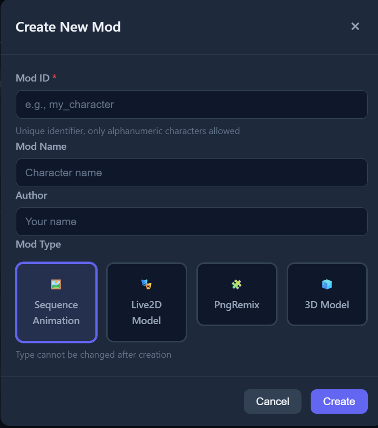

<br>

We provide a complete <a href="#en-auxiliary-tools">**toolchain**</a> to process differential frames/GIF/video into spritesheets for in-app animation. The other three formats use their original files directly, and the editor supports parsing these files

| Format           | Resource Type          | Description                                                    |
| ---------------- | ---------------------- | -------------------------------------------------------------- |
| **Sprite Sheet** | WebP / PNG             | Supports differential frames/GIF/video/spritesheet, with a complete animation processing toolchain |
| **Live2D**       | Live2D resource pack   | Live2D animation format, supports physics/expressions/motions  |
| **PngRemix**     | pngRemix file          | Custom format from PngTuber Remix                              |
| **3D**           | VRM / PMX + motion files | Supports VRM and MMD PMX 3D models                           |

<br>

> [!TIP]<br>
> If you have more formats you'd like us to support, feel free to let us know<br>
> Contact us: QQ Group: <a href="docs/imgs/QQ群.jpg" target="_blank" rel="noopener noreferrer">578258773</a>   Bilibili: <a href="https://b23.tv/ZKVKHH0" target="_blank" rel="noopener noreferrer">_Cafel_</a>

<br>

<a id="en-package-encryption"></a>

### 2. Package Encryption

Our application supports packaging your work into an **encrypted file sbuddy**. This format can only be used by the application itself — the editor cannot open it, and resources inside cannot be easily extracted


If you discover any vulnerabilities in our encryption/decryption, please let us know — we would be very grateful

<br>

> [!TIP]<br>
> The open-source code does not include the encryption/decryption components, so the source version cannot package or load sbuddy files<br>
> If you need this feature, please use our release version

<br>

<a id="en-memory-optimization"></a>

### 3. Memory Optimization

For WebGL-based programs, oversized texture resources can consume large amounts of memory, which has always been a difficult problem to solve


<br>

To minimize memory usage, we support texture downsampling during WebGL rendering<br>
Simply configure appropriate downsampling sizes in the mod based on common scaling values to enable texture downsampling<br>
With proper size settings, you can effectively reduce memory usage while maintaining adequate clarity

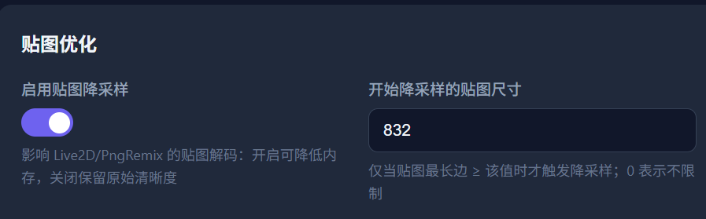


<br>

Additionally, we support customizing the maximum frame rate through configuration<br>
Excessively high frame rates will increase GPU usage; appropriately lowering the frame rate can reduce GPU load<br>
After installation, you can modify the **render_tuning.json** file in the **Config** folder within the installation directory to customize optimization behavior

<br>

<a id="en-dialogue-event-chains"></a>

### 4. Dialogue Event Chains

Our application supports complex dialogue event chains and per-sentence voice configuration. You can easily achieve this using our Mod Editor's form-based interface

- **Text & Voice** — Supports complex text and voice configuration with multi-language support
  - 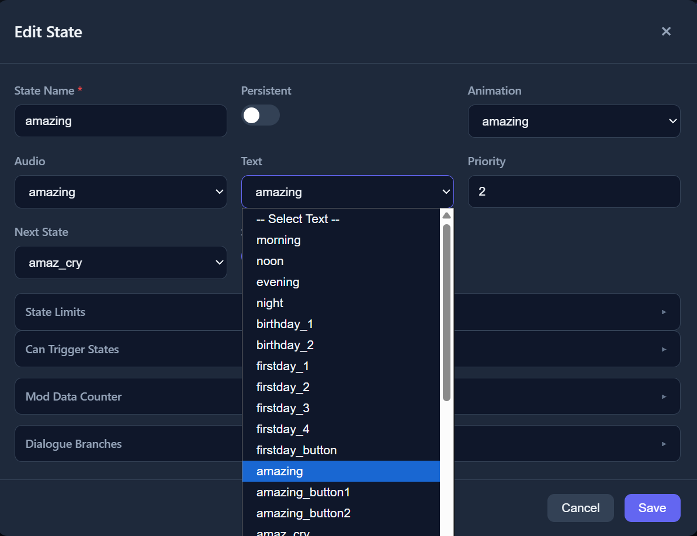

- **Dialogue Event Chains** — Supports text event chains including direct links, dialogue branches, random triggers, etc.
  - 

- **Conditional Triggers** — Restrict triggers by date/time/counter/temperature/weather/uptime conditions
  - 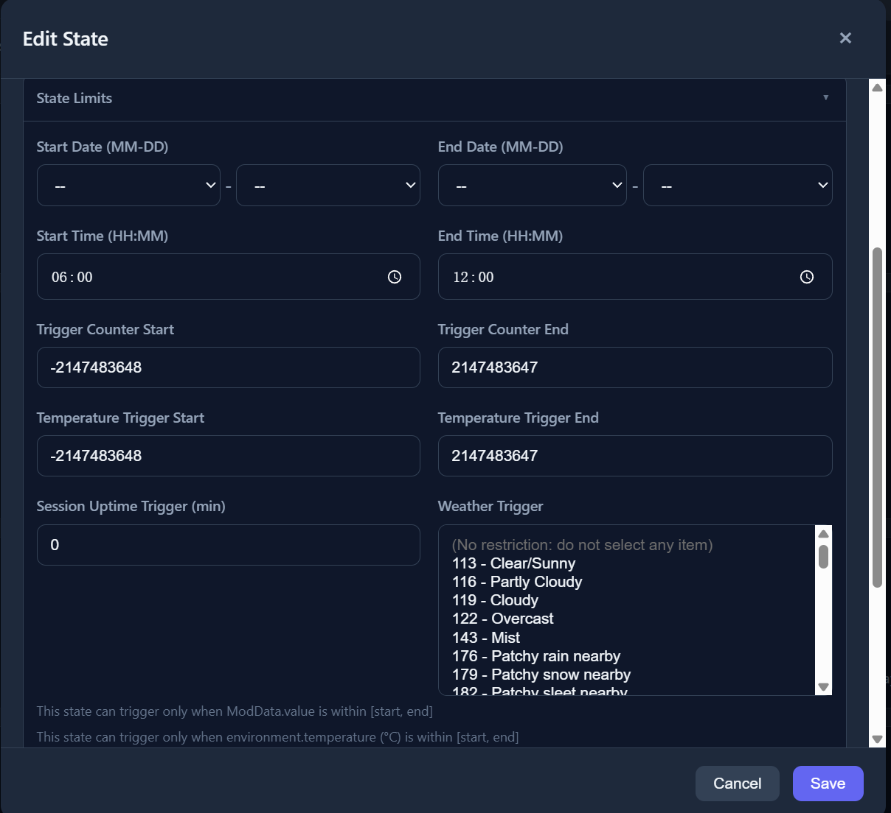

<br>

<a id="en-system-events"></a>

### 5. System Events

Our application supports various system events. Your desktop pet will react differently based on your current actions or real-world date/weather, creating a better sense of companionship. You can easily configure this using our Mod Editor's form-based interface

- **Keyboard & Mouse** — React based on keyboard and mouse input

- **Music Playback** — The pet can react when you use a music player
- **Drag** — The pet can react each time you drag it
- **Fullscreen App Launch** — The pet can react when you open certain fullscreen applications

- **Computer Unlock** — Greet you each time the computer exits lock screen
- **Work App Launch** — Greet you when you open certain work applications
- **Extended Computer Usage** — Greet you when you've been using the computer for a certain duration

- **Weather Changes** — Some dialogues only appear under certain weather conditions
- **Time Changes** — Some dialogues only appear at certain dates and times
- **Birthday Greetings** — Some dialogues only appear on the birthday you've entered

More events coming soon

<br>

<a id="en-mod-editor"></a>

### 6. Mod Editor

Tutorial:
<a href="docs/tutorial/NewMod.md" target="_blank" rel="noopener noreferrer">Quickly migrate/create desktop pets</a>

Our application supports a comprehensive form-based Mod Editor. You can complete most configurations without writing any code


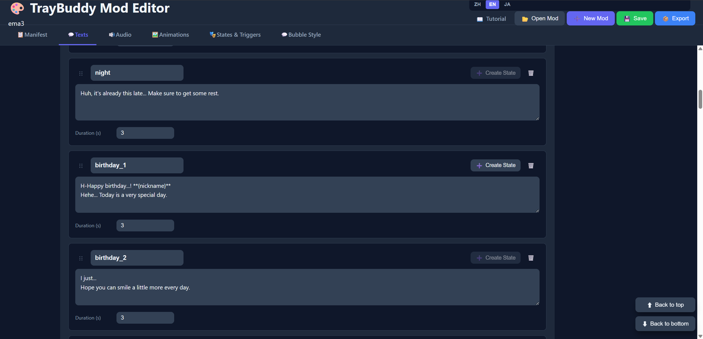

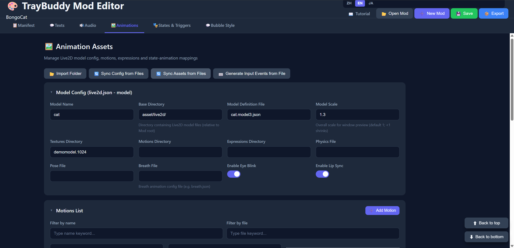


<br>

> [!TIP]<br>
> Official tutorial videos will be released in the future, stay tuned<br>
> If you have any questions during use, feel free to contact us for help

> [!WARNING]<br>
> The tools are still in their early stages. If you find any issues, please let us know<br>
> Contact us: QQ Group: <a href="docs/imgs/QQ群.jpg" target="_blank" rel="noopener noreferrer">578258773</a>   Bilibili: <a href="https://b23.tv/ZKVKHH0" target="_blank" rel="noopener noreferrer">_Cafel_</a>

<br>

<a id="en-mod-switching"></a>

### 7. Mod Switching & Multi-Version Management

The application has built-in Mod switching and multi-version management. You can conveniently switch between multiple Mods, and also import different versions of the same Mod

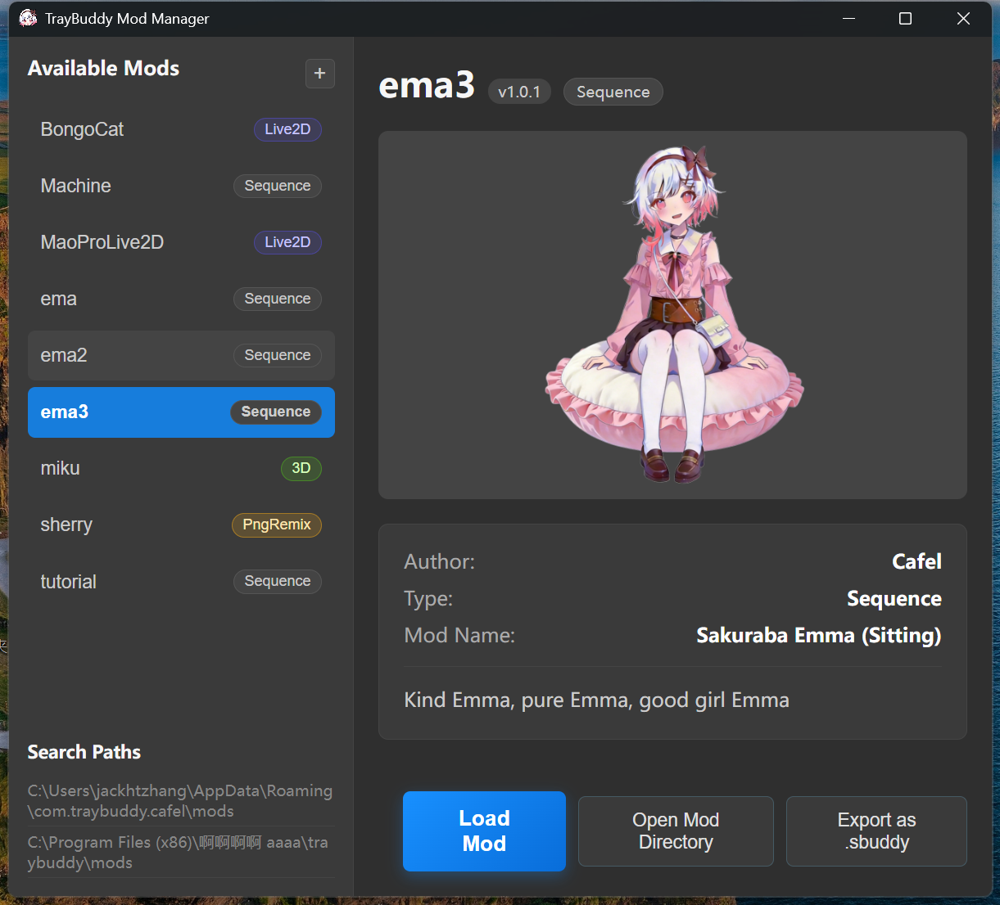
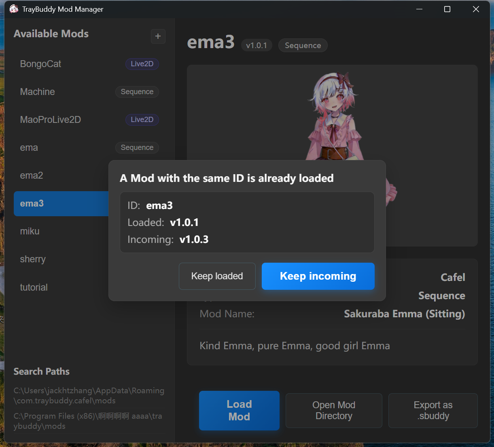

<br>

<a id="en-ai-tools"></a>

### 8. AI Tools

This application provides customizable AI tools that can detect the software or game you are currently using, and provide feedback for supported software or games

The main effect depends on your prompts and the AI's intelligence

<br>

<a href="https://www.bilibili.com/video/BV1idwczDE41" target="_blank" rel="noopener noreferrer"><b>Demo Video</b></a>

<a href="https://www.bilibili.com/video/BV1idwczDE41" target="_blank" rel="noopener noreferrer"></a>

<br>

<a id="en-utility-features"></a>

### 9. Utility Features

- **Memo** — Auto-popup on screen unlock, also viewable manually
  - 
- **Timed Reminders** — Set popup reminders for specific times
  - 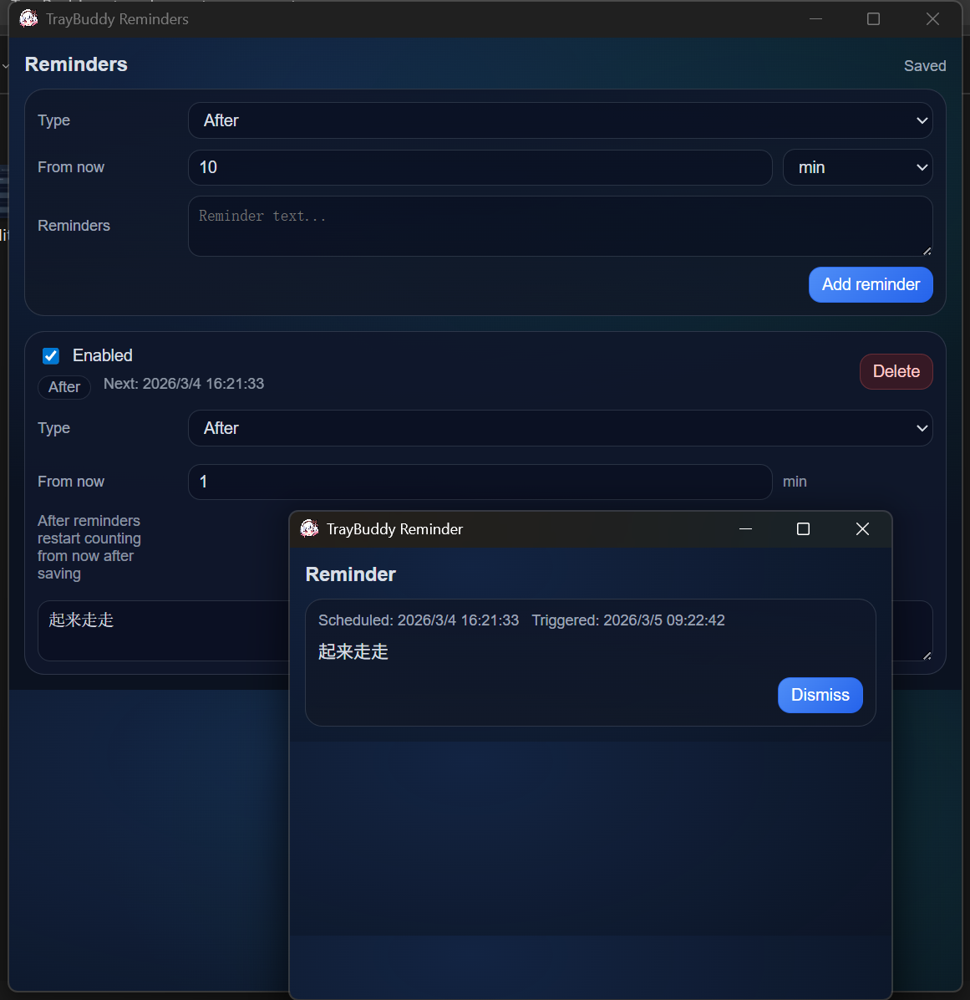

<br>

<a id="en-multi-language"></a>

### 10. Multi-language

This project supports i18n real-time multi-language switching. You can adjust it in **Right-click Menu - Settings - Interface Language**


<br>

<a id="en-installation"></a>

## Installation

### 1. Installing the App

The lite version only includes the tutorial Mod; the standard version includes some default Mods

1. Download the latest installer
2. Run the installer, select language and directory
3. After installation, launch TrayBuddy — the character will appear on the desktop
4. Right-click the system tray icon to access settings and features

<br>

### 2. Installing Mods

- **Double-click `.tbuddy` or `.sbuddy` files** to auto-import (file associations registered)
  - 
- Or manually browse and import via the **plus button** in the top-left of the Mod Manager
  - 

<br>

> [!TIP]<br>
> Sometimes when switching Mods, the character state may get stuck. In that case, please reload the Mod

<br>

### 3. Custom Configuration

After installation, users can modify config files in the Config folder within the installation directory to customize behavior:

| Config File                              | Description                                                 |
|------------------------------------------|-------------------------------------------------------------|
| `config/media_observer_keywords.json`    | Media app process name keywords (Spotify, QQ Music, NetEase Cloud, etc.) |
| `config/process_observer_keywords.json`  | Work app process name keywords (VS Code, Photoshop, Unity, etc.) |
| `config/render_tuning.json`              | Optimization settings, frame rate limiting |

<br>

<a id="en-toolchain"></a>

## Toolchain

TrayBuddy provides a complete Mod creation toolchain:

<br>

### 1. Mod Package Formats

| Format | Extension | Description                    |
|--------|-----------|--------------------------------|
| tbuddy | `.tbuddy` | ZIP archive, double-click to auto-import |
| sbuddy | `.sbuddy` | Encrypted archive, protects Mod resources |

The system streams resources from in-memory archives via the `tbuddy-asset://` custom protocol — no disk extraction needed.

For detailed Mod development guide, see `mods/mod-guide.md`

<br>

### 2. Mod Editor (`mod-tool/`)

A standalone web application for visual Mod editing:
- Animation/text/audio configuration and composition
- Event trigger configuration
- Built-in tutorial

Launch by double-clicking:

```bash
打开-mod编辑器.bat
```

<br>

> [!WARNING]<br>
> The tools are still in their early stages. If you find any issues, please let us know<br>
> Contact us: QQ Group: <a href="docs/imgs/QQ群.jpg" target="_blank" rel="noopener noreferrer">578258773</a>   Bilibili: <a href="https://b23.tv/ZKVKHH0" target="_blank" rel="noopener noreferrer">_Cafel_</a>

<br>

<a id="en-auxiliary-tools"></a>

### 3. Auxiliary Tools (`other-tool/`)

13 standalone web tools covering the full Mod creation workflow:

| Tool                    | Function                                   |
|-------------------------|--------------------------------------------|
| GIF Frame Extractor     | Extract frame sequences from GIF           |
| Video Frame Extractor   | Extract frames from video files            |
| Spritesheet Generator   | Merge differential frames into spritesheets |
| Spritesheet Splitter    | Split spritesheets into individual frames  |
| Spritesheet Compressor  | Optimize spritesheet file size             |
| Sequence Preview        | Preview differential frame/spritesheet animation |
| Sequence Alignment Tool | Frame alignment and offset adjustment      |
| Batch Crop & Resize     | Batch image processing                     |
| PNG to ICO              | Icon format conversion                     |
| Live2D Preview          | Live2D model preview                       |
| PngRemix Preview        | PngRemix model preview and debugging       |
| Model Preview           | 3D VRM/PMX model preview                   |

Launch by double-clicking the corresponding .bat file

<br>

<a id="en-building-from-source"></a>

## Building from Source

> [!WARNING]<br>
> Due to a busy work schedule, the author extensively used Claude-Opus and GPT-Codex when writing this project<br>
> If you find any code issues in the project, please let us know — we are deeply grateful<br>
> If you are uncomfortable with AI-related content, please simply ignore this project, and we apologize

<br>

### 1. Tech Stack

| Layer        | Technology                  | Description                                           |
|--------------|-----------------------------|-------------------------------------------------------|
| Frontend     | SvelteKit 5 + TypeScript    | Svelte 5 reactive system                              |
| Backend      | Tauri 2 (Rust)              | Desktop app container with system-level APIs          |
| 3D Rendering | Three.js + @pixiv/three-vrm | VRM / PMX 3D model rendering                          |
| Build Tool   | Vite 6 + pnpm               | Frontend build with `@sveltejs/adapter-static`        |
| Packaging    | NSIS                        | Windows installer with 4 UI languages                 |
| Windows API  | windows-rs 0.58             | Media control, audio, process, hooks, lock detection  |
| Testing      | Vitest + Cargo Test          | Frontend unit/component tests + backend Rust tests    |

<br>

### 2. Prerequisites

Run the one-click environment setup script (requires admin privileges):

```bash
setup-windows-build-env.bat
```

This script will auto-install:
- Node.js LTS
- Rust (via rustup)
- Visual Studio 2022 Build Tools (C++ workload)
- NSIS
- WebView2 Runtime

Or install manually:

| Dependency | Minimum Version |
|-----------|----------------|
| [Node.js](https://nodejs.org/) | 18+ |
| [Rust](https://rustup.rs/) | 1.75+ |
| [pnpm](https://pnpm.io/) | 8+ |
| [Visual Studio Build Tools](https://visualstudio.microsoft.com/visual-cpp-build-tools/) | 2022 |

<br>

### 3. Development Mode

```bash
# Install frontend dependencies
pnpm install

# Run manually
pnpm tauri dev
```

Or run the one-click development script (requires admin privileges):

```bash
dev.bat
```

<br>

### 4. Production Build

Run the one-click build script (requires admin privileges):

```bash
release.bat
```

This script will:
1. Clean release mods directory
2. Pack Mods into `.tbuddy` format
3. Run `pnpm tauri build` to generate the NSIS installer

Build output goes to `src-tauri/target/release/bundle/nsis/`.

<br>

### 5. Testing

```bash
# Run all frontend tests
pnpm test:run

# Frontend tests (watch mode)
pnpm test:watch

# Frontend test coverage
pnpm test:coverage

# Run backend Rust tests
cd src-tauri && cargo test
```

One-click full test suite (frontend + backend + coverage)

```bash
test.bat
```
<br>

### 6. Project Structure

```
TrayBuddy/
├── src/                        # Frontend source (SvelteKit + TypeScript)
│   ├── routes/                 # Page routes (11 pages)
│   │   ├── +page.svelte        #   Debug main page (9 Tabs)
│   │   ├── animation/          #   Sprite rendering window
│   │   ├── live2d/             #   Live2D rendering window
│   │   ├── pngremix/           #   PngRemix rendering window
│   │   ├── threed/             #   3D rendering window
│   │   ├── mods/               #   Mod Manager
│   │   ├── settings/           #   User Settings
│   │   ├── memo/               #   Memo
│   │   └── reminder/           #   Timed Reminders
│   ├── lib/                    # Frontend core modules
│   │   ├── animation/          #   Animation players (4 formats) + Window core
│   │   ├── audio/              #   Audio management
│   │   ├── bubble/             #   Speech bubble system
│   │   ├── trigger/            #   Frontend triggers
│   │   ├── i18n/               #   Internationalization
│   │   ├── types/              #   Type definitions
│   │   ├── utils/              #   Utility functions
│   │   └── components/         #   Debug panel components
│   └── test/                   # Frontend tests
├── src-tauri/                  # Backend source (Rust / Tauri 2)
│   └── src/
│       ├── lib.rs              #   App entry, command registration, custom protocol
│       ├── app_state.rs        #   Global state management
│       ├── modules/            #   Core functional modules
│       │   ├── resource.rs     #     Mod resource management
│       │   ├── state.rs        #     State machine engine
│       │   ├── media_observer  #     Media playback monitoring
│       │   ├── process_observer#     Process detection
│       │   ├── system_observer #     System event monitoring
│       │   ├── environment.rs  #     Environment info (weather/location)
│       │   ├── trigger.rs      #     Event trigger handling
│       │   ├── storage.rs      #     Persistent storage
│       │   ├── mod_archive.rs  #     Mod package reader
│       │   └── utils/          #     Utility functions
│       └── commands/           #   Tauri commands (frontend-backend communication)
├── config/                     # Runtime config (media/process keywords)
├── i18n/                       # I18n resources
├── mods/                       # Mod directory (tutorial Mod only)
├── mod-tool/                   # Mod Editor
├── other-tool/                 # Auxiliary tools (13)
└── tools-common/               # Shared tool code
```

<br>

<p align="right"><a href="#top">⬆ Back to top</a></p>

<!-- ============================================================ -->
<!-- 日本語                                                         -->
<!-- ============================================================ -->

<a id="日本語"></a>

**TrayBuddy** は **複数のアニメーション形式、パッケージ暗号化、高度なカスタマイズ** に対応したデスクトップペットアプリケーションで、ユーザーが **あらゆるアニメーション形式で素早くデスクトップペットを作成** できることを目指しています

デスクトップペット版の Wallpaper Engine のような汎用的なソリューションを提供し、より多くの人がより簡単に、より豊富なデスクトップペットを楽しめるようにしたいと考えています

> [!WARNING]<br>
> 現在、本プロジェクトはWindowsのみサポートしています<br>
> 理論的にはTauriはクロスプラットフォームに対応しており、コード内にも他のプラットフォーム用のプレースホルダー関数があります<br>
> しかし、著者はMacもLinuxデバイスも持っていないため、現時点では対応できません<br>
> 対応デバイスをお持ちの方で他プラットフォームのサポートを追加していただける方がいれば、大変感謝いたします **orz**

ダウンロード：<br>
ピュア版（pure）はチュートリアルmodのみを含み、サイズが小さいです<br>
スタンダード版（standard）はすべてのデフォルトmodを含み、コンテンツが豊富です<br>
mod パック (mods) には、実行可能ファイルに含まれていないすべての mod が含まれています。<br>
<a href="https://pan.baidu.com/s/5xPn--lWTiKHAfBCB5gta3Q" target="_blank" rel="noopener noreferrer">百度網盤</a>&nbsp;&nbsp;&nbsp;
<a href="https://pan.quark.cn/s/6c6c08b57fba?pwd=CiSm" target="_blank" rel="noopener noreferrer">夸克網盤</a>&nbsp;&nbsp;&nbsp;
<a href="https://github.com/cafel176/TrayBuddy/releases" target="_blank" rel="noopener noreferrer">github releases</a>&nbsp;&nbsp;&nbsp;

クレジット：
<a href="https://b23.tv/K9ceDZ8" target="_blank" rel="noopener noreferrer">INORGANIC_盐</a>&nbsp;&nbsp;&nbsp;
<a href="https://b23.tv/cTCT0hn" target="_blank" rel="noopener noreferrer">Snoworld_</a>&nbsp;&nbsp;&nbsp;
<a href="https://b23.tv/5gVvCq9" target="_blank" rel="noopener noreferrer">拉特兰的莫斯提马本人</a>&nbsp;&nbsp;&nbsp;

デモ素材の作者：
<a href="https://b23.tv/W95QcGZ" target="_blank" rel="noopener noreferrer">露姆娅</a>&nbsp;&nbsp;&nbsp;
<a href="https://b23.tv/vuFXqCX" target="_blank" rel="noopener noreferrer">dazeroyuu</a>&nbsp;&nbsp;&nbsp;
<a href="https://b23.tv/eOCGgIs" target="_blank" rel="noopener noreferrer">宇痕冫</a>&nbsp;&nbsp;&nbsp;

<br>

<a id="jp-対象ユーザー"></a>

## 対象ユーザー

もしあなたが：

- **いろんなタイプのデスクトップペットを切り替えたいけど、たくさんのソフトをインストールしたくない**

- **デスクトップペットを作りたい、アニメーションや音声やテキストがあるけど、コードは書きたくない**

- **自分のアニメーションモデルを展示したいだけで、他人に不正利用されたくない**

- **プロのデスクトップペットクリエイターで、いつものツールで制作した後、パッケージしてユーザーに選択肢を増やしたい**

なら、このプロジェクトはあなたに合うかもしれません

どんなアニメーション素材でもすぐに始められます：
<a href="docs/tutorial/NewMod.md" target="_blank" rel="noopener noreferrer">素早く デスクトップペットを移行/作成</a>

<br>

<a id="jp-ショーケース"></a>

## ショーケース

表示されているModはデモ目的のみです。ソースについては対応するリンクをご参照ください

コンテンツにライセンス/著作権の問題がある場合は、交換または削除いたしますのでご連絡ください

今後さらに多くのサンプルを追加予定です

<br>

<a href="" target="_blank" rel="noopener noreferrer"><b>シーケンスフレーム 半身</b></a>

**音声をオンにしてください**

https://github.com/user-attachments/assets/a9be1963-3ac6-46ea-82e1-1c3c9543b5a8

<br>

<a href="" target="_blank" rel="noopener noreferrer"><b>シーケンスフレーム 全身</b></a>

https://github.com/user-attachments/assets/209e9368-a991-46c4-b602-bebdad07f821

<br>

<a href="" target="_blank" rel="noopener noreferrer"><b>シーケンスフレーム 物体</b></a>

**音声をオンにしてください**

https://github.com/user-attachments/assets/7309ee75-d941-432f-8123-ba25004da64b

<br>

<a href="https://github.com/MMmmmoko/Bongo-Cat-Mver" target="_blank" rel="noopener noreferrer"><b>Live2D BongoCat</b></a>

**音声をオンにしてください**

https://github.com/user-attachments/assets/0b6ebd52-8cd1-4c37-8f86-1a9f6ba8a479

<br>

<a href="https://www.bilibili.com/video/BV1MM4m1z7Dy/?vd_source=1f5e08d6a2e054c354714c7090aed591" target="_blank" rel="noopener noreferrer"><b>Live2D BongoCat (@宇痕冫)</b></a>

https://github.com/user-attachments/assets/9a804437-6597-4fb3-8d60-b958ab5ec740

<br>

<a href="https://www.live2d.com/zh-CHS/learn/sample/" target="_blank" rel="noopener noreferrer"><b>Live2D キャラクター</b></a>

https://github.com/user-attachments/assets/180419f4-1567-4a44-85e1-29fdb8e8bde0

<br>

<a href="https://www.bilibili.com/video/BV1pbxnz5EvD/?share_source=copy_web&vd_source=83959be6660f3ec16d301ccce33457e7" target="_blank" rel="noopener noreferrer"><b>PngRemix (@dazeroyuu)</b></a>

**音声をオンにしてください**

https://github.com/user-attachments/assets/bea1138b-0468-40e5-b116-fd5c13b8c6e6

<br>

<a href="https://booth.pm/en/items/3226395" target="_blank" rel="noopener noreferrer"><b>3Dモデル VRM</b></a>

https://github.com/user-attachments/assets/bbf1eda6-fe6b-4234-b364-d7daaf01c90b

<br>

<a id="jp-紹介"></a>

## 紹介

1. 4種類のアニメーション形式に対応：<a href="#jp-アニメーション形式">**シーケンスフレーム（動画、差分画像、GIF）、Live2D、PngRemix、3Dモデル（VRM/PMX）**</a>

2. Modの<a href="#jp-パッケージ暗号化">**パッケージ暗号化**</a>に対応

3. メモリ使用量の最適化：<a href="#jp-メモリ最適化">**テクスチャダウンサンプリング、フレームレート制限 等**</a>

4. 複雑な<a href="#jp-対話イベントチェーン">**対話イベントチェーン**</a>と音声設定に対応

5. 多様なイベントに対応：<a href="#jp-システムイベント">**キーボード/マウス、音楽再生、PC解除、仕事アプリ起動、ドラッグ、全画面アプリ起動、天気変化、時間変化、長時間PC使用、誕生日挨拶 など**</a>

6. 完全な<a href="#jp-Modエディター">**Mod制作ツールチェーン**</a>、フォーム式エディターでコード不要

7. <a href="#jp-Mod切り替え">**複数Modの切り替えと単一Modのマルチバージョン管理**</a>に対応

8. AIツール：<a href="#jp-AIツール">**忙しい時の付き添いを提供するAIツール**</a>

9. 便利機能：<a href="#jp-便利機能">**メモとタイマーリマインダー**</a>

10. 多言語：<a href="#jp-多言語">**简体中文/English/日本語**</a>

<br>

> [!WARNING]<br>
> このプロジェクトはまだ初期段階です。問題を発見された場合は、ぜひフィードバックをお願いします<br>
> お問い合わせ：QQ群：<a href="docs/imgs/QQ群.jpg" target="_blank" rel="noopener noreferrer">578258773</a>   Bilibili: <a href="https://b23.tv/ZKVKHH0" target="_blank" rel="noopener noreferrer">_Cafel_</a>

<br>

<a id="jp-機能特性"></a>

## 機能特性

<a id="jp-アニメーション形式"></a>

### 1. アニメーション形式

TrayBuddyは4種類の異なるアニメーション形式を統合管理します：

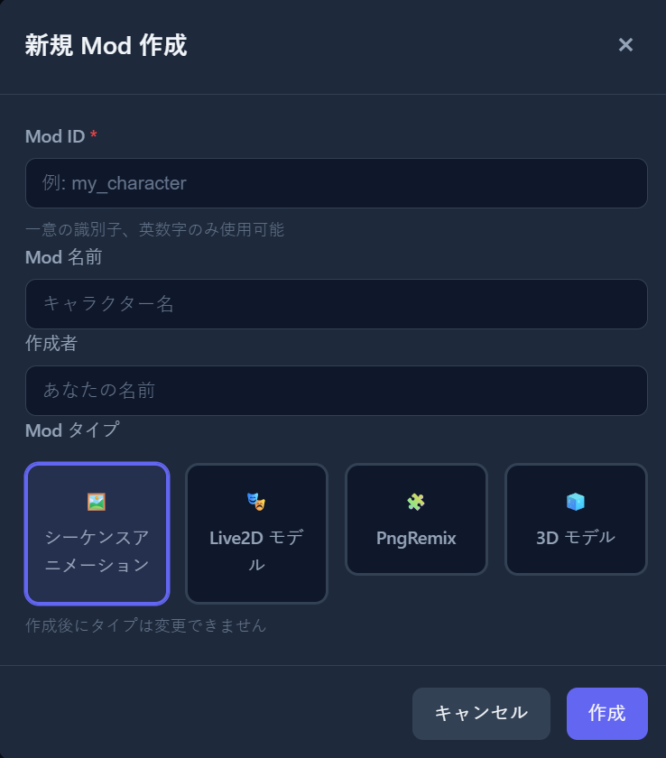

<br>

差分画像/GIF/動画をスプライトシートに処理するための完全な<a href="#jp-補助ツールセット">**ツールチェーン**</a>を提供しています。他の3つの形式は元のファイルをそのまま使用し、エディター内でファイルの解析をサポートしています

| 形式               | リソースタイプ           | 説明                                                         |
| ------------------ | ---------------------- | ------------------------------------------------------------ |
| **シーケンスフレーム** | WebP / PNG             | 差分画像/GIF/動画/スプライトシートに対応、完全なアニメーション処理ツールチェーン |
| **Live2D**         | Live2Dリソースパック     | Live2Dアニメーション形式、物理/表情/モーション対応             |
| **PngRemix**       | pngRemixファイル        | PngTuber Remixのカスタム形式                                  |
| **3D**             | VRM / PMX + モーションファイル | VRMとMMD PMX 3Dモデルに対応                              |

<br>

> [!TIP]<br>
> さらに対応してほしい形式があれば、ぜひフィードバックをお願いします<br>
> お問い合わせ：QQ群：<a href="docs/imgs/QQ群.jpg" target="_blank" rel="noopener noreferrer">578258773</a>   Bilibili: <a href="https://b23.tv/ZKVKHH0" target="_blank" rel="noopener noreferrer">_Cafel_</a>

<br>

<a id="jp-パッケージ暗号化"></a>

### 2. パッケージ暗号化

本アプリケーションは作品を**暗号化ファイルsbuddy**にパッケージングすることをサポートしています。この形式はアプリケーション本体でのみ使用でき、エディターでは開けず、内部のリソースを簡単に取り出すこともできません


暗号化/復号化に脆弱性を発見された場合は、ぜひフィードバックをお願いします。大変感謝いたします

<br>

> [!TIP]<br>
> オープンソースコードには暗号化/復号化の部分は含まれていません。そのため、ソースコード版ではsbuddyのパッケージングと読み込みができません<br>
> この機能が必要な場合は、リリース版をご利用ください

<br>

<a id="jp-メモリ最適化"></a>

### 3. メモリ使用量の最適化

WebGLベースのプログラムでは、テクスチャリソースのサイズが大きすぎると大量のメモリを消費します。これは常に解決が困難な問題でした


<br>

メモリ使用量を最小限に抑えるため、WebGLレンダリング時のテクスチャダウンサンプリングをサポートしています<br>
Mod内で一般的なスケーリング値に基づいて適切なダウンサンプリングサイズを設定するだけで、テクスチャダウンサンプリングを有効にできます<br>
適切なサイズ設定により、十分な鮮明度を維持しながらメモリ使用量を効果的に削減できます


<br>

また、設定ファイルによる最大フレームレートのカスタマイズもサポートしています<br>
フレームレートが高すぎるとGPU使用率が増加します。フレームレートを適切に下げることでGPU負荷を軽減できます<br>
インストール後、インストールディレクトリ内の **Config** フォルダにある **render_tuning.json** ファイルを変更して最適化動作をカスタマイズできます

<br>

<a id="jp-対話イベントチェーン"></a>

### 4. 対話イベントチェーン

本アプリケーションは複雑な対話イベントチェーンと各セリフの音声設定に対応しています。Modエディターのフォーム式インターフェースで簡単に実現できます

- **テキスト＆音声** — 複雑なテキストと音声の設定をサポート、多言語対応
  - 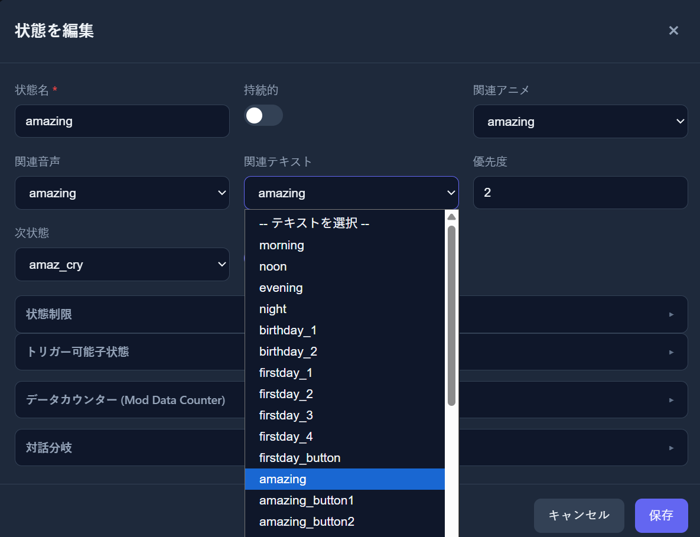

- **対話イベントチェーン** — 直接リンク、対話分岐、ランダムトリガーなどのテキストイベントチェーンをサポート
  - 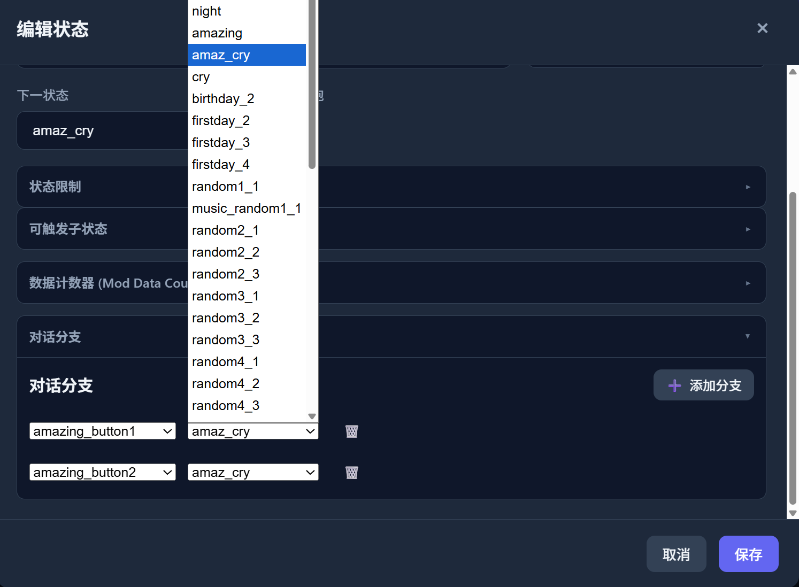

- **条件トリガー** — 日付/時刻/カウンター/気温/天気/稼働時間による条件付きトリガー
  - 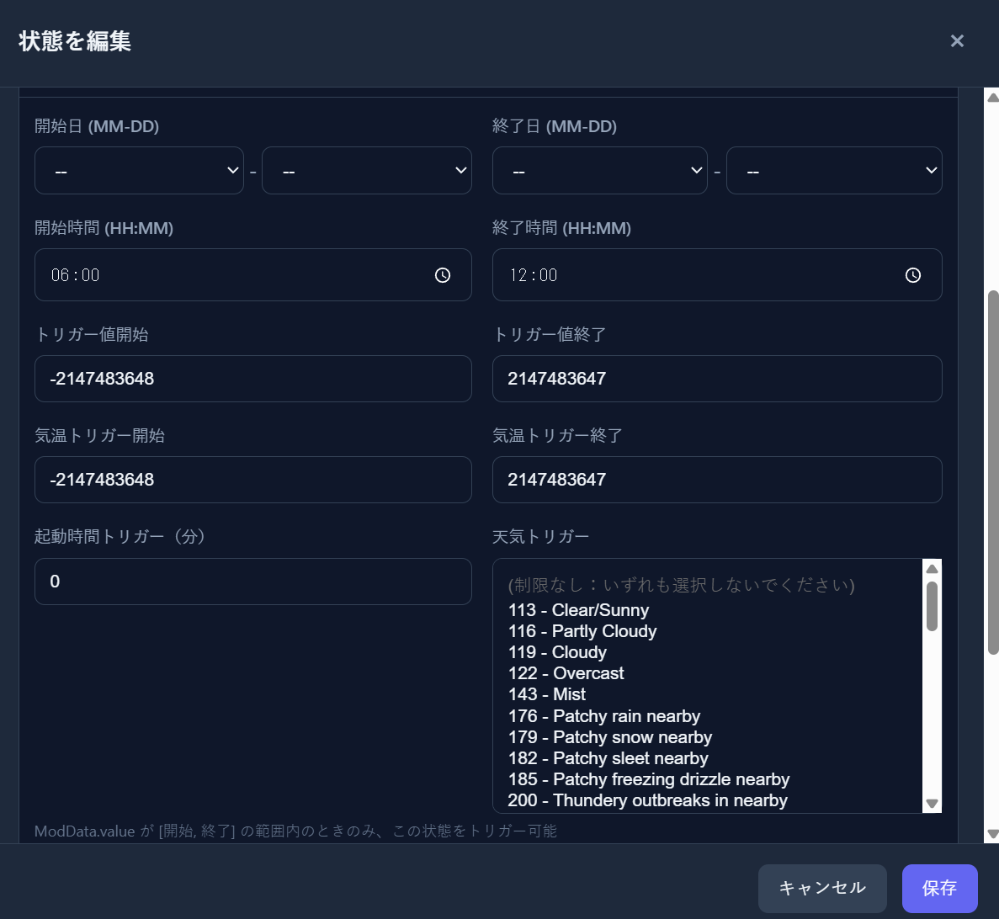

<br>

<a id="jp-システムイベント"></a>

### 5. システムイベント

本アプリケーションは多様なシステムイベントに対応しています。デスクトップペットはあなたの現在の行動や現実の日付・天気に応じて異なる反応をし、より良い寄り添い感を演出します。Modエディターのフォーム式インターフェースで簡単に設定できます

- **キーボード＆マウス** — キーボードやマウスの入力に応じて反応

- **音楽再生** — 音楽プレーヤーを使用する際にペットが反応
- **ドラッグ** — ペットをドラッグするたびに反応
- **全画面アプリ起動** — 特定の全画面アプリを開いた際にペットが反応

- **PC解除** — ロック画面解除のたびに挨拶
- **仕事アプリ起動** — 特定の仕事用ソフトを開いた際に挨拶
- **長時間PC使用** — 一定時間PC使用で挨拶

- **天気変化** — 特定の天気条件でのみ表示される対話
- **時間変化** — 特定の日時でのみ表示される対話
- **誕生日挨拶** — 登録した誕生日にのみ表示される対話

続々追加中、より多くのイベントに対応予定

<br>

<a id="jp-Modエディター"></a>

### 6. Modエディター

チュートリアル：
<a href="docs/tutorial/NewMod.md" target="_blank" rel="noopener noreferrer">素早く デスクトップペットを移行/作成</a>

本アプリケーションは充実したフォーム式Modエディターをサポートしています。コードを一切書かずにほとんどの設定を完了できます

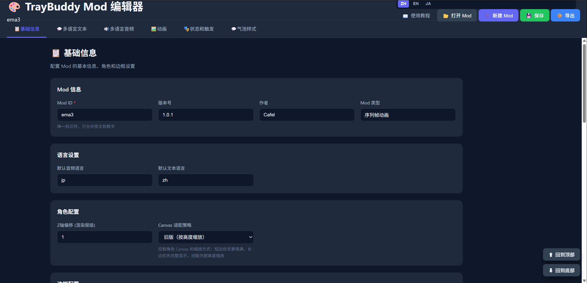
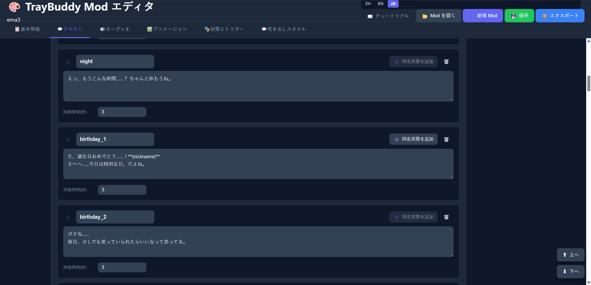
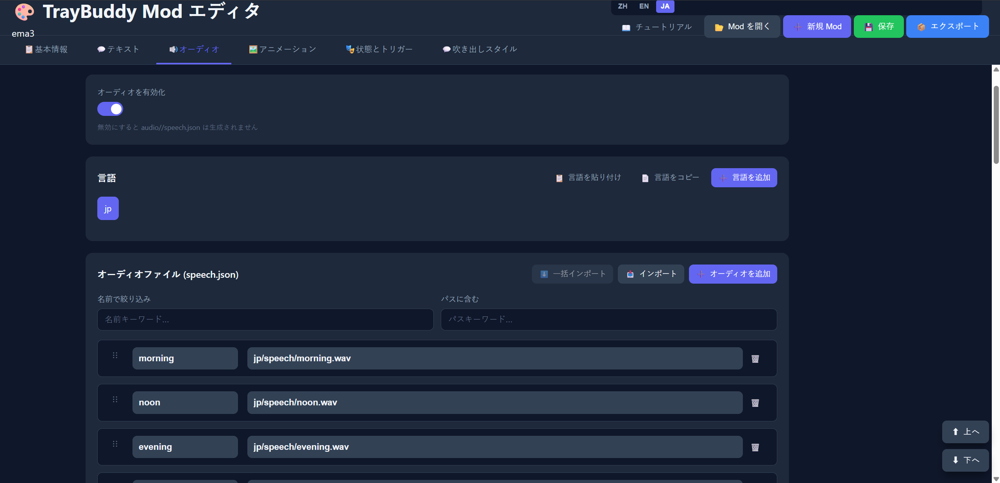
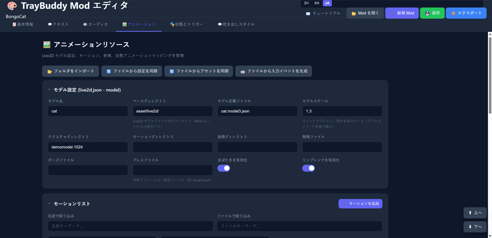


<br>

> [!TIP]<br>
> 今後、公式チュートリアル動画シリーズを公開予定です。お楽しみに<br>
> ご不明点があれば、お気軽にお問い合わせください

> [!WARNING]<br>
> ツールはまだ初期段階です。問題を発見された場合は、ぜひフィードバックをお願いします<br>
> お問い合わせ：QQ群：<a href="docs/imgs/QQ群.jpg" target="_blank" rel="noopener noreferrer">578258773</a>   Bilibili: <a href="https://b23.tv/ZKVKHH0" target="_blank" rel="noopener noreferrer">_Cafel_</a>

<br>

<a id="jp-Mod切り替え"></a>

### 7. Mod切り替えとマルチバージョン管理

アプリにはMod切り替えとマルチバージョン管理機能が内蔵されています。複数のMod間で簡単に切り替えができ、同じModの異なるバージョンをインポートすることも可能です

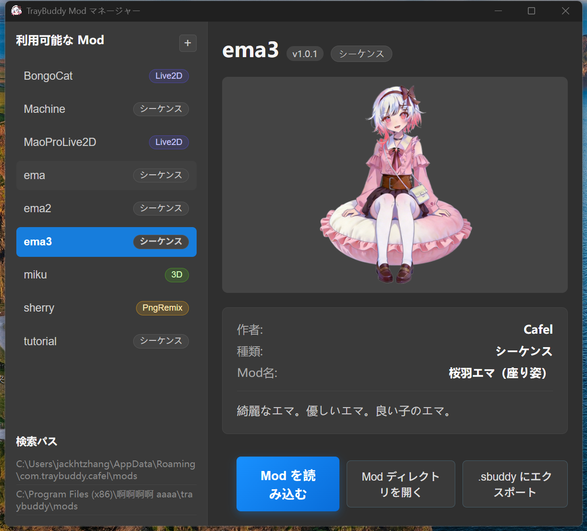
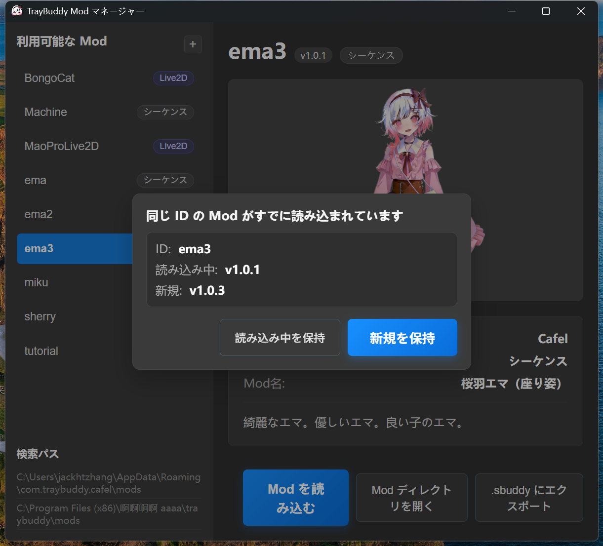

<br>

<a id="jp-AIツール"></a>

### 8. AIツール

本アプリケーションはカスタマイズ可能なAIツールを提供しており、現在使用中のソフトウェアやゲームを検出し、対応するソフトウェアやゲームに対してフィードバックを提供します

主な効果はプロンプトとAIの知能に依存します

<br>

<a href="https://www.bilibili.com/video/BV1idwczDE41" target="_blank" rel="noopener noreferrer"><b>デモ動画</b></a>

<a href="https://www.bilibili.com/video/BV1idwczDE41" target="_blank" rel="noopener noreferrer"></a>

<br>

<a id="jp-便利機能"></a>

### 9. 便利機能

- **メモ** — 画面ロック解除時に自動ポップアップ、手動表示も可能
  - 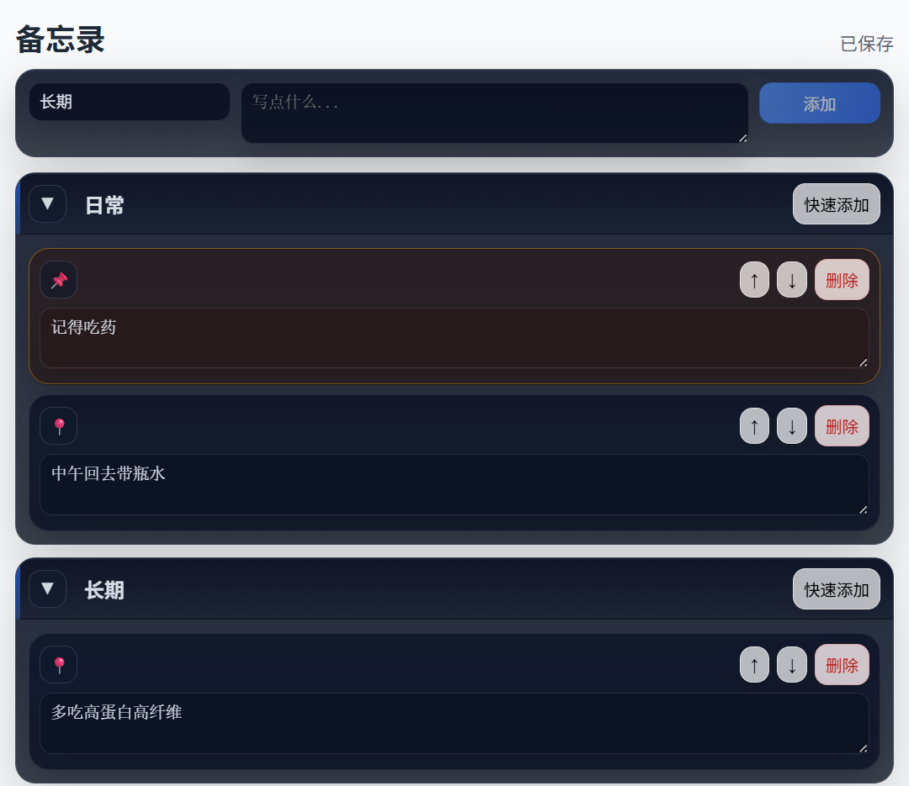
- **タイマーリマインダー** — 指定時刻のポップアップリマインダー設定
  - 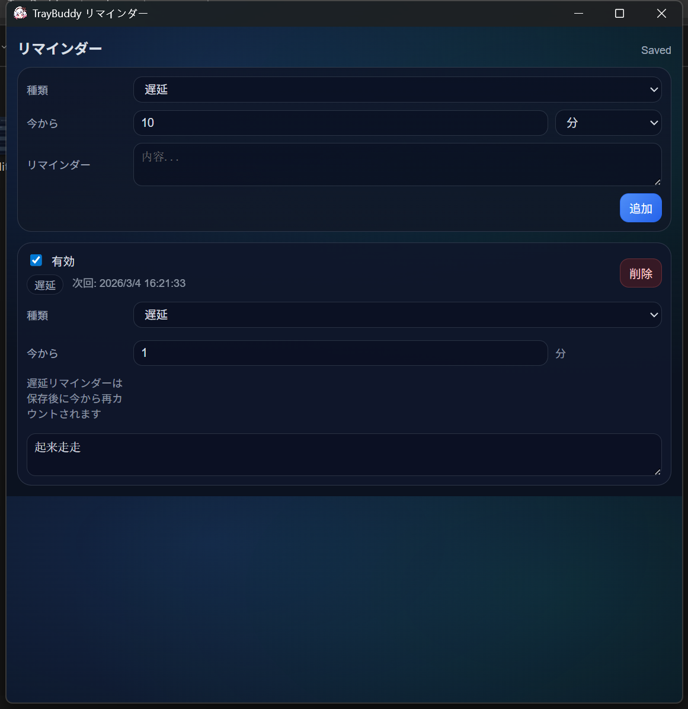

<br>

<a id="jp-多言語"></a>

### 10. 多言語

本プロジェクトはi18nリアルタイム多言語切り替えに対応しています。**右クリックメニュー - 設定 - インターフェース言語** で調整できます


<br>

<a id="jp-インストール"></a>

## インストール

### 1. アプリのインストール

軽量版にはチュートリアルModのみ含まれ、通常版にはいくつかのデフォルトModが含まれます

1. 最新のインストーラーをダウンロード
2. インストーラーを実行し、言語とディレクトリを選択
3. インストール完了後、TrayBuddyを起動するとキャラクターがデスクトップに表示されます
4. システムトレイアイコンを右クリックして設定と機能メニューにアクセス

<br>

### 2. Modのインストール

- **`.tbuddy` または `.sbuddy` ファイルをダブルクリック**で自動インポート（ファイル関連付け済み）
  - 
- またはModマネージャー左上の**プラスボタン**から手動でブラウズしてインポート
  - 

<br>

> [!TIP]<br>
> Mod切り替え時にキャラクターの状態がフリーズすることがあります。その場合はModを再読み込みしてください

<br>

### 3. カスタム設定

インストール後、インストールディレクトリ内のConfigフォルダにある設定ファイルを変更して動作をカスタマイズできます：

| 設定ファイル                             | 説明                                                  |
|-----------------------------------------|-------------------------------------------------------|
| `config/media_observer_keywords.json`   | メディアアプリプロセス名キーワード（Spotify、QQ Music、NetEase Cloud等） |
| `config/process_observer_keywords.json` | 作業アプリプロセス名キーワード（VS Code、Photoshop、Unity等） |
| `config/render_tuning.json`             | 最適化関連設定、フレームレート制限 |

<br>

<a id="jp-ツールチェーン"></a>

## ツールチェーン

TrayBuddyは完全なMod制作ツールチェーンを提供します：

<br>

### 1. Modパッケージ形式

| 形式   | 拡張子    | 説明                               |
|--------|-----------|-----------------------------------|
| tbuddy | `.tbuddy` | ZIPアーカイブ、ダブルクリックで自動インポート |
| sbuddy | `.sbuddy` | 暗号化アーカイブ、Modリソースを保護  |

システムは `tbuddy-asset://` カスタムプロトコルを通じてメモリ内のアーカイブからリソースをストリーミング — ディスクへの展開は不要。

詳細なMod開発ガイドは `mods/mod-guide.md` をご参照ください

<br>

### 2. Modエディター (`mod-tool/`)

Mod設定をビジュアル編集するスタンドアロンWebアプリ：
- アニメーション/テキスト/オーディオの設定と組み合わせ
- イベントトリガー設定
- 内蔵チュートリアル

ダブルクリックで起動：

```bash
打开-mod编辑器.bat
```

<br>

> [!WARNING]<br>
> ツールはまだ初期段階です。問題を発見された場合は、ぜひフィードバックをお願いします<br>
> お問い合わせ：QQ群：<a href="docs/imgs/QQ群.jpg" target="_blank" rel="noopener noreferrer">578258773</a>   Bilibili: <a href="https://b23.tv/ZKVKHH0" target="_blank" rel="noopener noreferrer">_Cafel_</a>

<br>

<a id="jp-補助ツールセット"></a>

### 3. 補助ツールセット (`other-tool/`)

Mod制作の全ワークフローをカバーする13の独立Webツール：

| ツール                      | 機能                                      |
|----------------------------|-------------------------------------------|
| GIFフレーム抽出              | GIF動画からフレームシーケンスを抽出          |
| ビデオフレーム抽出            | 動画ファイルからフレームを抽出              |
| スプライトシート生成          | 差分画像をスプライトシートに合成            |
| スプライトシート分割          | スプライトシートを個別フレームに分割         |
| スプライトシート圧縮          | スプライトシートのサイズ最適化              |
| シーケンスプレビュー          | 差分画像/スプライトシートアニメーションのプレビュー |
| シーケンス位置合わせ          | フレームの位置合わせとオフセット調整         |
| 一括クロップ＆リサイズ        | バッチ画像処理                             |
| PNG → ICO                  | アイコン形式変換                           |
| Live2Dプレビュー             | Live2Dモデルプレビュー                     |
| PngRemixプレビュー           | PngRemixモデルのプレビューとデバッグ        |
| モデルプレビュー             | 3D VRM/PMXモデルプレビュー                 |

対応する.batファイルをダブルクリックで起動できます

<br>

<a id="jp-ソースからビルド"></a>

## ソースからビルド

> [!WARNING]<br>
> 多忙なため、著者はこのプロジェクトの作成にClaude-OpusとGPT-Codexを大量に使用しました<br>
> プロジェクト内にコードの問題を発見された場合は、フィードバックをいただけると大変ありがたく存じます<br>
> AI関連のコンテンツがお気に召さない場合は、本プロジェクトを無視してください。お詫び申し上げます

<br>

### 1. 技術スタック

| レイヤー       | 技術                         | 説明                                           |
|---------------|-----------------------------|-------------------------------------------------|
| フロントエンド | SvelteKit 5 + TypeScript    | Svelte 5 リアクティブシステム                    |
| バックエンド   | Tauri 2 (Rust)              | システムレベルAPIを提供するデスクトップアプリコンテナ |
| 3Dレンダリング | Three.js + @pixiv/three-vrm  | VRM / PMX 3Dモデルレンダリング                   |
| ビルドツール   | Vite 6 + pnpm               | `@sveltejs/adapter-static` によるフロントエンドビルド |
| パッケージング | NSIS                        | 4言語UIのWindowsインストーラー                    |
| Windows API   | windows-rs 0.58             | メディア制御、オーディオ、プロセス、フック、ロック検出等 |
| テスト        | Vitest + Cargo Test          | フロントエンドユニット/コンポーネントテスト + バックエンドRustテスト |

<br>

### 2. 環境準備

ワンクリック環境セットアップスクリプトを実行（管理者権限が必要）：

```bash
setup-windows-build-env.bat
```

このスクリプトは以下を自動インストールします：
- Node.js LTS
- Rust（rustup経由）
- Visual Studio 2022 Build Tools（C++ワークロード）
- NSIS
- WebView2 Runtime

または手動でインストール：

| 依存関係 | 最低バージョン |
|---------|-------------|
| [Node.js](https://nodejs.org/) | 18+ |
| [Rust](https://rustup.rs/) | 1.75+ |
| [pnpm](https://pnpm.io/) | 8+ |
| [Visual Studio Build Tools](https://visualstudio.microsoft.com/visual-cpp-build-tools/) | 2022 |

<br>

### 3. 開発モード

```bash
# フロントエンド依存関係をインストール
pnpm install

# 手動で実行
pnpm tauri dev
```

またはワンクリック開発スクリプトをダブルクリックで実行（管理者権限が必要）：

```bash
dev.bat
```

<br>

### 4. リリースビルド

ワンクリックビルドスクリプトをダブルクリックで実行（管理者権限が必要）：

```bash
release.bat
```

このスクリプトは以下を実行します：
1. リリースmodsディレクトリをクリーン
2. Modを `.tbuddy` 形式にパック
3. `pnpm tauri build` を実行してNSISインストーラーを生成

ビルド出力先: `src-tauri/target/release/bundle/nsis/`

<br>

### 5. 自動テスト

```bash
# 全フロントエンドテストを実行
pnpm test:run

# フロントエンドテスト（ウォッチモード）
pnpm test:watch

# フロントエンドテストカバレッジ
pnpm test:coverage

# バックエンドRustテストを実行
cd src-tauri && cargo test
```

ワンクリック全テスト（フロントエンド + バックエンド + カバレッジ）

```bash
test.bat
```
<br>

### 6. プロジェクト構成

```
TrayBuddy/
├── src/                        # フロントエンドソース（SvelteKit + TypeScript）
│   ├── routes/                 # ページルーティング（11ページ）
│   │   ├── +page.svelte        #   デバッグメインページ（9タブ）
│   │   ├── animation/          #   スプライトレンダリングウィンドウ
│   │   ├── live2d/             #   Live2Dレンダリングウィンドウ
│   │   ├── pngremix/           #   PngRemixレンダリングウィンドウ
│   │   ├── threed/             #   3Dレンダリングウィンドウ
│   │   ├── mods/               #   Modマネージャー
│   │   ├── settings/           #   ユーザー設定
│   │   ├── memo/               #   メモ
│   │   └── reminder/           #   タイマーリマインダー
│   ├── lib/                    # フロントエンドコアモジュール
│   │   ├── animation/          #   アニメーションプレイヤー（4形式）+ ウィンドウコア
│   │   ├── audio/              #   オーディオ管理
│   │   ├── bubble/             #   吹き出しシステム
│   │   ├── trigger/            #   フロントエンドトリガー
│   │   ├── i18n/               #   国際化
│   │   ├── types/              #   型定義
│   │   ├── utils/              #   ユーティリティ関数
│   │   └── components/         #   デバッグパネルコンポーネント
│   └── test/                   # フロントエンドテスト
├── src-tauri/                  # バックエンドソース（Rust / Tauri 2）
│   └── src/
│       ├── lib.rs              #   アプリエントリ、コマンド登録、カスタムプロトコル
│       ├── app_state.rs        #   グローバル状態管理
│       ├── modules/            #   コア機能モジュール
│       │   ├── resource.rs     #     Modリソース管理
│       │   ├── state.rs        #     状態機械エンジン
│       │   ├── media_observer  #     メディア再生監視
│       │   ├── process_observer#     プロセス検出
│       │   ├── system_observer #     システムイベント監視
│       │   ├── environment.rs  #     環境情報（天気/位置）
│       │   ├── trigger.rs      #     イベントトリガー処理
│       │   ├── storage.rs      #     永続化ストレージ
│       │   ├── mod_archive.rs  #     Modパッケージリーダー
│       │   └── utils/          #     ユーティリティ関数
│       └── commands/           #   Tauriコマンド（フロントエンド-バックエンド通信）
├── config/                     # ランタイム設定（メディア/プロセスキーワード）
├── i18n/                       # 国際化リソース
├── mods/                       # Modディレクトリ（チュートリアルModのみ）
├── mod-tool/                   # Modエディター
├── other-tool/                 # 補助ツールセット（13個）
└── tools-common/               # ツール共有コード
```

<br>

<p align="right"><a href="#top">⬆ トップへ戻る</a></p>
