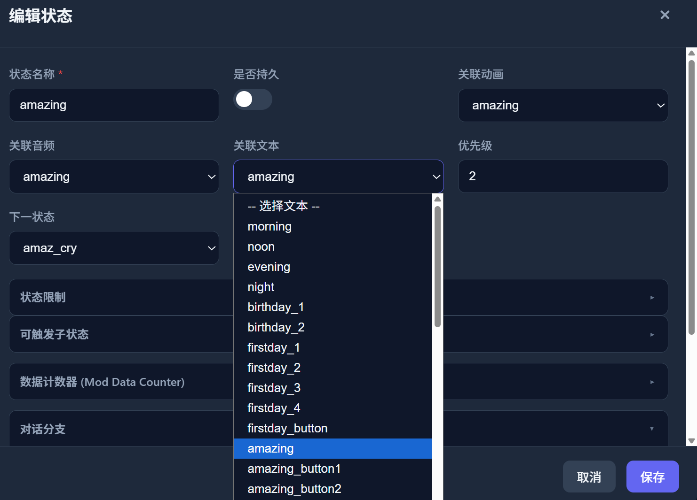
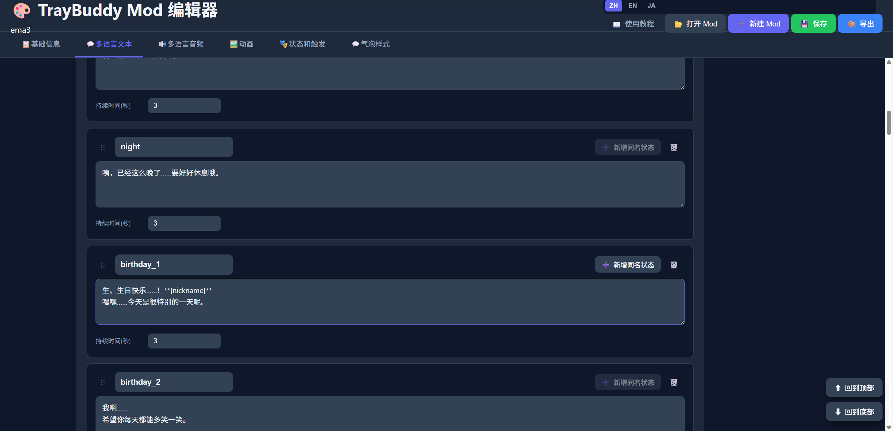
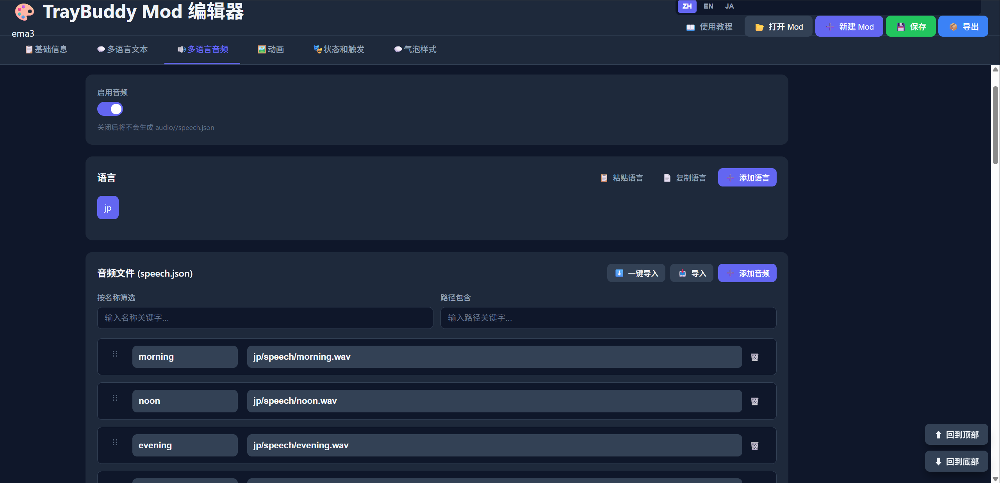
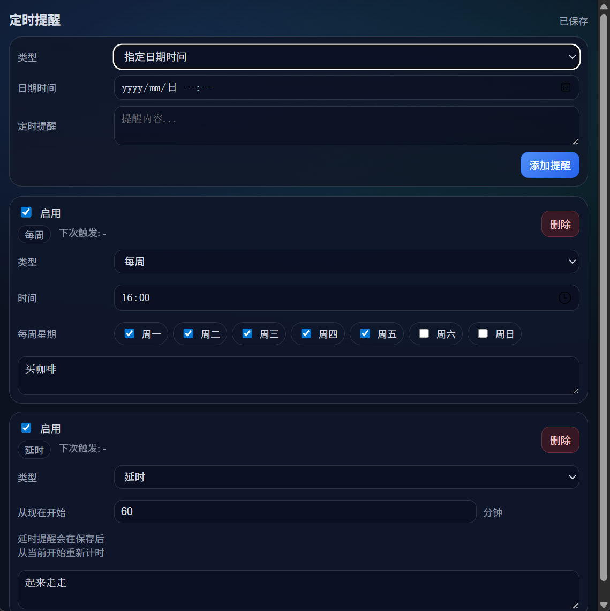

<a id="top"></a>

<p align="center">
  
</p>

<h1 align="center">TrayBuddy</h1>

<p align="center">
  <a href="#简体中文">简体中文</a> ｜ <a href="#en-target-audience">English</a> ｜ <a href="#jp-対象ユーザー">日本語</a>
</p>

<p align="center">
  
  
  
  
  
  
</p>

<br>

<!-- ======================================================= -->
<!-- 简体中文-->
<!-- ======================================================= -->

<a id="简体中文"></a>

**TrayBuddy**是一款支持 **多种动画类型、包加密、高度自定义** 的桌宠应用，致力于让用户和创作者都能获得出色的体验

> [!WARNING]<br>
> 当前项目仅支持Windows<br>
> 理论上Tauri是支持跨平台的，代码内也预留了其他平台的占位函数<br>
> 但是作者既没有Mac也没有Linux设备，所以没法做，以后再看<br>
> 如果有大佬有对应的设备愿意补齐对应平台的支持，我们会感激不尽 **orz**

下载：
<a href="https://pan.baidu.com/s/5xPn--lWTiKHAfBCB5gta3Q">百度网盘</a>
<a href="https://pan.quark.cn/s/6c6c08b57fba?pwd=CiSm">夸克网盘</a>

鸣谢：
<a href="https://b23.tv/K9ceDZ8">INORGANIC_盐</a>
<a href="https://b23.tv/cTCT0hn">Snoworld_</a>

<br>

<a id="zh-适用人群"></a>

## 适用人群

如果你：

- **喜欢不同类型桌宠来回换，又不想装很多软件**

- **想做桌宠，有动画，或有配音，或有文本，但不想写代码**

- **只想展示自己的动画模型，但又不想被别人滥用**

- **是专业桌宠作者，用惯用的工具做完后，可以顺手打个包给用户多一种选择**

那么这个项目可能会适合你

<br>

<a id="zh-效果展示"></a>

## 效果展示

陈列的Mod仅用于效果演示，来源请见对应链接

后续会增加更多的样例

<table>
<tr>
<td align="center"><a><b>序列帧 半身</b></a></td>
<td align="center"><a><b>序列帧 全身</b></a></td>
</tr>
<tr>
<td><video src="docs/Video/img1.mp4" controls width="360"></video></td>
<td><video src="docs/Video/img2.mp4" controls width="360"></video></td>
</tr>
<tr>
<td align="center"><a href="https://github.com/MMmmmoko/Bongo-Cat-Mver"><b>Live2D BongoCat</b></a></td>
<td align="center"><a href="https://www.live2d.com/zh-CHS/learn/sample/"><b>Live2D 人物</b></a></td>
</tr>
<tr>
<td><video src="docs/Video/live2d1.mp4" controls width="360"></video></td>
<td><video src="docs/Video/live2d2.mp4" controls width="360"></video></td>
</tr>
<tr>
<td align="center"><a href="https://www.bilibili.com/video/BV1pbxnz5EvD/?share_source=copy_web&vd_source=83959be6660f3ec16d301ccce33457e7"><b>PngRemix</b></a></td>
<td align="center"><a><b>PngRemix</b></a></td>
</tr>
<tr>
<td><video src="docs/Video/pngremix1.mp4" controls width="360"></video></td>
<td></td>
</tr>
<tr>
<td align="center"><a href="https://booth.pm/en/items/3226395"><b>3D 模型 (VRM)</b></a></td>
<td align="center"><a><b>3D 模型 (PMX)</b></a></td>
</tr>
<tr>
<td><video src="docs/Video/3d1.mp4" controls width="360"></video></td>
<td></td>
</tr>
</table>

<br>

<a id="zh-简介"></a>

## 简介

1. 支持 4 种动画格式：<a href="#zh-动画格式">**序列帧(差分图，gif，spritesheet)、Live2D、PngRemix、3D模型(vrm/pmx)**</a>

2. 支持对mod进行 <a href="#zh-包加密">**包加密**</a>

3. 内存占用优化：<a href="#zh-内存占用优化">**纹理降采样、帧率限制 等**</a>

4. 支持复杂的 <a href="#zh-对话事件链">**对话事件链**</a> 和语音配置

5. 支持多种事件：<a href="#zh-系统事件">**键盘鼠标、播放音乐、电脑解锁、工作程序启动、拖拽、全屏应用启动、天气变换、时间变化、长时间使用电脑、生日问候 等**</a>

6. 完整的<a href="#zh-Mod编辑器">**Mod 创作工具链**</a>，填表式编辑器不需要写代码

7. 支持<a href="#zh-Mod切换和多版本管理">**多种 Mod 切换和单一 Mod 的多版本管理**</a>

8. 辅助功能：<a href="#zh-辅助功能">**备忘录和定时提醒**</a>

<br>

> [!TIP]<br>
> 本项目仍处于早期阶段，如果您发现问题，欢迎反馈给我们<br>
> 联系我们：QQ群：<a href="docs/imgs/QQ群.jpg">578258773</a>   Bilibili: <a href="https://b23.tv/ZKVKHH0">_Cafel_</a>

<br>

<a id="zh-功能特性"></a>

## 功能特性

<a id="zh-动画格式"></a>

### 1. 动画格式

TrayBuddy 统一管理 4 种不同的动画格式：


<br>

我们提供一整套 <a href="#zh-辅助工具集">**工具链**</a> 用于将 差分图/gif/视频 处理成spritesheet用于程序内动画，其他三种格式直接使用原本文件，编辑器内支持对文件进行解析

| 格式         | 资源类型               | 说明                                                       |
| ------------ | ---------------------- | ---------------------------------------------------------- |
| **序列帧**   | WebP / PNG             | 支持差分图/gif/视频/spritesheet，有一整套工具链处理动画       |
| **Live2D**   | live2d资源包           | live2d动画格式，支持物理/表情/动作                            |
| **PngRemix** | pngRemix文件           | pngtuber remix的自定义格式                                   |
| **3D**       | vrm / pmx + 动作文件   | 支持 VRM 和 MMD PMX 3D 模型                                 |

<br>

<a id="zh-包加密"></a>

### 2. 包加密

我们的程序支持将您的作品打包为一个 **加密文件sbuddy**，这种格式只能被程序本身使用，编辑器无法打开，也无法被简单的解包拿到内部的资源


如果您发现我们的加密解密存在漏洞，欢迎反馈给我们，我们将会非常感激

<br>

> [!TIP]<br>
> 开源代码内不包括加密解密的部分，因此使用源码版将无法打包和加载sbuddy<br>
> 如果您有相关的需求，请使用我们的release版本

<br>

<a id="zh-内存占用优化"></a>

### 3. 内存占用优化

基于webgl的程序，贴图资源如果尺寸过大，会占用大量内存，这一直以来都是一个难以解决的问题


<br>

为了尽量减少内存占用，我们支持webgl渲染时贴图降采样<br>
只要在mod内根据常用的缩放值配置合适的降采样尺寸，即可开启贴图降采样<br>
尺寸合适的话，就可以在保证合适清晰度的前提下，有效减少内存占用


<br>

同时，我们支持在设置面板调整最大帧率<br>
过高的帧率会导致GPU占用增加，适当降低帧率可以减少GPU占用


<br>

<a id="zh-对话事件链"></a>

### 4. 对话事件链

我们的程序支持复杂的对话事件链和每句对话的语音配置，您可以使用我们的 Mod编辑器 轻易的填表式完成这一目标

- **文本语音** — 支持配置复杂的文本和语音，支持多语言
  - 

- **对话事件链** — 支持文本事件链，包括直接链接，对话分支，随机触发等
  - 

- **条件触发** — 按日期/时间/计数器/气温/天气/运行时长等条件限制触发
  - 

<br>

<a id="zh-系统事件"></a>

### 5. 系统事件

我们的程序支持多种系统事件，桌宠会根据您当前的行为或您现实中的日期或天气做出不同的反应，为您的桌宠营造更好的陪伴感。您可以使用我们的 Mod编辑器轻易的填表式完成这一目标

- **键盘鼠标** — 根据键盘鼠标按键做出反馈

- **播放音乐** — 当您使用音乐播放器时，桌宠可以做出反馈
- **拖拽** — 每次拖拽桌宠时，桌宠可以做出反馈
- **全屏应用启动** — 当您打开某些全屏应用时，桌宠可以做出反馈

- **电脑解锁** — 每次电脑结束锁屏，做出打招呼的行为
- **工作程序启动** — 当您打开某些工作软件时，做出问候的行为
- **长时间使用电脑** — 当您使用电脑达到一定时长时，做出问候的行为

- **天气变换** — 某些对话只有在某些天气下才会出现
- **时间变化** — 某些对话只有在某些日期时间下才会出现
- **生日问候** — 某些对话只有在您填写的生日那一天才会出现

未完待续，更多事件支持中

<br>

<a id="zh-Mod编辑器"></a>

### 6. Mod编辑器

我们的程序支持完善的填表式Mod编辑器，您可以在不写任何代码的情况下完成大部分的配置






<br>

> [!TIP]<br>
> 工具仍处于早期阶段，如果您发现问题，欢迎反馈给我们<br>
> 联系我们：QQ群：<a href="docs/imgs/QQ群.jpg">578258773</a>   Bilibili: <a href="https://b23.tv/ZKVKHH0">_Cafel_</a>

<br>

<a id="zh-Mod切换和多版本管理"></a>

### 7. Mod切换和多版本管理

程序内置了Mod切换和多版本管理功能，您可以便捷的在多个Mod之间切换，同时，您也可以为程序导入同一个Mod的不同版本


<br>

<a id="zh-辅助功能"></a>

### 8. 辅助功能

- **备忘录** — 每次解锁屏幕时自动弹出，也可手动查看
  - 
- **定时提醒** — 设置指定时间的弹窗提醒
  - 

<br>

<a id="zh-安装"></a>

## 安装

### 1. 安装主程序

纯净版仅包含教程Mod，标准版则包含一些默认Mod

1. 下载最新版安装程序
2. 运行安装程序，选择安装语言和目录
3. 安装完成后启动 TrayBuddy，角色将出现在桌面上
4. 右键系统托盘图标可访问设置和功能菜单

<br>

### 2. 安装 Mod

- **双击 `.tbuddy` 或 `.sbuddy` 文件**即可自动导入（已关联文件类型）
  - 
- 或通过 Mod 管理器左上角的**加号按钮**手动浏览、导入
  - 

<br>

> [!TIP]<br>
> 有时在切换Mod时会出现角色状态卡住的情况，此时请重新加载Mod

<br>

### 3. 自定义配置

应用安装后，用户可修改安装目录内以下配置文件来自定义行为：

| 配置文件                               | 说明                                               |
|----------------------------------------|----------------------------------------------------|
| `config/media_observer_keywords.json`  | 媒体应用进程名关键词（Spotify、QQ 音乐、网易云等）  |
| `config/process_observer_keywords.json` | 工作应用进程名关键词（VS Code、Photoshop、Unity 等） |

<br>

<a id="zh-工具链"></a>

## 工具链

TrayBuddy 提供完整的 Mod 创作工具链：

<br>

### 1. Mod 打包格式

| 格式   | 扩展名    | 说明                     |
|--------|-----------|--------------------------|
| tbuddy | `.tbuddy` | ZIP 归档，双击自动导入   |
| sbuddy | `.sbuddy` | 加密归档，保护 Mod 资源  |

系统通过 `tbuddy-asset://` 自定义协议从内存中的归档流式加载资源，无需解压到磁盘。

详细的 Mod 开发指南请参阅 `mods/mod-guide.md`

<br>

### 2. Mod 编辑器 (`mod-tool/`)

可视化编辑 Mod 配置的独立 Web 应用：
- 动画/文本/音频 配置和组合
- 事件触发配置
- 内置教程

直接双击启动：

```bash
打开-mod编辑器.bat
```

<br>

> [!TIP]<br>
> 工具仍处于早期阶段，如果您发现问题，欢迎反馈给我们<br>
> 联系我们：QQ群：<a href="docs/imgs/QQ群.jpg">578258773</a>   Bilibili: <a href="https://b23.tv/ZKVKHH0">_Cafel_</a>

<br>

<a id="zh-辅助工具集"></a>

### 3. 辅助工具集 (`other-tool/`)

13 个独立 Web 工具，覆盖 Mod 制作全流程：

| 工具 | 功能 |
|------|------|
| GIF 提取序列帧 | 从 GIF 动图提取帧序列 |
| 视频提取序列帧 | 从视频文件提取帧序列 |
| Spritesheet 生成 | 将差分图组合并为精灵图 |
| Spritesheet 切分 | 将精灵图拆分为单帧 |
| Spritesheet 压缩 | 精灵图体积优化 |
| 序列帧预览 | 预览 差分图组/Spritesheet 动画效果 |
| 序列帧对齐工具 | 帧对齐和偏移调整 |
| 批量裁切缩放 | 批量图片处理 |
| PNG 转 ICO | 图标格式转换 |
| Live2D 预览 | Live2D 模型预览 |
| PngRemix 预览 | PngRemix 模型预览与调试 |
| 模型预览 | 3D VRM/PMX 模型预览 |

直接双击启动对应的bat即可

<br>

<a id="zh-从源码构建"></a>

## 从源码构建

> [!WARNING]<br>
> 因为工作繁忙时间不多，作者在编写本项目时大量使用了Claude-Opus和GPT-Codex<br>
> 如果您发现项目中存在任何代码问题，请反馈给我们，我们深表感谢<br>
> 如果您不喜欢AI相关内容，请直接忽略本项目，我们也表示抱歉

<br>

### 1. 技术栈

| 层级       | 技术                        | 说明                                          |
|------------|-----------------------------|-----------------------------------------------|
| 前端框架   | SvelteKit 5 + TypeScript    | Svelte 5 响应式系统                           |
| 后端框架   | Tauri 2 (Rust)              | 桌面应用容器，提供系统级 API                  |
| 3D 渲染    | Three.js + @pixiv/three-vrm  | VRM / PMX 3D 模型渲染                         |
| 构建工具   | Vite 6 + pnpm               | 前端构建，`@sveltejs/adapter-static` 静态适配 |
| 打包分发   | NSIS                        | Windows 安装程序，支持 4 种安装界面语言       |
| Windows API | windows-rs 0.58            | 媒体控制、音频、进程、钩子、锁屏检测等        |
| 测试框架   | Vitest + Cargo Test         | 前端单元/组件测试 + 后端 Rust 测试            |

<br>

### 2. 环境准备

直接双击运行一键环境安装脚本（需要管理员权限）：

```bash
setup-windows-build-env.bat
```

该脚本将自动安装：
- Node.js LTS
- Rust (via rustup)
- Visual Studio 2022 Build Tools (C++ workload)
- NSIS
- WebView2 Runtime

或手动安装：

| 依赖 | 最低版本 |
|------|---------|
| [Node.js](https://nodejs.org/) | 18+ |
| [Rust](https://rustup.rs/) | 1.75+ |
| [pnpm](https://pnpm.io/) | 8+ |
| [Visual Studio Build Tools](https://visualstudio.microsoft.com/visual-cpp-build-tools/) | 2022 |

<br>

### 3. 开发模式

```bash
# 安装前端依赖
pnpm install

# 手动执行
pnpm tauri dev
```

或者直接双击运行一键开发脚本（需要管理员权限）：

```bash
dev.bat
```

<br>

### 4. 构建发布版

直接双击运行一键打包脚本（需要管理员权限）：

```bash
release.bat
```

该脚本会：
1. 清理 release mods 目录
2. 打包 Mod 为 `.tbuddy` 格式
3. 执行 `pnpm tauri build` 生成 NSIS 安装程序

构建产物输出到 `src-tauri/target/release/bundle/nsis/`。

<br>

### 5. 自动化测试

```bash
# 运行全部前端测试
pnpm test:run

# 前端测试（Watch 模式）
pnpm test:watch

# 前端测试覆盖率
pnpm test:coverage

# 运行后端 Rust 测试
cd src-tauri && cargo test
```

一键全部测试（前端 + 后端 + 覆盖率）

```bash
test.bat
```
<br>

### 6. 项目结构

```
TrayBuddy/
├── src/                        # 前端源码（SvelteKit + TypeScript）
│   ├── routes/                 # 页面路由（11 个页面）
│   │   ├── +page.svelte        #   调试主页面（9 个 Tab）
│   │   ├── animation/          #   序列帧渲染窗口
│   │   ├── live2d/             #   Live2D 渲染窗口
│   │   ├── pngremix/           #   PngRemix 渲染窗口
│   │   ├── threed/             #   3D 渲染窗口
│   │   ├── mods/               #   Mod 管理器
│   │   ├── settings/           #   用户设置
│   │   ├── memo/               #   备忘录
│   │   └── reminder/           #   定时提醒
│   ├── lib/                    # 前端核心模块
│   │   ├── animation/          #   动画播放器（4 种格式）+ 窗口核心
│   │   ├── audio/              #   音频管理
│   │   ├── bubble/             #   对话气泡系统
│   │   ├── trigger/            #   前端触发器
│   │   ├── i18n/               #   国际化
│   │   ├── types/              #   类型定义
│   │   ├── utils/              #   工具函数
│   │   └── components/         #   调试面板组件
│   └── test/                   # 前端测试
├── src-tauri/                  # 后端源码（Rust / Tauri 2）
│   └── src/
│       ├── lib.rs              #   应用入口、命令注册、自定义协议
│       ├── app_state.rs        #   全局状态管理
│       ├── modules/            #   核心功能模块
│       │   ├── resource.rs     #     Mod 资源管理
│       │   ├── state.rs        #     状态机引擎
│       │   ├── media_observer  #     媒体播放监听
│       │   ├── process_observer#     进程检测
│       │   ├── system_observer #     系统事件监听
│       │   ├── environment.rs  #     环境信息（天气/位置）
│       │   ├── trigger.rs      #     事件触发处理
│       │   ├── storage.rs      #     持久化存储
│       │   ├── mod_archive.rs  #     Mod 包读取层
│       │   └── utils/          #     工具函数
│       └── commands/           #   Tauri 命令（前后端通信）
├── config/                     # 运行时配置（媒体/进程关键词）
├── i18n/                       # 国际化资源
├── mods/                       # Mod 目录（仅含教程 Mod）
├── mod-tool/                   # Mod 编辑器
├── other-tool/                 # 辅助工具集（13 个）
└── tools-common/               # 工具共享代码
```

<br>

<p align="right"><a href="#top">⬆ 返回顶部</a></p>

<!-- ============================================================ -->
<!-- English                                                       -->
<!-- ============================================================ -->

<a id="en-target-audience"></a>

## Who Is This For

If you:

- **Like switching between different types of desktop pets, but don't want to install many apps**

- **Want to make a desktop pet with animations, voiceovers, or dialogues, but don't want to write code**

- **Just want to showcase your animation models, but don't want them to be misused**

- **Are a professional desktop pet creator and want to package your work as an extra option for users after finishing with your usual tools**

Then this project might be for you

<br>

<a id="en-showcase"></a>

## Showcase


<br>

<a id="en-introduction"></a>

## Introduction

**TrayBuddy** is a desktop pet application that supports **multiple animation types, package encryption, and high customizability**, dedicated to providing an excellent experience for both users and creators

1. Supports 4 animation formats: **Sprite Sheets (differential frames, GIF, spritesheet), Live2D, PngRemix, 3D Models (VRM/PMX)**

2. Supports package encryption for mods

3. Supports complex dialogue event chains and voice configuration

4. Supports various events: keyboard/mouse, music playback, computer unlock, work app launch, drag, fullscreen app launch, weather changes, time changes, extended computer usage, birthday greetings, etc.

5. Complete Mod creation toolchain with form-based editor — no coding required

6. Supports switching between multiple Mods and multi-version management for a single Mod

7. Utility features: Memo and Timed Reminders

<br>

> [!TIP]<br>
> This project is still in its early stages. If you find any issues, please let us know<br>
> Contact us: QQ Group: 578258773   Bilibili: _Cafel_

> [!WARNING]<br>
> This project currently only supports Windows<br>
> In theory, Tauri supports cross-platform, and placeholder functions for other platforms are included in the code<br>
> However, the author has neither a Mac nor a Linux device, so it cannot be done

<br>

<a id="en-features"></a>

## Features

### Animation Formats

TrayBuddy manages 4 different animation formats in a unified way:

We provide a complete toolchain to process differential frames/GIF/video into spritesheets for in-app animation. The other three formats use their original files directly, and the editor supports parsing these files

| Format           | Resource Type          | Description                                                    |
| ---------------- | ---------------------- | -------------------------------------------------------------- |
| **Sprite Sheet** | WebP / PNG             | Supports differential frames/GIF/video/spritesheet, with a complete animation processing toolchain |
| **Live2D**       | Live2D resource pack   | Live2D animation format, supports physics/expressions/motions  |
| **PngRemix**     | pngRemix file          | Custom format from PngTuber Remix                              |
| **3D**           | VRM / PMX + motion files | Supports VRM and MMD PMX 3D models                           |

<br>

### Package Encryption

Our application supports packaging your work into an encrypted file called sbuddy. This format can only be used by the application itself — the editor cannot open it, and resources inside cannot be easily extracted

If you discover any vulnerabilities in our encryption/decryption, please let us know — we would be very grateful

> [!TIP]<br>
> The open-source code does not include the encryption/decryption components, so the source version cannot package or load sbuddy files<br>
> If you need this feature, please use our release version

<br>

### Dialogue Event Chains

Our application supports complex dialogue event chains and per-sentence voice configuration. You can easily achieve this using our Mod Editor's form-based interface

- **Text & Voice** — Supports complex text and voice configuration with multi-language support
- **Dialogue Event Chains** — Supports text event chains including direct links, dialogue branches, random triggers, etc.
- **Conditional Triggers** — Restrict triggers by date/time/counter/temperature/weather/uptime conditions

<br>

### System Events

Our application supports various system events. Your desktop pet will react differently based on your current actions or real-world date/weather, creating a better sense of companionship. You can easily configure this using our Mod Editor's form-based interface

- **Keyboard & Mouse** — React based on keyboard and mouse input

- **Music Playback** — The pet can react when you use a music player
- **Drag** — The pet can react each time you drag it
- **Fullscreen App Launch** — The pet can react when you open certain fullscreen applications

- **Computer Unlock** — Greet you each time the computer exits lock screen
- **Work App Launch** — Greet you when you open certain work applications
- **Extended Computer Usage** — Greet you when you've been using the computer for a certain duration

- **Weather Changes** — Some dialogues only appear under certain weather conditions
- **Time Changes** — Some dialogues only appear at certain dates and times
- **Birthday Greetings** — Some dialogues only appear on the birthday you've entered

More events coming soon

<br>

### Mod Editor


<br>

### Mod Switching & Multi-Version Management


<br>

### Utility Features

- **Memo** — Auto-popup on screen unlock, also viewable manually
- **Timed Reminders** — Set popup reminders for specific times


<br>

<a id="en-tech-stack"></a>

## Tech Stack

| Layer        | Technology                  | Description                                           |
|--------------|-----------------------------|-------------------------------------------------------|
| Frontend     | SvelteKit 5 + TypeScript    | Svelte 5 reactive system                              |
| Backend      | Tauri 2 (Rust)              | Desktop app container with system-level APIs          |
| 3D Rendering | Three.js + @pixiv/three-vrm | VRM / PMX 3D model rendering                          |
| Build Tool   | Vite 6 + pnpm               | Frontend build with `@sveltejs/adapter-static`        |
| Packaging    | NSIS                        | Windows installer with 4 UI languages                 |
| Windows API  | windows-rs 0.58             | Media control, audio, process, hooks, lock detection  |
| Testing      | Vitest + Cargo Test          | Frontend unit/component tests + backend Rust tests    |

<br>

<a id="en-installation"></a>

## Installation

### Installing the App

1. Download the latest `.exe` installer from [Releases](../../releases)
2. The lite version only includes the tutorial Mod; the standard version includes some default Mods
3. Run the installer, select language and directory
4. After installation, launch TrayBuddy — the character will appear on the desktop
5. Right-click the system tray icon to access settings and features

<br>

### Installing Mods

- **Double-click `.tbuddy` or `.sbuddy` files** to auto-import (file associations registered)
- Or manually browse and import via the **plus button** in the top-left of the Mod Manager

> [!TIP]<br>
> Sometimes when switching Mods, the character state may get stuck. In that case, please reload the Mod

<br>

<a id="en-building-from-source"></a>

## Building from Source

> [!WARNING]<br>
> Due to a busy work schedule, the author extensively used Claude-Opus and GPT-Codex when writing this project<br>
> If you are uncomfortable with this, we apologize

<br>

### Prerequisites

Run the one-click environment setup script (requires admin privileges):

```bash
setup-windows-build-env.bat
```

This script will auto-install:
- Node.js LTS
- Rust (via rustup)
- Visual Studio 2022 Build Tools (C++ workload)
- NSIS
- WebView2 Runtime

Or install manually:

| Dependency | Minimum Version |
|-----------|----------------|
| [Node.js](https://nodejs.org/) | 18+ |
| [Rust](https://rustup.rs/) | 1.75+ |
| [pnpm](https://pnpm.io/) | 8+ |
| [Visual Studio Build Tools](https://visualstudio.microsoft.com/visual-cpp-build-tools/) | 2022 |

<br>

### Development Mode

```bash
# Install frontend dependencies
pnpm install

# Start development mode (with hot reload)
dev.bat
# Or manually
pnpm tauri dev
```

<br>

### Production Build

```bash
release.bat
```

This script will:
1. Clean release mods directory
2. Pack Mods into `.tbuddy` format
3. Run `pnpm tauri build` to generate the NSIS installer

Build output goes to `src-tauri/target/release/bundle/nsis/`.

<br>

<a id="en-mod-system"></a>

## Mod System

### Mod Package Formats

| Format | Extension | Description                    |
|--------|-----------|--------------------------------|
| tbuddy | `.tbuddy` | ZIP archive, double-click to auto-import |
| sbuddy | `.sbuddy` | Encrypted archive, protects Mod resources |

The system streams resources from in-memory archives via the `tbuddy-asset://` custom protocol — no disk extraction needed.

For detailed Mod development guide, see `mods/mod-guide.md`

<br>

> [!TIP]<br>
> This project is still in its early stages. If you find any issues, please let us know<br>
> Contact us: QQ Group: 578258773   Bilibili: _Cafel_

<br>

<a id="en-toolchain"></a>

## Toolchain

TrayBuddy provides a complete Mod creation toolchain:

<br>

### Mod Editor (`mod-tool/`)

A standalone web application for visual Mod editing:
- Animation/text/audio configuration and composition
- Event trigger configuration
- Built-in tutorial

```bash
# Launch the Mod Editor
cd mod-tool && 打开-mod编辑器.bat
```

> [!TIP]<br>
> The tools are still in their early stages. If you find any issues, please let us know<br>
> Contact us: QQ Group: 578258773   Bilibili: _Cafel_

<br>

### Auxiliary Tools (`other-tool/`)

13 standalone web tools covering the full Mod creation workflow:

| Tool                    | Function                                   |
|-------------------------|--------------------------------------------|
| GIF Frame Extractor     | Extract frame sequences from GIF           |
| Video Frame Extractor   | Extract frames from video files            |
| Spritesheet Generator   | Merge differential frames into spritesheets |
| Spritesheet Splitter    | Split spritesheets into individual frames  |
| Spritesheet Compressor  | Optimize spritesheet file size             |
| Sequence Preview        | Preview differential frame/spritesheet animation |
| Sequence Alignment Tool | Frame alignment and offset adjustment      |
| Batch Crop & Resize     | Batch image processing                     |
| PNG to ICO              | Icon format conversion                     |
| Live2D Preview          | Live2D model preview                       |
| PngRemix Preview        | PngRemix model preview and debugging       |
| Model Preview           | 3D VRM/PMX model preview                   |

> [!TIP]<br>
> The tools are still in their early stages. If you find any issues, please let us know<br>
> Contact us: QQ Group: 578258773   Bilibili: _Cafel_

<br>

<a id="en-project-structure"></a>

## Project Structure

```
TrayBuddy/
├── src/                        # Frontend source (SvelteKit + TypeScript)
│   ├── routes/                 # Page routes (11 pages)
│   │   ├── +page.svelte        #   Debug main page (9 Tabs)
│   │   ├── animation/          #   Sprite rendering window
│   │   ├── live2d/             #   Live2D rendering window
│   │   ├── pngremix/           #   PngRemix rendering window
│   │   ├── threed/             #   3D rendering window
│   │   ├── mods/               #   Mod Manager
│   │   ├── settings/           #   User Settings
│   │   ├── memo/               #   Memo
│   │   └── reminder/           #   Timed Reminders
│   ├── lib/                    # Frontend core modules
│   │   ├── animation/          #   Animation players (4 formats) + Window core
│   │   ├── audio/              #   Audio management
│   │   ├── bubble/             #   Speech bubble system
│   │   ├── trigger/            #   Frontend triggers
│   │   ├── i18n/               #   Internationalization
│   │   ├── types/              #   Type definitions
│   │   ├── utils/              #   Utility functions
│   │   └── components/         #   Debug panel components
│   └── test/                   # Frontend tests
├── src-tauri/                  # Backend source (Rust / Tauri 2)
│   └── src/
│       ├── lib.rs              #   App entry, command registration, custom protocol
│       ├── app_state.rs        #   Global state management
│       ├── modules/            #   Core functional modules
│       │   ├── resource.rs     #     Mod resource management
│       │   ├── state.rs        #     State machine engine
│       │   ├── media_observer  #     Media playback monitoring
│       │   ├── process_observer#     Process detection
│       │   ├── system_observer #     System event monitoring
│       │   ├── environment.rs  #     Environment info (weather/location)
│       │   ├── trigger.rs      #     Event trigger handling
│       │   ├── storage.rs      #     Persistent storage
│       │   ├── mod_archive.rs  #     Mod package reader
│       │   └── utils/          #     Utility functions
│       └── commands/           #   Tauri commands (frontend-backend communication)
├── config/                     # Runtime config (media/process keywords)
├── i18n/                       # I18n resources
├── mods/                       # Mod directory (tutorial Mod only)
├── mod-tool/                   # Mod Editor
├── other-tool/                 # Auxiliary tools (13)
└── tools-common/               # Shared tool code
```

<br>

### Custom Configuration

After installation, users can modify the following config files to customize behavior:

| Config File                              | Description                                                 |
|------------------------------------------|-------------------------------------------------------------|
| `config/media_observer_keywords.json`    | Media app process name keywords (Spotify, QQ Music, NetEase Cloud, etc.) |
| `config/process_observer_keywords.json`  | Work app process name keywords (VS Code, Photoshop, Unity, etc.) |

<br>

<a id="en-testing"></a>

## Testing

```bash
# Run all frontend tests
pnpm test:run

# Frontend tests (watch mode)
pnpm test:watch

# Frontend test coverage
pnpm test:coverage

# Run backend Rust tests
cd src-tauri && cargo test

# One-click full test suite (frontend + backend + coverage)
test.bat
```

<br>

<p align="right"><a href="#top">⬆ Back to top</a></p>

<!-- ============================================================ -->
<!-- 日本語                                                         -->
<!-- ============================================================ -->

<a id="jp-対象ユーザー"></a>

## 対象ユーザー

もしあなたが：

- **いろんなタイプのデスクトップペットを切り替えたいけど、たくさんのソフトをインストールしたくない**

- **デスクトップペットを作りたい、アニメーションや音声やテキストがあるけど、コードは書きたくない**

- **自分のアニメーションモデルを展示したいだけで、他人に不正利用されたくない**

- **プロのデスクトップペットクリエイターで、いつものツールで制作した後、パッケージしてユーザーに選択肢を増やしたい**

なら、このプロジェクトはあなたに合うかもしれません

<br>

<a id="jp-ショーケース"></a>

## ショーケース


<br>

<a id="jp-紹介"></a>

## 紹介

**TrayBuddy** は **複数のアニメーション形式、パッケージ暗号化、高度なカスタマイズ** に対応したデスクトップペットアプリケーションで、ユーザーとクリエイター双方に優れた体験を提供することを目指しています

1. 4種類のアニメーション形式に対応：**シーケンスフレーム（差分画像、GIF、スプライトシート）、Live2D、PngRemix、3Dモデル（VRM/PMX）**

2. Modのパッケージ暗号化に対応

3. 複雑な対話イベントチェーンと音声設定に対応

4. 多様なイベントに対応：キーボード/マウス、音楽再生、PC解除、仕事アプリ起動、ドラッグ、全画面アプリ起動、天気変化、時間変化、長時間PC使用、誕生日挨拶 など

5. 完全なMod制作ツールチェーン、フォーム式エディターでコード不要

6. 複数Modの切り替えと単一Modのマルチバージョン管理に対応

7. 便利機能：メモとタイマーリマインダー

<br>

> [!TIP]<br>
> このプロジェクトはまだ初期段階です。問題を発見された場合は、ぜひフィードバックをお願いします<br>
> お問い合わせ：QQ群: 578258773   Bilibili: _Cafel_

> [!WARNING]<br>
> 現在、本プロジェクトはWindowsのみサポートしています<br>
> 理論的にはTauriはクロスプラットフォームに対応しており、コード内にも他のプラットフォーム用のプレースホルダー関数があります<br>
> しかし、著者はMacもLinuxデバイスも持っていないため、対応できません

<br>

<a id="jp-機能特性"></a>

## 機能特性

### アニメーション形式

TrayBuddyは4種類の異なるアニメーション形式を統合管理します：

差分画像/GIF/動画をスプライトシートに処理するための完全なツールチェーンを提供しています。他の3つの形式は元のファイルをそのまま使用し、エディター内でファイルの解析をサポートしています

| 形式               | リソースタイプ           | 説明                                                         |
| ------------------ | ---------------------- | ------------------------------------------------------------ |
| **シーケンスフレーム** | WebP / PNG             | 差分画像/GIF/動画/スプライトシートに対応、完全なアニメーション処理ツールチェーン |
| **Live2D**         | Live2Dリソースパック     | Live2Dアニメーション形式、物理/表情/モーション対応             |
| **PngRemix**       | pngRemixファイル        | PngTuber Remixのカスタム形式                                  |
| **3D**             | VRM / PMX + モーションファイル | VRMとMMD PMX 3Dモデルに対応                              |

<br>

### パッケージ暗号化

本アプリケーションは作品をsbuddyという暗号化ファイルにパッケージングすることをサポートしています。この形式はアプリケーション本体でのみ使用でき、エディターでは開けず、内部のリソースを簡単に取り出すこともできません

暗号化/復号化に脆弱性を発見された場合は、ぜひフィードバックをお願いします。大変感謝いたします

> [!TIP]<br>
> オープンソースコードには暗号化/復号化の部分は含まれていません。そのため、ソースコード版ではsbuddyのパッケージングと読み込みができません<br>
> この機能が必要な場合は、リリース版をご利用ください

<br>

### 対話イベントチェーン

本アプリケーションは複雑な対話イベントチェーンと各セリフの音声設定に対応しています。Modエディターのフォーム式インターフェースで簡単に実現できます

- **テキスト＆音声** — 複雑なテキストと音声の設定をサポート、多言語対応
- **対話イベントチェーン** — 直接リンク、対話分岐、ランダムトリガーなどのテキストイベントチェーンをサポート
- **条件トリガー** — 日付/時刻/カウンター/気温/天気/稼働時間による条件付きトリガー

<br>

### システムイベント

本アプリケーションは多様なシステムイベントに対応しています。デスクトップペットはあなたの現在の行動や現実の日付・天気に応じて異なる反応をし、より良い寄り添い感を演出します。Modエディターのフォーム式インターフェースで簡単に設定できます

- **キーボード＆マウス** — キーボードやマウスの入力に応じて反応

- **音楽再生** — 音楽プレーヤーを使用する際にペットが反応
- **ドラッグ** — ペットをドラッグするたびに反応
- **全画面アプリ起動** — 特定の全画面アプリを開いた際にペットが反応

- **PC解除** — ロック画面解除のたびに挨拶
- **仕事アプリ起動** — 特定の仕事用ソフトを開いた際に挨拶
- **長時間PC使用** — 一定時間PC使用で挨拶

- **天気変化** — 特定の天気条件でのみ表示される対話
- **時間変化** — 特定の日時でのみ表示される対話
- **誕生日挨拶** — 登録した誕生日にのみ表示される対話

続々追加中、より多くのイベントに対応予定

<br>

### Modエディター


<br>

### Mod切り替えとマルチバージョン管理


<br>

### 便利機能

- **メモ** — 画面ロック解除時に自動ポップアップ、手動表示も可能
- **タイマーリマインダー** — 指定時刻のポップアップリマインダー設定


<br>

<a id="jp-技術スタック"></a>

## 技術スタック

| レイヤー       | 技術                         | 説明                                           |
|---------------|-----------------------------|-------------------------------------------------|
| フロントエンド | SvelteKit 5 + TypeScript    | Svelte 5 リアクティブシステム                    |
| バックエンド   | Tauri 2 (Rust)              | システムレベルAPIを提供するデスクトップアプリコンテナ |
| 3Dレンダリング | Three.js + @pixiv/three-vrm  | VRM / PMX 3Dモデルレンダリング                   |
| ビルドツール   | Vite 6 + pnpm               | `@sveltejs/adapter-static` によるフロントエンドビルド |
| パッケージング | NSIS                        | 4言語UIのWindowsインストーラー                    |
| Windows API   | windows-rs 0.58             | メディア制御、オーディオ、プロセス、フック、ロック検出等 |
| テスト        | Vitest + Cargo Test          | フロントエンドユニット/コンポーネントテスト + バックエンドRustテスト |

<br>

<a id="jp-インストール"></a>

## インストール

### アプリのインストール

1. [Releases](../../releases) から最新の `.exe` インストーラーをダウンロード
2. 軽量版にはチュートリアルModのみ含まれ、通常版にはいくつかのデフォルトModが含まれます
3. インストーラーを実行し、言語とディレクトリを選択
4. インストール完了後、TrayBuddyを起動するとキャラクターがデスクトップに表示されます
5. システムトレイアイコンを右クリックして設定と機能メニューにアクセス

<br>

### Modのインストール

- **`.tbuddy` または `.sbuddy` ファイルをダブルクリック**で自動インポート（ファイル関連付け済み）
- またはModマネージャー左上の**プラスボタン**から手動でブラウズしてインポート

> [!TIP]<br>
> Mod切り替え時にキャラクターの状態がフリーズすることがあります。その場合はModを再読み込みしてください

<br>

<a id="jp-ソースからビルド"></a>

## ソースからビルド

> [!WARNING]<br>
> 多忙なため、著者はこのプロジェクトの作成にClaude-OpusとGPT-Codexを大量に使用しました<br>
> 関連する内容にご不満がある場合、お詫び申し上げます

<br>

### 環境準備

ワンクリック環境セットアップスクリプトを実行（管理者権限が必要）：

```bash
setup-windows-build-env.bat
```

このスクリプトは以下を自動インストールします：
- Node.js LTS
- Rust（rustup経由）
- Visual Studio 2022 Build Tools（C++ワークロード）
- NSIS
- WebView2 Runtime

または手動でインストール：

| 依存関係 | 最低バージョン |
|---------|-------------|
| [Node.js](https://nodejs.org/) | 18+ |
| [Rust](https://rustup.rs/) | 1.75+ |
| [pnpm](https://pnpm.io/) | 8+ |
| [Visual Studio Build Tools](https://visualstudio.microsoft.com/visual-cpp-build-tools/) | 2022 |

<br>

### 開発モード

```bash
# フロントエンド依存関係をインストール
pnpm install

# 開発モードで起動（ホットリロード付き）
dev.bat
# または手動で
pnpm tauri dev
```

<br>

### リリースビルド

```bash
release.bat
```

このスクリプトは以下を実行します：
1. リリースmodsディレクトリをクリーン
2. Modを `.tbuddy` 形式にパック
3. `pnpm tauri build` を実行してNSISインストーラーを生成

ビルド出力先: `src-tauri/target/release/bundle/nsis/`

<br>

<a id="jp-modシステム"></a>

## Modシステム

### Modパッケージ形式

| 形式   | 拡張子    | 説明                               |
|--------|-----------|-----------------------------------|
| tbuddy | `.tbuddy` | ZIPアーカイブ、ダブルクリックで自動インポート |
| sbuddy | `.sbuddy` | 暗号化アーカイブ、Modリソースを保護  |

システムは `tbuddy-asset://` カスタムプロトコルを通じてメモリ内のアーカイブからリソースをストリーミング — ディスクへの展開は不要。

詳細なMod開発ガイドは `mods/mod-guide.md` をご参照ください

<br>

> [!TIP]<br>
> このプロジェクトはまだ初期段階です。問題を発見された場合は、ぜひフィードバックをお願いします<br>
> お問い合わせ：QQ群: 578258773   Bilibili: _Cafel_

<br>

<a id="jp-ツールチェーン"></a>

## ツールチェーン

TrayBuddyは完全なMod制作ツールチェーンを提供します：

<br>

### Modエディター (`mod-tool/`)

Mod設定をビジュアル編集するスタンドアロンWebアプリ：
- アニメーション/テキスト/オーディオの設定と組み合わせ
- イベントトリガー設定
- 内蔵チュートリアル

```bash
# Modエディターを起動
cd mod-tool && 打开-mod编辑器.bat
```

> [!TIP]<br>
> ツールはまだ初期段階です。問題を発見された場合は、ぜひフィードバックをお願いします<br>
> お問い合わせ：QQ群: 578258773   Bilibili: _Cafel_

<br>

### 補助ツールセット (`other-tool/`)

Mod制作の全ワークフローをカバーする13の独立Webツール：

| ツール                      | 機能                                      |
|----------------------------|-------------------------------------------|
| GIFフレーム抽出              | GIF動画からフレームシーケンスを抽出          |
| ビデオフレーム抽出            | 動画ファイルからフレームを抽出              |
| スプライトシート生成          | 差分画像をスプライトシートに合成            |
| スプライトシート分割          | スプライトシートを個別フレームに分割         |
| スプライトシート圧縮          | スプライトシートのサイズ最適化              |
| シーケンスプレビュー          | 差分画像/スプライトシートアニメーションのプレビュー |
| シーケンス位置合わせ          | フレームの位置合わせとオフセット調整         |
| 一括クロップ＆リサイズ        | バッチ画像処理                             |
| PNG → ICO                  | アイコン形式変換                           |
| Live2Dプレビュー             | Live2Dモデルプレビュー                     |
| PngRemixプレビュー           | PngRemixモデルのプレビューとデバッグ        |
| モデルプレビュー             | 3D VRM/PMXモデルプレビュー                 |

> [!TIP]<br>
> ツールはまだ初期段階です。問題を発見された場合は、ぜひフィードバックをお願いします<br>
> お問い合わせ：QQ群: 578258773   Bilibili: _Cafel_

<br>

<a id="jp-プロジェクト構成"></a>

## プロジェクト構成

```
TrayBuddy/
├── src/                        # フロントエンドソース（SvelteKit + TypeScript）
│   ├── routes/                 # ページルーティング（11ページ）
│   │   ├── +page.svelte        #   デバッグメインページ（9タブ）
│   │   ├── animation/          #   スプライトレンダリングウィンドウ
│   │   ├── live2d/             #   Live2Dレンダリングウィンドウ
│   │   ├── pngremix/           #   PngRemixレンダリングウィンドウ
│   │   ├── threed/             #   3Dレンダリングウィンドウ
│   │   ├── mods/               #   Modマネージャー
│   │   ├── settings/           #   ユーザー設定
│   │   ├── memo/               #   メモ
│   │   └── reminder/           #   タイマーリマインダー
│   ├── lib/                    # フロントエンドコアモジュール
│   │   ├── animation/          #   アニメーションプレイヤー（4形式）+ ウィンドウコア
│   │   ├── audio/              #   オーディオ管理
│   │   ├── bubble/             #   吹き出しシステム
│   │   ├── trigger/            #   フロントエンドトリガー
│   │   ├── i18n/               #   国際化
│   │   ├── types/              #   型定義
│   │   ├── utils/              #   ユーティリティ関数
│   │   └── components/         #   デバッグパネルコンポーネント
│   └── test/                   # フロントエンドテスト
├── src-tauri/                  # バックエンドソース（Rust / Tauri 2）
│   └── src/
│       ├── lib.rs              #   アプリエントリ、コマンド登録、カスタムプロトコル
│       ├── app_state.rs        #   グローバル状態管理
│       ├── modules/            #   コア機能モジュール
│       │   ├── resource.rs     #     Modリソース管理
│       │   ├── state.rs        #     状態機械エンジン
│       │   ├── media_observer  #     メディア再生監視
│       │   ├── process_observer#     プロセス検出
│       │   ├── system_observer #     システムイベント監視
│       │   ├── environment.rs  #     環境情報（天気/位置）
│       │   ├── trigger.rs      #     イベントトリガー処理
│       │   ├── storage.rs      #     永続化ストレージ
│       │   ├── mod_archive.rs  #     Modパッケージリーダー
│       │   └── utils/          #     ユーティリティ関数
│       └── commands/           #   Tauriコマンド（フロントエンド-バックエンド通信）
├── config/                     # ランタイム設定（メディア/プロセスキーワード）
├── i18n/                       # 国際化リソース
├── mods/                       # Modディレクトリ（チュートリアルModのみ）
├── mod-tool/                   # Modエディター
├── other-tool/                 # 補助ツールセット（13個）
└── tools-common/               # ツール共有コード
```

<br>

### カスタム設定

インストール後、以下の設定ファイルを変更して動作をカスタマイズできます：

| 設定ファイル                             | 説明                                                  |
|-----------------------------------------|-------------------------------------------------------|
| `config/media_observer_keywords.json`   | メディアアプリプロセス名キーワード（Spotify、QQ Music、NetEase Cloud等） |
| `config/process_observer_keywords.json` | 作業アプリプロセス名キーワード（VS Code、Photoshop、Unity等） |

<br>

<a id="jp-テスト"></a>

## テスト

```bash
# 全フロントエンドテストを実行
pnpm test:run

# フロントエンドテスト（ウォッチモード）
pnpm test:watch

# フロントエンドテストカバレッジ
pnpm test:coverage

# バックエンドRustテストを実行
cd src-tauri && cargo test

# ワンクリック全テスト（フロントエンド + バックエンド + カバレッジ）
test.bat
```

<br>

<p align="right"><a href="#top">⬆ トップへ戻る</a></p>
