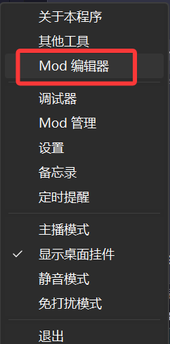
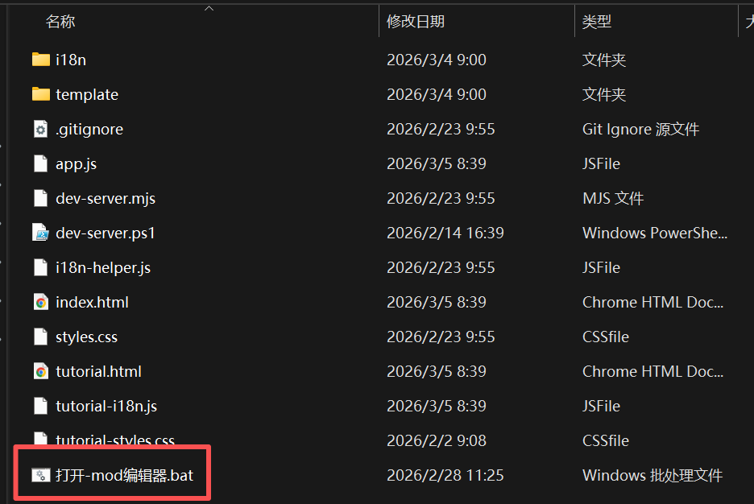
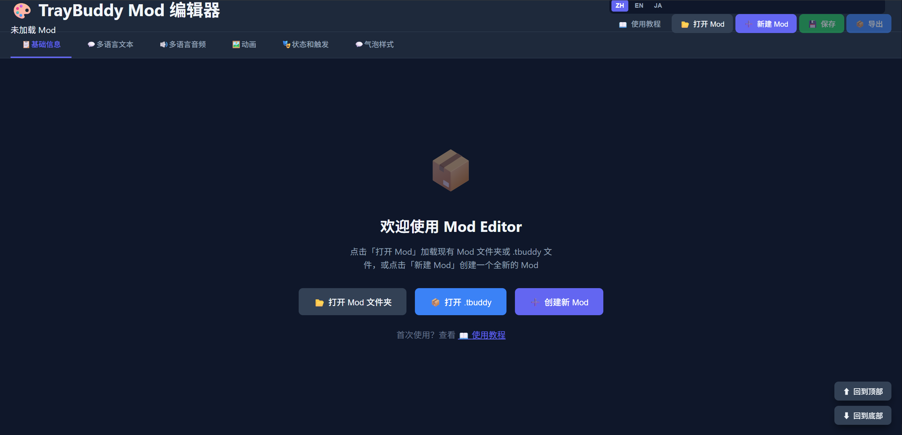
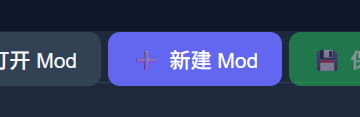
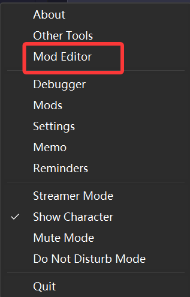
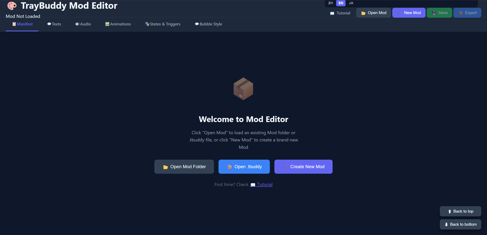
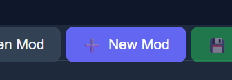
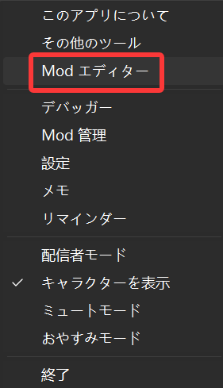
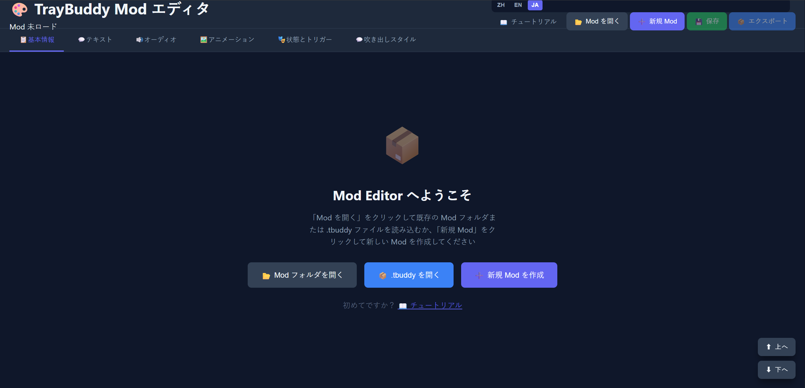
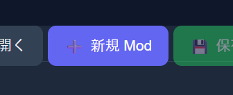

  

  <a href="#简体中文">简体中文</a> ｜ <a href="#English">English</a> ｜ <a href="#日本語">日本語</a>

 

<!-- ======================================================= -->
<!-- 简体中文-->
<!-- ======================================================= -->

<h1 align="center">如何新建Mod</h1>

> [!WARNING] 
> 本项目仍处于早期阶段，如果您有任何疑问，欢迎联系我们 
> 联系我们：QQ群：<a href="mod-tool/imgs/QQ群.jpg" target="_blank" rel="noopener noreferrer">578258773</a>   Bilibili: <a href="https://b23.tv/ZKVKHH0" target="_blank" rel="noopener noreferrer">_Cafel_</a>

 

## 打开Mod编辑器

在安装并打开程序后，您可以右键托盘图标或人物挂件以打开右键菜单，之后选择 **Mod编辑器**，

 

系统会打开一个文件夹，请直接双击 **打开-mod编辑器.bat**

 

您的Web浏览器会启动一个新的窗口，这就是我们的Mod编辑器

 

## 新建Mod

在打开Mod编辑器后，您可以点击右上角的 **新建Mod** 按钮

 

之后，请在弹出的窗口内填写基本信息，并根据您的动画类型选择对应的Mod类型，最后点击 **创建**

 

创建完成后，请注意此时Mod还并没有在本地创建任何文件，因此推荐您首先点击右上角的 **保存** 并选择一个文件夹

 

> [!TIP] 
> 我们推荐您将Mod保存目录设置为 **程序安装目录内的mods文件夹**  
> 这样启动程序时可以直接加载您的新Mod而无需任何额外操作

 

等待系统右下角出现 **保存成功** 的提示之后，相关的文件就被保存到了目标文件夹中

 

您现在可以开始正式创作您的Mod了

 

下一步：
<a href="Sequence.md" target="_blank" rel="noopener noreferrer">序列帧</a>&nbsp;&nbsp;&nbsp;
<a href="live2d.md" target="_blank" rel="noopener noreferrer">live2d</a>&nbsp;&nbsp;&nbsp;
<a href="pngremix.md" target="_blank" rel="noopener noreferrer">pngremix</a>&nbsp;&nbsp;&nbsp;
<a href="" target="_blank" rel="noopener noreferrer">3d</a>&nbsp;&nbsp;&nbsp;

 

<a href="#top">⬆ 返回顶部</a>

<!-- ======================================================= -->
<!-- English-->
<!-- ======================================================= -->

<h1 align="center">How to Create a New Mod</h1>

> [!WARNING] 
> This project is still in its early stages. If you have any questions, feel free to contact us 
> Contact us: QQ Group: <a href="mod-tool/imgs/QQ群.jpg" target="_blank" rel="noopener noreferrer">578258773</a>   Bilibili: <a href="https://b23.tv/ZKVKHH0" target="_blank" rel="noopener noreferrer">_Cafel_</a>

 

## Open the Mod Editor

After installing and opening the application, you can right-click the tray icon or the character widget to open the context menu, then select **Mod Editor**

 

A folder will open. Simply double-click **打开-mod编辑器.bat**

 

Your web browser will launch a new window — this is our Mod Editor

 

## Create a New Mod

After opening the Mod Editor, you can click the **New Mod** button in the top-right corner

 

Next, fill in the basic information in the popup window, select the corresponding Mod type based on your animation type, and click **Create**

 

After creation, please note that no files have been created locally yet. It is recommended to click **Save** in the top-right corner first and choose a folder

 

> [!TIP] 
> We recommend saving your Mod to the **mods folder within the application installation directory** 
> This way, the program can directly load your new Mod on startup without any extra steps

 

Once the **Save Successful** notification appears in the bottom-right corner of the system, the related files have been saved to the target folder

 

You can now start creating your Mod

 

Next step:
<a href="Sequence.md" target="_blank" rel="noopener noreferrer">Sequence</a>&nbsp;&nbsp;&nbsp;
<a href="live2d.md" target="_blank" rel="noopener noreferrer">live2d</a>&nbsp;&nbsp;&nbsp;
<a href="pngremix.md" target="_blank" rel="noopener noreferrer">pngremix</a>&nbsp;&nbsp;&nbsp;
<a href="" target="_blank" rel="noopener noreferrer">3d</a>&nbsp;&nbsp;&nbsp;

 

<a href="#top">⬆ Back to Top</a>

<!-- ======================================================= -->
<!-- 日本語-->
<!-- ======================================================= -->

<h1 align="center">新しいModの作成方法</h1>

> [!WARNING] 
> 本プロジェクトはまだ初期段階です。ご不明な点がございましたら、お気軽にお問い合わせください 
> お問い合わせ：QQ群：<a href="mod-tool/imgs/QQ群.jpg" target="_blank" rel="noopener noreferrer">578258773</a>   Bilibili: <a href="https://b23.tv/ZKVKHH0" target="_blank" rel="noopener noreferrer">_Cafel_</a>

 

## Modエディターを開く

アプリケーションをインストールして起動した後、トレイアイコンまたはキャラクターウィジェットを右クリックしてコンテキストメニューを開き、**Modエディター** を選択してください

 

フォルダーが開きます。**打开-mod编辑器.bat** をダブルクリックしてください

 

Webブラウザで新しいウィンドウが起動します。これがModエディターです

 

## 新しいModを作成する

Modエディターを開いた後、右上の **新規Mod** ボタンをクリックしてください

 

ポップアップウィンドウで基本情報を入力し、アニメーションタイプに応じたModタイプを選択して、**作成** をクリックしてください

 

作成完了後、まだローカルにファイルが作成されていないことにご注意ください。まず右上の **保存** をクリックしてフォルダーを選択することをお勧めします

 

> [!TIP] 
> Modの保存先を **アプリケーションインストールディレクトリ内のmodsフォルダー** に設定することをお勧めします 
> こうすることで、プログラム起動時に追加操作なしで新しいModを直接ロードできます

 

システムの右下に **保存成功** の通知が表示されたら、関連ファイルが対象フォルダーに保存されています

 

これでModの制作を開始できます

 

次のステップ：
<a href="Sequence.md" target="_blank" rel="noopener noreferrer">シーケンスフレーム</a>&nbsp;&nbsp;&nbsp;
<a href="live2d.md" target="_blank" rel="noopener noreferrer">live2d</a>&nbsp;&nbsp;&nbsp;
<a href="pngremix.md" target="_blank" rel="noopener noreferrer">pngremix</a>&nbsp;&nbsp;&nbsp;
<a href="" target="_blank" rel="noopener noreferrer">3d</a>&nbsp;&nbsp;&nbsp;

 

<a href="#top">⬆ トップに戻る</a>

