

  

  <a href="#简体中文">简体中文</a> ｜ <a href="#English">English</a> ｜ <a href="#日本語">日本語</a>

 

<!-- ======================================================= -->
<!-- 简体中文-->
<!-- ======================================================= -->

<h1 align="center">如何快速创建序列帧Mod</h1>

> [!WARNING] 
> 本项目仍处于早期阶段，如果您有任何疑问，欢迎联系我们 
> 联系我们：QQ群：<a href="docs/imgs/QQ群.jpg" target="_blank" rel="noopener noreferrer">578258773</a>   Bilibili: <a href="https://b23.tv/ZKVKHH0" target="_blank" rel="noopener noreferrer">_Cafel_</a>

 

## 处理动画

在安装并打开程序后，您可以右键托盘图标或人物挂件以打开右键菜单，之后选择 **其他工具**，

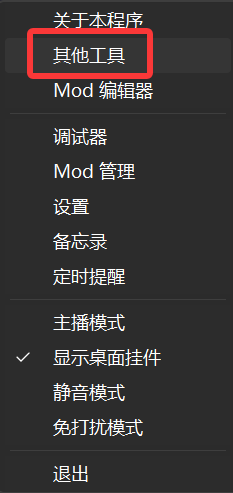

 

系统会打开一个文件夹，这里陈列了TrayBuddy提供的工具链

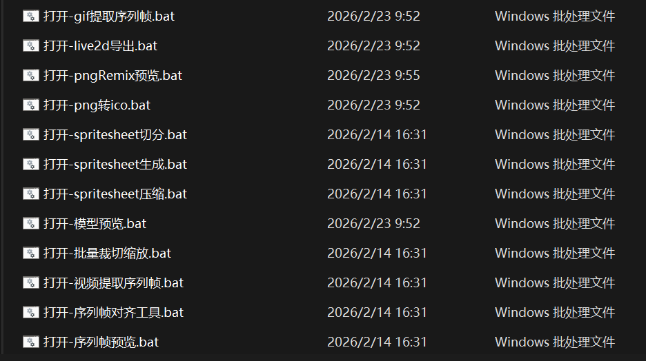

 

不论您的原始素材是 **GIF/视频/一组差分png**，您都可以使用工具链中的工具来将他们转换为SpriteSheet

| 工具 | 功能 |
|------|------|
| GIF 提取序列帧 | 从 GIF 动图提取帧序列 |
| 视频提取序列帧 | 从视频文件提取帧序列 |
| Spritesheet 生成 | 将差分图组合并为精灵图 |
| Spritesheet 切分 | 将精灵图拆分为单帧 |
| Spritesheet 压缩 | 精灵图体积优化 |
| 序列帧预览 | 预览 差分图组/Spritesheet 动画效果 |
| 序列帧对齐工具 | 帧对齐和偏移调整 |
| 批量裁切缩放 | 批量图片处理 |

 

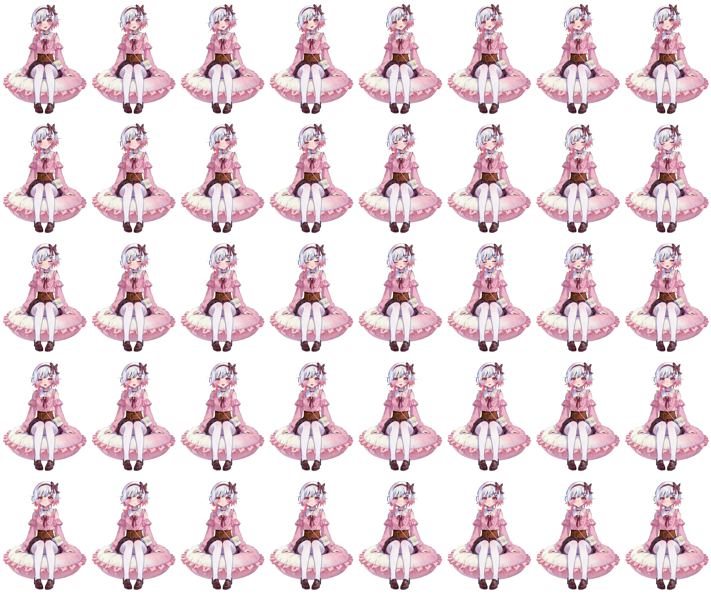

 

## 添加动画

当您拥有了第一个Spritesheet后，回到Mod编辑器，选择 **动画** 界面

 

请在 **序列帧动画 (sequence.json)** 右边点击 **导入** 按钮

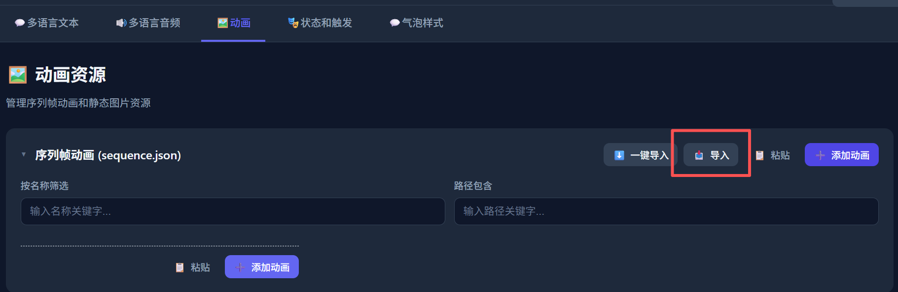

 

选择您刚才的SpriteSheet后，编辑器会导入并生成一个新的动画，此时点击 **编辑** 按钮

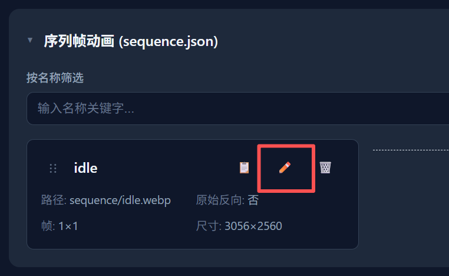

 

请根据您的SpriteSheet，填写 **横向帧数和纵向帧数**，如果您的填写无误，帧宽度和帧高度会自动计算出来，确认无误后，点击 **保存**

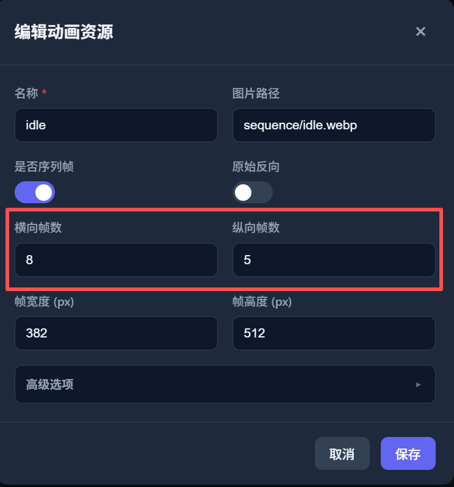

 

## 添加状态

当您拥有了第一个动画后，选择 **状态和触发** 界面

 

展开 **核心状态** 分类标签，点击 **idle** 状态的 **编辑** 按钮

 

在打开的窗口内，找到 **关联动画** 下拉菜单，选择您刚才的动画，并点击保存

 

至此您就完成了一个最简单的序列帧Mod的创建，不要忘记点击 **保存** 将修改保存到您的文件夹

 

之后如果您的Mod保存在 **程序安装目录内的mods文件夹**，您可以直接启动程序调试您的Mod

 

下一步：
<a href="states_triggers.md" target="_blank" rel="noopener noreferrer">状态和触发</a>&nbsp;&nbsp;&nbsp;

 

<a href="#top">⬆ 返回顶部</a>

<!-- ======================================================= -->
<!-- English-->
<!-- ======================================================= -->

<h1 align="center">How to Quickly Create a Sequence Frame Mod</h1>

> [!WARNING] 
> This project is still in its early stages. If you have any questions, feel free to contact us 
> Contact us: QQ Group: <a href="docs/imgs/QQ群.jpg" target="_blank" rel="noopener noreferrer">578258773</a>   Bilibili: <a href="https://b23.tv/ZKVKHH0" target="_blank" rel="noopener noreferrer">_Cafel_</a>

 

## Process Animations

After installing and opening the application, you can right-click the tray icon or the character widget to open the context menu, then select **Other Tools**

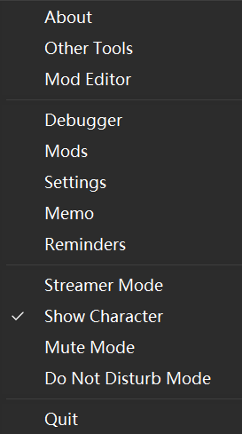

 

A folder will open, displaying the toolchain provided by TrayBuddy

 

Regardless of whether your original assets are **GIF / video / a set of differential PNGs**, you can use the tools in the toolchain to convert them into a SpriteSheet

| Tool | Function |
|------|----------|
| GIF Extract Frames | Extract frame sequences from GIF animations |
| Video Extract Frames | Extract frame sequences from video files |
| Spritesheet Generate | Merge differential images into a sprite sheet |
| Spritesheet Split | Split a sprite sheet into individual frames |
| Spritesheet Compress | Optimize sprite sheet file size |
| Sequence Frame Preview | Preview differential images / SpriteSheet animation effects |
| Sequence Frame Alignment Tool | Frame alignment and offset adjustment |
| Batch Crop & Resize | Batch image processing |

 

 

## Add Animation

Once you have your first SpriteSheet, go back to the Mod Editor and select the **Animation** tab

 

Click the **Import** button to the right of **Sequence Frame Animation (sequence.json)**

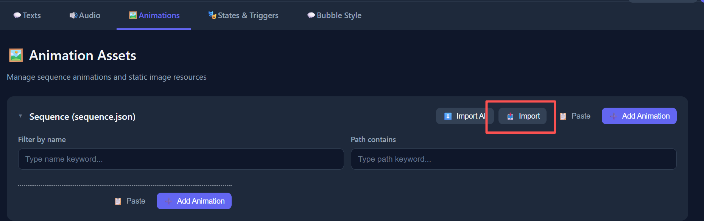

 

After selecting your SpriteSheet, the editor will import and generate a new animation. Then click the **Edit** button

 

Based on your SpriteSheet, fill in the **horizontal frame count and vertical frame count**. If your input is correct, the frame width and frame height will be calculated automatically. After confirming, click **Save**

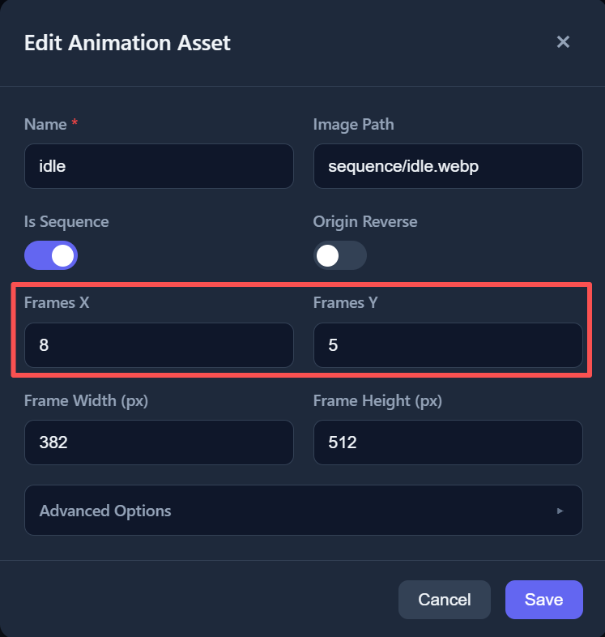

 

## Add State

Once you have your first animation, select the **States and Triggers** tab

 

Expand the **Core States** category, and click the **Edit** button for the **idle** state

 

In the opened window, find the **Associated Animation** dropdown menu, select your animation, and click Save

 

You have now completed the creation of a basic sequence frame Mod. Don't forget to click **Save** to save your changes to your folder

 

After that, if your Mod is saved in the **mods folder within the application installation directory**, you can directly launch the application to debug your Mod

 

Next step:
<a href="states_triggers.md" target="_blank" rel="noopener noreferrer">States and Triggers</a>&nbsp;&nbsp;&nbsp;

 

<a href="#top">⬆ Back to Top</a>

<!-- ======================================================= -->
<!-- 日本語-->
<!-- ======================================================= -->

<h1 align="center">シーケンスフレームModの簡単な作成方法</h1>

> [!WARNING] 
> 本プロジェクトはまだ初期段階です。ご不明な点がございましたら、お気軽にお問い合わせください 
> お問い合わせ：QQ群：<a href="docs/imgs/QQ群.jpg" target="_blank" rel="noopener noreferrer">578258773</a>   Bilibili: <a href="https://b23.tv/ZKVKHH0" target="_blank" rel="noopener noreferrer">_Cafel_</a>

 

## アニメーションの処理

アプリケーションをインストールして起動した後、トレイアイコンまたはキャラクターウィジェットを右クリックしてコンテキストメニューを開き、**その他のツール** を選択してください

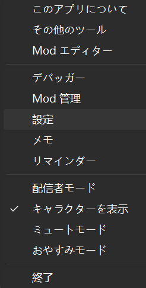

 

フォルダーが開き、TrayBuddyが提供するツールチェーンが表示されます

 

元の素材が **GIF / 動画 / 差分PNGセット** のいずれであっても、ツールチェーン内のツールを使用してSpriteSheetに変換できます

| ツール | 機能 |
|--------|------|
| GIF フレーム抽出 | GIFアニメーションからフレームシーケンスを抽出 |
| 動画フレーム抽出 | 動画ファイルからフレームシーケンスを抽出 |
| Spritesheet 生成 | 差分画像をスプライトシートに結合 |
| Spritesheet 分割 | スプライトシートを個別フレームに分割 |
| Spritesheet 圧縮 | スプライトシートのファイルサイズ最適化 |
| シーケンスフレームプレビュー | 差分画像 / SpriteSheet のアニメーション効果をプレビュー |
| シーケンスフレーム位置合わせツール | フレームの位置合わせとオフセット調整 |
| 一括トリミング＆リサイズ | 一括画像処理 |

 

 

## アニメーションの追加

最初のSpriteSheetが準備できたら、Modエディターに戻り、**アニメーション** タブを選択してください

 

**シーケンスフレームアニメーション (sequence.json)** の右側にある **インポート** ボタンをクリックしてください

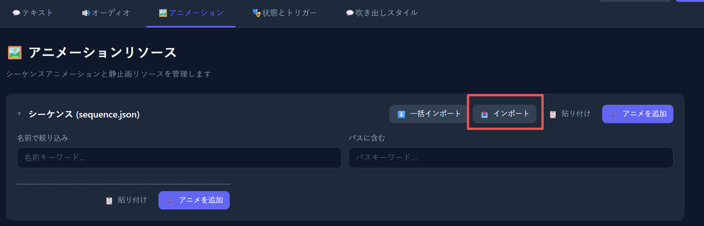

 

SpriteSheetを選択すると、エディターがインポートして新しいアニメーションを生成します。次に **編集** ボタンをクリックしてください

 

SpriteSheetに基づいて、**横方向のフレーム数と縦方向のフレーム数** を入力してください。入力が正しければ、フレーム幅とフレーム高さが自動的に計算されます。確認後、**保存** をクリックしてください

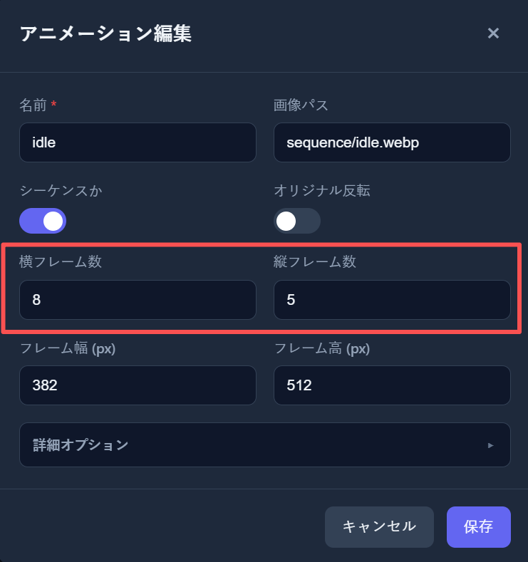

 

## ステートの追加

最初のアニメーションが準備できたら、**ステートとトリガー** タブを選択してください

 

**コアステート** カテゴリを展開し、**idle** ステートの **編集** ボタンをクリックしてください

 

開いたウィンドウで、**関連アニメーション** ドロップダウンメニューを見つけ、先ほどのアニメーションを選択して、保存をクリックしてください

 

これで最も基本的なシーケンスフレームModの作成が完了です。**保存** をクリックして変更をフォルダーに保存することをお忘れなく

 

その後、Modが **アプリケーションインストールディレクトリ内のmodsフォルダー** に保存されている場合、直接アプリケーションを起動してModをデバッグできます

 

次のステップ：
<a href="states_triggers.md" target="_blank" rel="noopener noreferrer">ステートとトリガー</a>&nbsp;&nbsp;&nbsp;

 

<a href="#top">⬆ トップに戻る</a>

