

  

  <a href="#简体中文">简体中文</a> ｜ <a href="#English">English</a> ｜ <a href="#日本語">日本語</a>

 

<!-- ======================================================= -->
<!-- 简体中文-->
<!-- ======================================================= -->

<h1 align="center">如何快速创建live2d Mod</h1>

> [!WARNING] 
> 本项目仍处于早期阶段，如果您有任何疑问，欢迎联系我们 
> 联系我们：QQ群：<a href="docs/imgs/QQ群.jpg" target="_blank" rel="noopener noreferrer">578258773</a>   Bilibili: <a href="https://b23.tv/ZKVKHH0" target="_blank" rel="noopener noreferrer">_Cafel_</a>

 

## 导入资产

进入Mod编辑器，选择 **动画** 界面

 

请在顶部按钮中点击 **导入文件夹** 按钮，选择live2d文件，**保证model3.json直接处于该目录下**，并等待右下角出现导入成功的提示

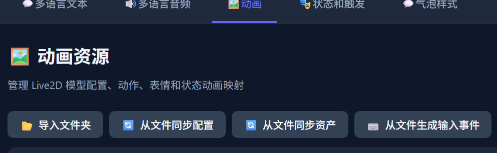

 

请在顶部按钮中点击 **从文件同步配置** 按钮，并检查 **模型配置 (live2d.json - model)** 分类签下的内容是否正确，如不正确，请自行补充

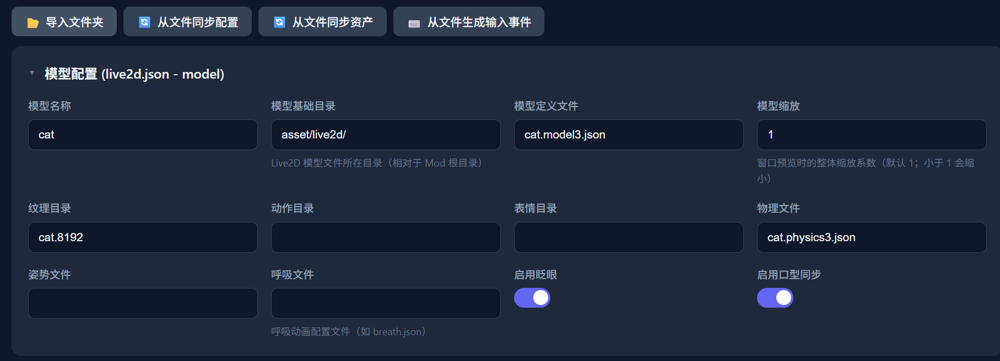

 

请在顶部按钮中点击 **从文件同步资产** 按钮，并检查 **表情列表 (expressions) / 动作列表 (motions) / 背景/叠加图层 (background_layers) / 状态-动画映射 (states)** 分类签下的内容是否正确

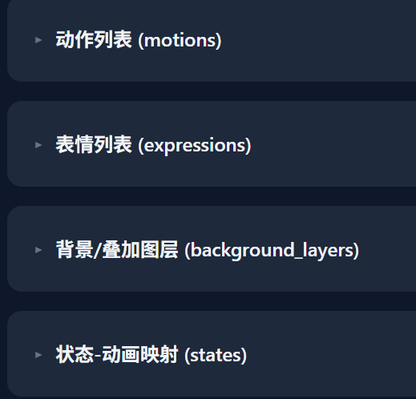

 

您也可以自己编辑状态映射，根据您的需求删除多余状态，或将动作和表情映射到同一个状态内

 

请在顶部按钮中点击 **从文件生成输入事件** 按钮，以根据live2d内配置的参数生成输入事件

 

如果您的live2d是BongoCat，则配置到此结束了，请继续下一步：
<a href="states_triggers.md" target="_blank" rel="noopener noreferrer">状态和触发</a> 
如果不是，请继续查看后续内容

 

## 添加状态

当 **状态-动画映射 (states)** 分类标签下的内容正确后，您可以点击每一项的 **新增同名状态** 按钮来新增对应状态 
不过当前教程中我们只创建了一个 **idle** 状态，其他状态的处理请见以后的教程

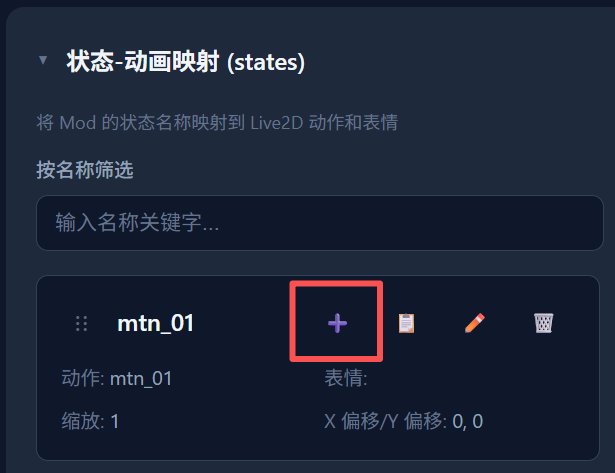

 

全部映射完成后，选择 **状态和触发** 界面

 

展开 **核心状态** 分类标签，点击 **idle** 状态的 **编辑** 按钮

 

在打开的窗口内，找到 **关联动画** 下拉菜单，选择您刚才的动画，并点击保存

 

至此您就完成了一个最简单的live2d Mod的创建，不要忘记点击 **保存** 将修改保存到您的文件夹

 

之后如果您的Mod保存在 **程序安装目录内的mods文件夹**，您可以直接启动程序调试您的Mod

 

下一步：
<a href="states_triggers.md" target="_blank" rel="noopener noreferrer">状态和触发</a>&nbsp;&nbsp;&nbsp;

 

<a href="#top">⬆ 返回顶部</a>

<!-- ======================================================= -->
<!-- English-->
<!-- ======================================================= -->

<h1 align="center">How to Quickly Create a live2d Mod</h1>

> [!WARNING] 
> This project is still in its early stages. If you have any questions, feel free to contact us 
> Contact us: QQ Group: <a href="docs/imgs/QQ群.jpg" target="_blank" rel="noopener noreferrer">578258773</a>   Bilibili: <a href="https://b23.tv/ZKVKHH0" target="_blank" rel="noopener noreferrer">_Cafel_</a>

 

## Import Assets

Open the Mod Editor and select the **Animation** tab

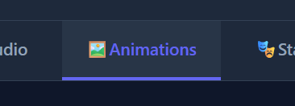

 

Click the **Import Folder** button in the top toolbar, select your live2d files, **make sure model3.json is directly under that directory**, and wait for the import success notification to appear in the bottom-right corner

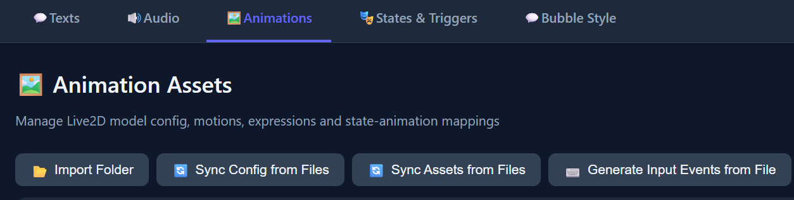

 

Click the **Sync Config from File** button in the top toolbar, and check whether the content under **Model Config (live2d.json - model)** is correct. If not, please fill it in manually

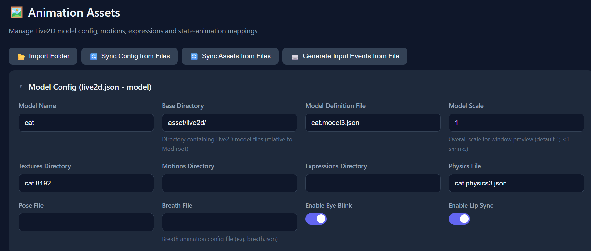

 

Click the **Sync Assets from File** button in the top toolbar, and check whether the content under **Expressions List (expressions) / Motions List (motions) / Background/Overlay Layers (background_layers) / State-Animation Mapping (states)** is correct

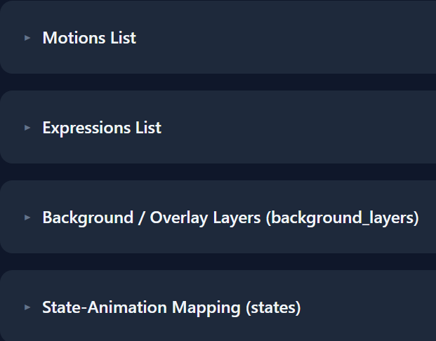

 

Of course, you can also edit the state mapping yourself — remove unnecessary states or map motions and expressions into the same state as needed

 

Click the **Generate Input Events from File** button in the top toolbar to generate input events based on the parameters configured in the live2d file

 

If your live2d is BongoCat, the configuration ends here. Please proceed to the next step:
<a href="states_triggers.md" target="_blank" rel="noopener noreferrer">States and Triggers</a> 
If not, please continue reading the following content

 

## Add States

Once the content under **State-Animation Mapping (states)** is correct, you can click the **Add State with Same Name** button for each item to create the corresponding state 
However, in this tutorial we only create an **idle** state. Handling other states will be covered in future tutorials

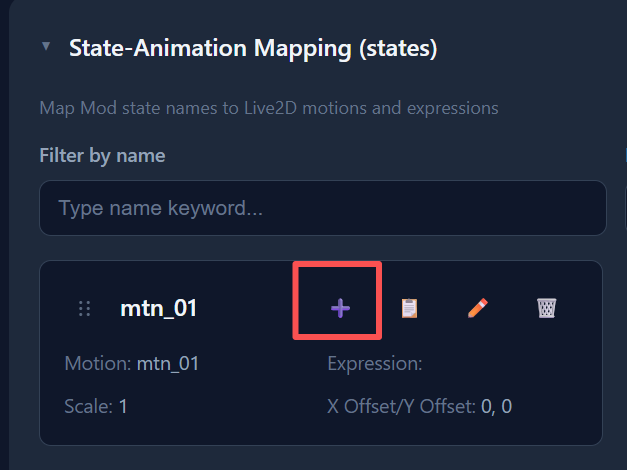

 

After all mappings are complete, select the **States and Triggers** tab

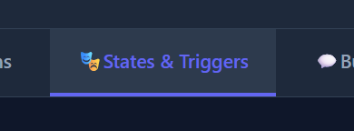

 

Expand the **Core States** category, and click the **Edit** button for the **idle** state

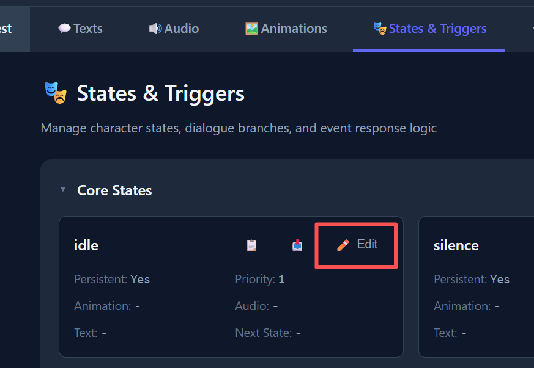

 

In the opened window, find the **Associated Animation** dropdown menu, select your animation, and click Save

 

You have now completed the creation of a basic live2d Mod. Don't forget to click **Save** to save your changes to your folder

 

After that, if your Mod is saved in the **mods folder within the application installation directory**, you can directly launch the application to debug your Mod

 

Next step:
<a href="states_triggers.md" target="_blank" rel="noopener noreferrer">States and Triggers</a>&nbsp;&nbsp;&nbsp;

 

<a href="#top">⬆ Back to Top</a>

<!-- ======================================================= -->
<!-- 日本語-->
<!-- ======================================================= -->

<h1 align="center">live2d Modの簡単な作成方法</h1>

> [!WARNING] 
> 本プロジェクトはまだ初期段階です。ご不明な点がございましたら、お気軽にお問い合わせください 
> お問い合わせ：QQ群：<a href="docs/imgs/QQ群.jpg" target="_blank" rel="noopener noreferrer">578258773</a>   Bilibili: <a href="https://b23.tv/ZKVKHH0" target="_blank" rel="noopener noreferrer">_Cafel_</a>

 

## アセットのインポート

Modエディターを開き、**アニメーション** タブを選択してください

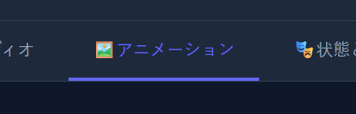

 

上部ツールバーの **フォルダーをインポート** ボタンをクリックし、live2dファイルを選択してください。**model3.jsonがそのディレクトリ直下にあることを確認してください**。右下にインポート成功の通知が表示されるまでお待ちください

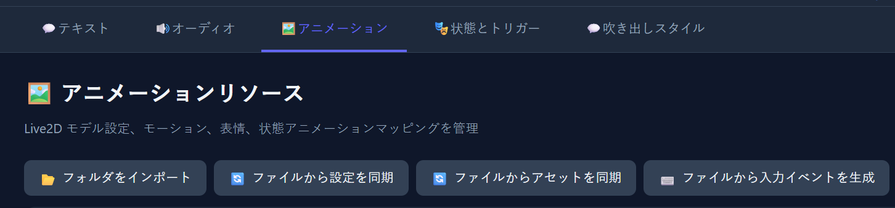

 

上部ツールバーの **ファイルから設定を同期** ボタンをクリックし、**モデル設定 (live2d.json - model)** カテゴリの内容が正しいか確認してください。正しくない場合は手動で補完してください

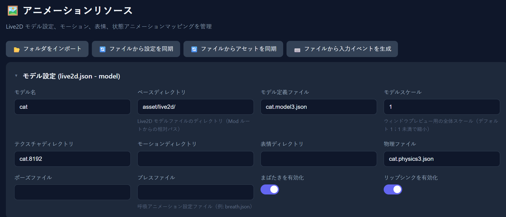

 

上部ツールバーの **ファイルからアセットを同期** ボタンをクリックし、**表情リスト (expressions) / モーションリスト (motions) / 背景/オーバーレイレイヤー (background_layers) / ステート-アニメーションマッピング (states)** カテゴリの内容が正しいか確認してください

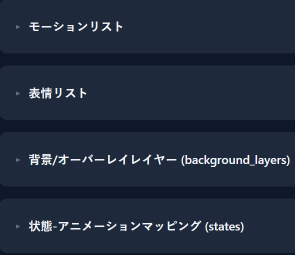

 

もちろん、ステートマッピングを自分で編集することもできます。必要に応じて不要なステートを削除したり、モーションと表情を同じステートにマッピングしたりできます

 

上部ツールバーの **ファイルから入力イベントを生成** ボタンをクリックし、live2dファイル内に設定されたパラメータに基づいて入力イベントを生成してください

 

お使いのlive2dがBongoCatの場合、設定はここで終了です。次のステップに進んでください：
<a href="states_triggers.md" target="_blank" rel="noopener noreferrer">ステートとトリガー</a> 
そうでない場合は、以下の内容を引き続きご覧ください

 

## ステートの追加

**ステート-アニメーションマッピング (states)** カテゴリの内容が正しければ、各項目の **同名ステートを追加** ボタンをクリックして対応するステートを作成できます 
ただし、このチュートリアルでは **idle** ステートのみを作成します。他のステートの処理は今後のチュートリアルで説明します

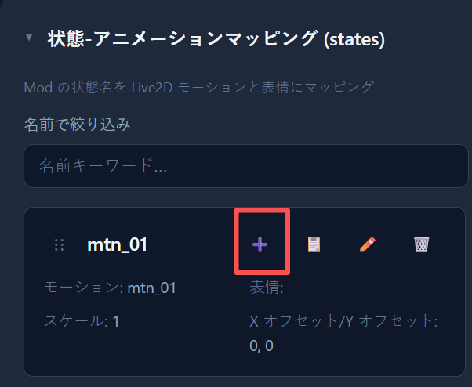

 

すべてのマッピングが完了したら、**ステートとトリガー** タブを選択してください

 

**コアステート** カテゴリを展開し、**idle** ステートの **編集** ボタンをクリックしてください

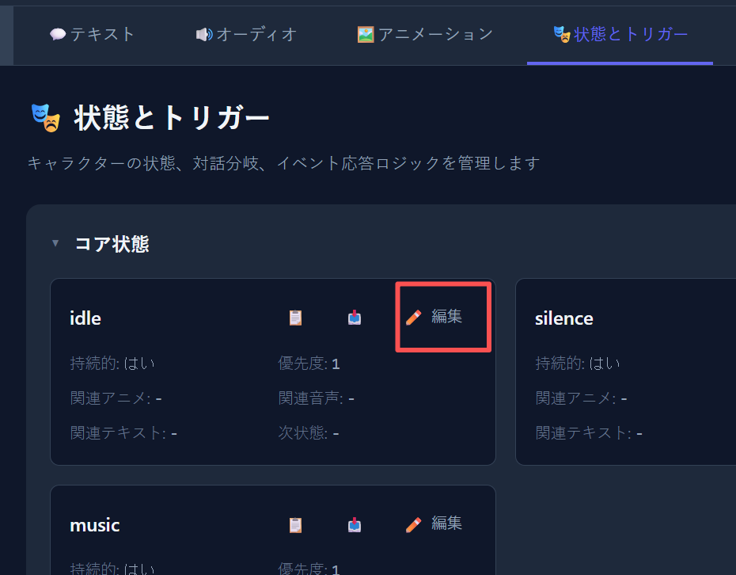

 

開いたウィンドウで、**関連アニメーション** ドロップダウンメニューを見つけ、先ほどのアニメーションを選択して、保存をクリックしてください

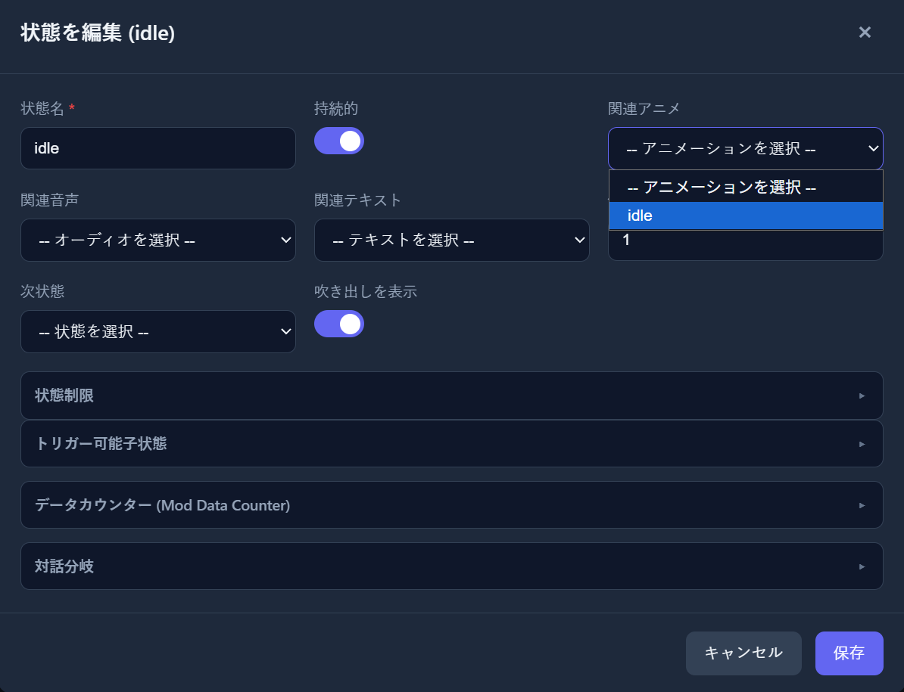

 

これで最も基本的なlive2d Modの作成が完了です。**保存** をクリックして変更をフォルダーに保存することをお忘れなく

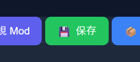

 

その後、Modが **アプリケーションインストールディレクトリ内のmodsフォルダー** に保存されている場合、直接アプリケーションを起動してModをデバッグできます

 

次のステップ：
<a href="states_triggers.md" target="_blank" rel="noopener noreferrer">ステートとトリガー</a>&nbsp;&nbsp;&nbsp;

 

<a href="#top">⬆ トップに戻る</a>

