

  

  <a href="#简体中文">简体中文</a> ｜ <a href="#English">English</a> ｜ <a href="#日本語">日本語</a>

 

<!-- ======================================================= -->
<!-- 简体中文-->
<!-- ======================================================= -->

<h1 align="center">如何快速创建pngremix Mod</h1>

> [!WARNING] 
> 本项目仍处于早期阶段，如果您有任何疑问，欢迎联系我们 
> 联系我们：QQ群：<a href="mod-tool/imgs/QQ群.jpg" target="_blank" rel="noopener noreferrer">578258773</a>   Bilibili: <a href="https://b23.tv/ZKVKHH0" target="_blank" rel="noopener noreferrer">_Cafel_</a>

 

## 导入资产

进入Mod编辑器，选择 **动画** 界面

 

请在顶部按钮中点击 **导入文件** 按钮，选择pngremix文件，并等待右下角出现导入成功的提示

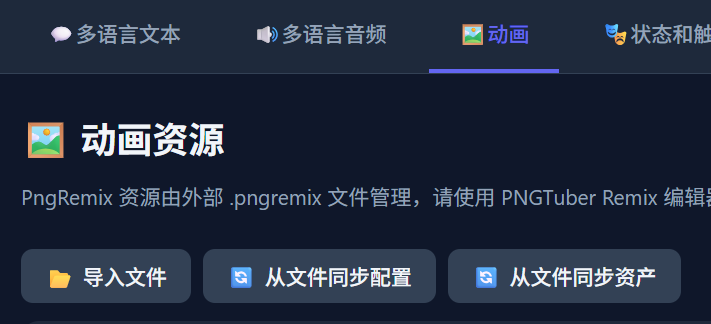

 

请在顶部按钮中点击 **从文件同步配置** 按钮，并检查 **模型配置 (pngremix.json - model)** 分类签下的内容是否正确，如不正确，请自行补充

 

请在顶部按钮中点击 **从文件同步资产** 按钮，并检查 **表情列表 (expressions) / 动作列表 (motions) / 状态映射 (states)** 分类签下的内容是否正确

 

当然您也可以自己编辑状态映射，根据您的需求删除多余状态，或将动作和表情映射到同一个状态内

 

## 添加状态

当 **状态映射 (states)** 分类标签下的内容正确后，您可以点击每一项的 **新增同名状态** 按钮来新增对应状态 
不过当前教程中我们只创建了一个 **idle** 状态，其他状态的处理请见以后的教程

 

全部映射完成后，选择 **状态和触发** 界面

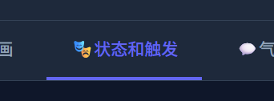

 

展开 **核心状态** 分类标签，点击 **idle** 状态的 **编辑** 按钮

 

在打开的窗口内，找到 **关联动画** 下拉菜单，选择您刚才的动画，并点击保存

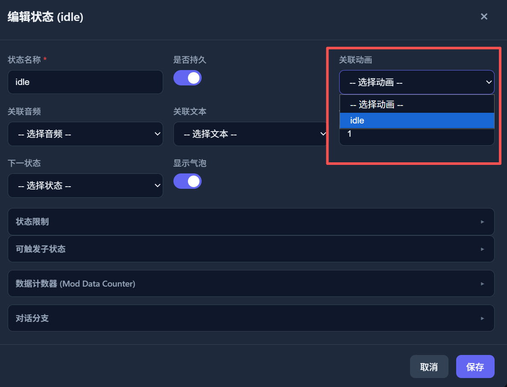

 

至此您就完成了一个最简单的pngremix Mod的创建，不要忘记点击 **保存** 将修改保存到您的文件夹

 

之后如果您的Mod保存在 **程序安装目录内的mods文件夹**，您可以直接启动程序调试您的Mod

 

下一步：
<a href="states_triggers.md" target="_blank" rel="noopener noreferrer">状态和触发</a>&nbsp;&nbsp;&nbsp;

 

<a href="#top">⬆ 返回顶部</a>

<!-- ======================================================= -->
<!-- English-->
<!-- ======================================================= -->

<h1 align="center">How to Quickly Create a PngRemix Mod</h1>

> [!WARNING] 
> This project is still in its early stages. If you have any questions, feel free to contact us 
> Contact us: QQ Group: <a href="mod-tool/imgs/QQ群.jpg" target="_blank" rel="noopener noreferrer">578258773</a>   Bilibili: <a href="https://b23.tv/ZKVKHH0" target="_blank" rel="noopener noreferrer">_Cafel_</a>

 

## Import Assets

Open the Mod Editor and select the **Animation** tab

 

Click the **Import File** button in the top toolbar, select your pngremix file, and wait for the import success notification to appear in the bottom-right corner

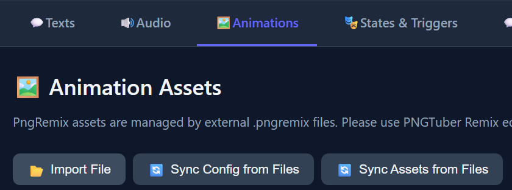

 

Click the **Sync Config from File** button in the top toolbar, and check whether the content under **Model Config (pngremix.json - model)** is correct. If not, please fill it in manually

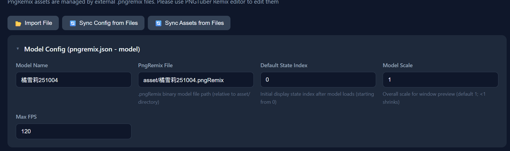

 

Click the **Sync Assets from File** button in the top toolbar, and check whether the content under **Expressions List (expressions) / Motions List (motions) / State Mapping (states)** is correct

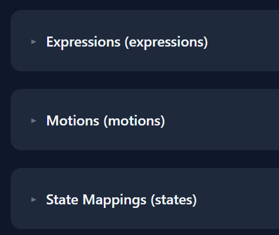

 

Of course, you can also edit the state mapping yourself — remove unnecessary states or map motions and expressions into the same state as needed

 

## Add States

Once the content under **State Mapping (states)** is correct, you can click the **Add State with Same Name** button for each item to create the corresponding state 
However, in this tutorial we only create an **idle** state. Handling other states will be covered in future tutorials

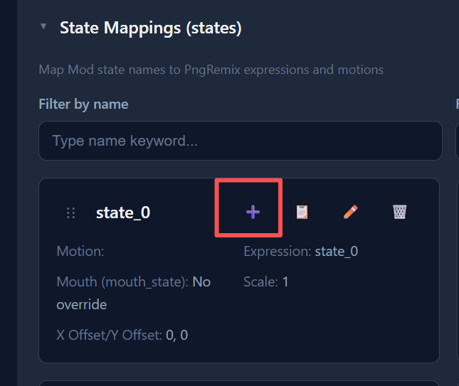

 

After all mappings are complete, select the **States and Triggers** tab

 

Expand the **Core States** category, and click the **Edit** button for the **idle** state

 

In the opened window, find the **Associated Animation** dropdown menu, select your animation, and click Save

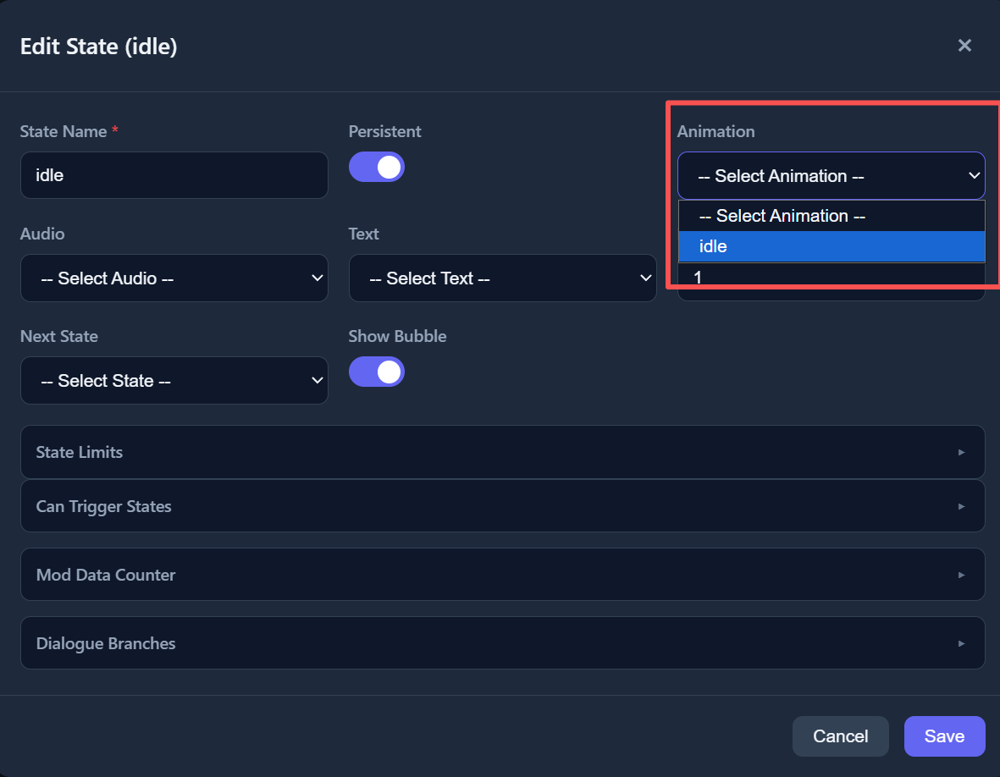

 

You have now completed the creation of a basic PngRemix Mod. Don't forget to click **Save** to save your changes to your folder

 

After that, if your Mod is saved in the **mods folder within the application installation directory**, you can directly launch the application to debug your Mod

 

Next step:
<a href="states_triggers.md" target="_blank" rel="noopener noreferrer">States and Triggers</a>&nbsp;&nbsp;&nbsp;

 

<a href="#top">⬆ Back to Top</a>

<!-- ======================================================= -->
<!-- 日本語-->
<!-- ======================================================= -->

<h1 align="center">PngRemix Modの簡単な作成方法</h1>

> [!WARNING] 
> 本プロジェクトはまだ初期段階です。ご不明な点がございましたら、お気軽にお問い合わせください 
> お問い合わせ：QQ群：<a href="mod-tool/imgs/QQ群.jpg" target="_blank" rel="noopener noreferrer">578258773</a>   Bilibili: <a href="https://b23.tv/ZKVKHH0" target="_blank" rel="noopener noreferrer">_Cafel_</a>

 

## アセットのインポート

Modエディターを開き、**アニメーション** タブを選択してください

 

上部ツールバーの **ファイルをインポート** ボタンをクリックし、pngremixファイルを選択して、右下にインポート成功の通知が表示されるまでお待ちください

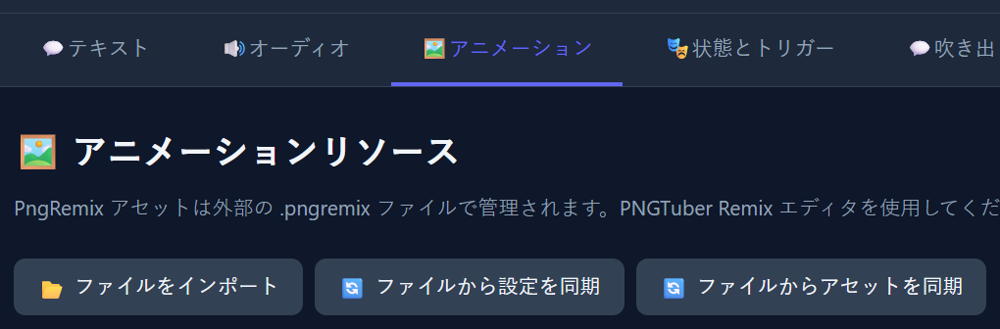

 

上部ツールバーの **ファイルから設定を同期** ボタンをクリックし、**モデル設定 (pngremix.json - model)** カテゴリの内容が正しいか確認してください。正しくない場合は手動で補完してください

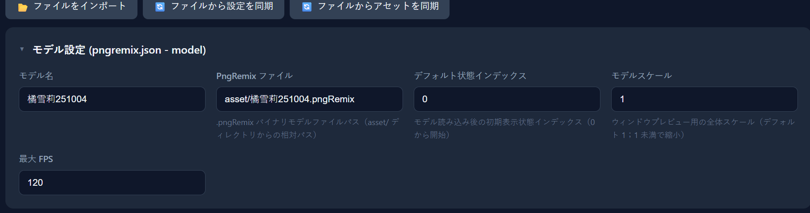

 

上部ツールバーの **ファイルからアセットを同期** ボタンをクリックし、**表情リスト (expressions) / モーションリスト (motions) / ステートマッピング (states)** カテゴリの内容が正しいか確認してください

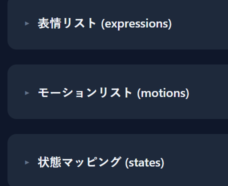

 

もちろん、ステートマッピングを自分で編集することもできます。必要に応じて不要なステートを削除したり、モーションと表情を同じステートにマッピングしたりできます

 

## ステートの追加

**ステートマッピング (states)** カテゴリの内容が正しければ、各項目の **同名ステートを追加** ボタンをクリックして対応するステートを作成できます 
ただし、このチュートリアルでは **idle** ステートのみを作成します。他のステートの処理は今後のチュートリアルで説明します

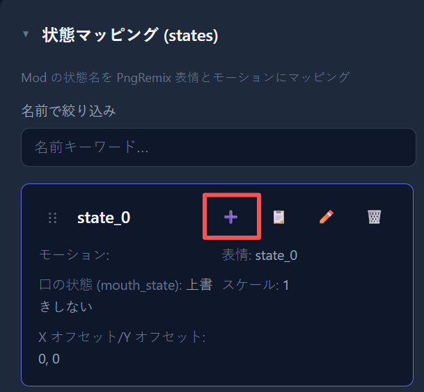

 

すべてのマッピングが完了したら、**ステートとトリガー** タブを選択してください

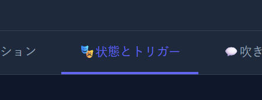

 

**コアステート** カテゴリを展開し、**idle** ステートの **編集** ボタンをクリックしてください

 

開いたウィンドウで、**関連アニメーション** ドロップダウンメニューを見つけ、先ほどのアニメーションを選択して、保存をクリックしてください

 

これで最も基本的なPngRemix Modの作成が完了です。**保存** をクリックして変更をフォルダーに保存することをお忘れなく

 

その後、Modが **アプリケーションインストールディレクトリ内のmodsフォルダー** に保存されている場合、直接アプリケーションを起動してModをデバッグできます

 

次のステップ：
<a href="states_triggers.md" target="_blank" rel="noopener noreferrer">ステートとトリガー</a>&nbsp;&nbsp;&nbsp;

 

<a href="#top">⬆ トップに戻る</a>

