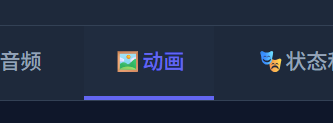
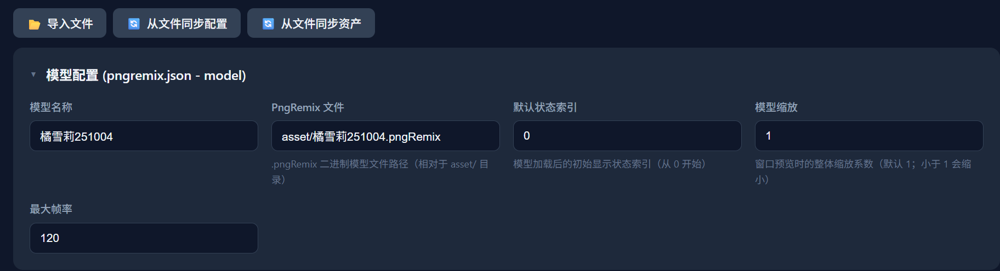
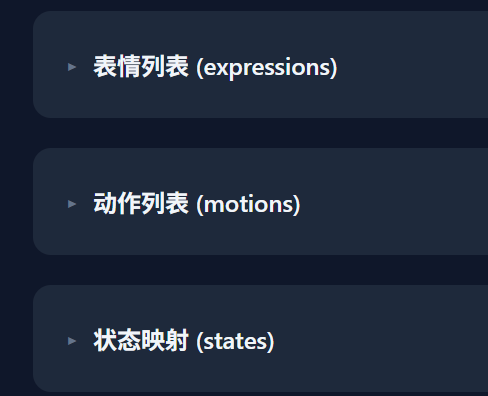
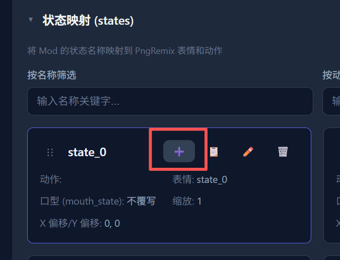
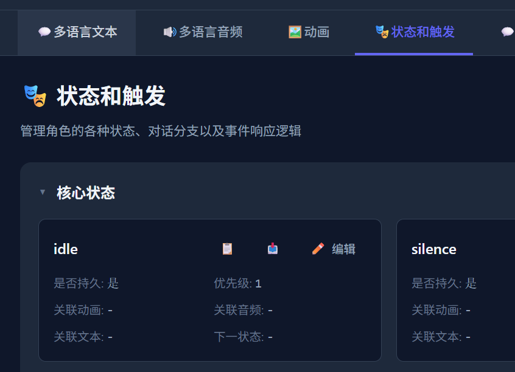
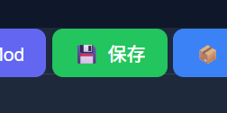



  

  <a href="#简体中文">简体中文</a> ｜ <a href="#English">English</a> ｜ <a href="#日本語">日本語</a>

 

<!-- ======================================================= -->
<!-- 简体中文-->
<!-- ======================================================= -->

<h1 align="center">如何快速创建pngremix Mod</h1>

> [!WARNING] 
> 本项目仍处于早期阶段，如果您有任何疑问，欢迎联系我们 
> 联系我们：QQ群：<a href="docs/imgs/QQ群.jpg" target="_blank" rel="noopener noreferrer">578258773</a>   Bilibili: <a href="https://b23.tv/ZKVKHH0" target="_blank" rel="noopener noreferrer">_Cafel_</a>

 

## 导入资产

进入Mod编辑器，选择 **动画** 界面

 

请在顶部按钮中点击 **导入文件** 按钮，选择pngremix文件，并等待右下角出现导入成功的提示

 

请在顶部按钮中点击 **从文件同步配置** 按钮，并检查 **模型配置 (pngremix.json - model)** 分类签下的内容是否正确，如不正确，请自行补充

 

请在顶部按钮中点击 **从文件同步资产** 按钮，并检查 **表情列表 (expressions) / 动作列表 (motions) / 状态映射 (states)** 分类签下的内容是否正确

 

当然您也可以自己编辑状态映射，根据您的需求删除多余状态，或将动作和表情映射到同一个状态内

 

## 添加状态

当 **状态映射 (states)** 分类标签下的内容正确后，您可以点击每一项的 **新增同名状态** 按钮来新增对应状态 
不过当前教程中我们只创建了一个 **idle** 状态，其他状态的处理请见以后的教程

 

全部映射完成后，选择 **状态和触发** 界面

 

展开 **核心状态** 分类标签，点击 **idle** 状态的 **编辑** 按钮

 

在打开的窗口内，找到 **关联动画** 下拉菜单，选择您刚才的动画，并点击保存

 

至此您就完成了一个最简单的pngremix Mod的创建，不要忘记点击 **保存** 将修改保存到您的文件夹

 

之后如果您的Mod保存在 **程序安装目录内的mods文件夹**，您可以直接启动程序调试您的Mod

 

> [!TIP] 
> **更多内容有待后续更新**

 

<a href="#top">⬆ 返回顶部</a>

<!-- ======================================================= -->
<!-- English-->
<!-- ======================================================= -->

<!-- ======================================================= -->
<!-- 日本語-->
<!-- ======================================================= -->

