

  

  <a href="#简体中文">简体中文</a> ｜ <a href="#English">English</a> ｜ <a href="#日本語">日本語</a>

 

<!-- ======================================================= -->
<!-- 简体中文-->
<!-- ======================================================= -->

<h1 align="center">状态和触发</h1>

> [!WARNING] 
> 本项目仍处于早期阶段，如果您有任何疑问，欢迎联系我们 
> 联系我们：QQ群：<a href="mod-tool/imgs/QQ群.jpg" target="_blank" rel="noopener noreferrer">578258773</a>   Bilibili: <a href="https://b23.tv/ZKVKHH0" target="_blank" rel="noopener noreferrer">_Cafel_</a>

 

## 状态

本程序简单来讲就是个有限状态机，状态和触发是它的核心

状态一共分为3类，**核心状态**，**重要状态**，**普通状态**

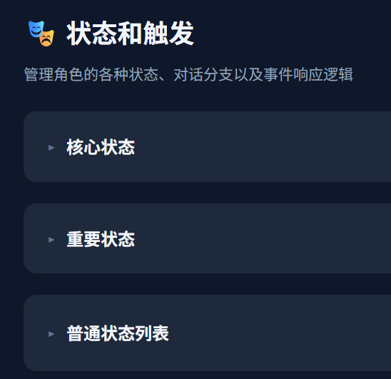

 

其中核心状态和重要状态不可增删，由系统写死。普通状态可以随意的新增和删除。

这三类状态的配置都是一样的，每个状态都可以绑定 **关联音频** **关联动画** **关联文本**

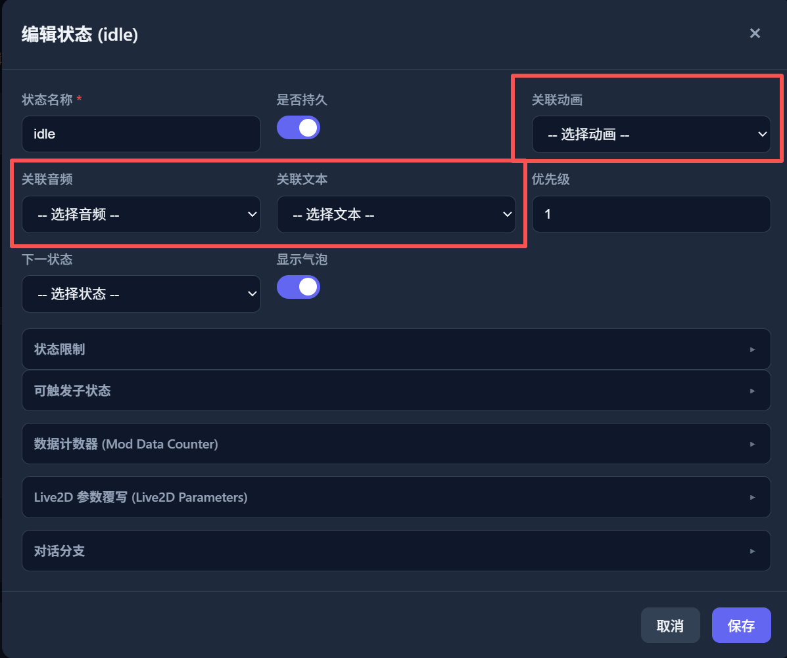

 

当你在 **多语言文本** **多语言音频** **动画**，界面内添加了对应内容后，下拉菜单就可以将添加的内容和状态绑定到一起

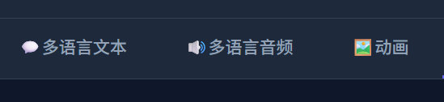

 

## 触发

状态定义好之后，由不同的触发来使得程序执行对应的状态

您可以从状态和触发界面的最下方找到当前所有支持的触发类型

这里介绍最常用的一种：**鼠标点击**

您可以从 **触发器 (事件响应)** 分类签内找到 **click** 事件，该事件对应的就是鼠标左键点击角色挂件，点击编辑该事件

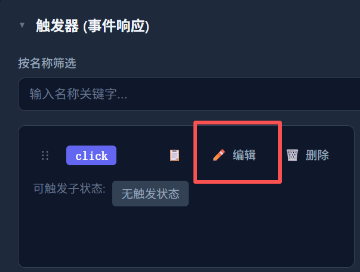

 

请点击 **添加状态组** 按钮

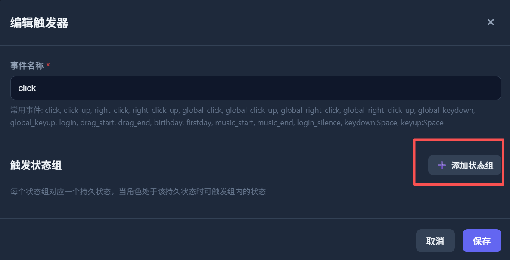

 

请不要管 选择状态 下拉菜单，不提供持久状态意味着任何持久状态下都可以触发 
直接点击 **添加状态** 按钮

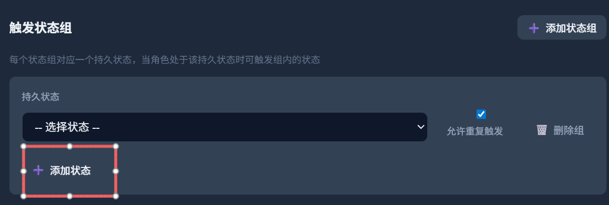

 

在新添加的项的下拉菜单内选择状态，即可将该状态加入点击可触发的状态列表内，之后点击保存

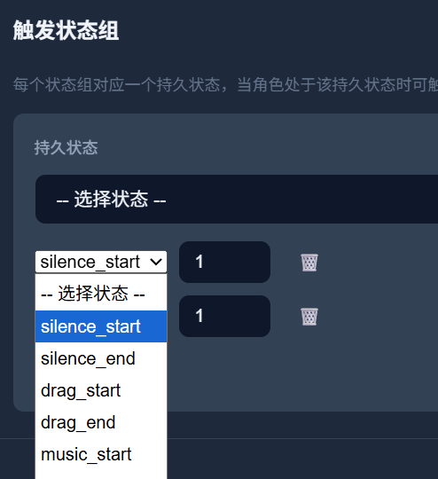

 

至此，您在点击您的宠物时就可以使得其播放新的动画音频和文本了

不要忘记点击 **保存** 将修改保存到您的文件夹

 

之后如果您的Mod保存在 **程序安装目录内的mods文件夹**，您可以直接启动程序调试您的Mod

 

> [!TIP] 
> **更多内容有待后续更新**

 

<a href="#top">⬆ 返回顶部</a>

<!-- ======================================================= -->
<!-- English-->
<!-- ======================================================= -->

<h1 align="center">States and Triggers</h1>

> [!WARNING] 
> This project is still in its early stages. If you have any questions, feel free to contact us 
> Contact: QQ Group: <a href="mod-tool/imgs/QQ群.jpg" target="_blank" rel="noopener noreferrer">578258773</a>   Bilibili: <a href="https://b23.tv/ZKVKHH0" target="_blank" rel="noopener noreferrer">_Cafel_</a>

 

## States

This application is essentially a finite state machine — states and triggers are its core.

States are divided into 3 categories: **Core States**, **Important States**, and **Normal States**

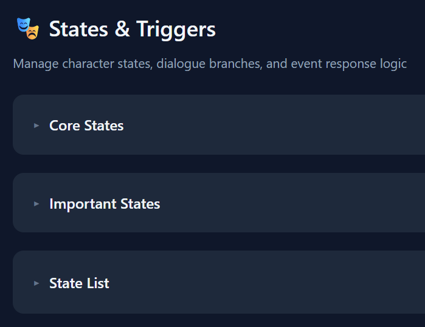

 

Core states and important states cannot be added or deleted — they are hardcoded by the system. Normal states can be freely added and deleted.

All three categories share the same configuration. Each state can bind **Associated Audio**, **Associated Animation**, and **Associated Text**

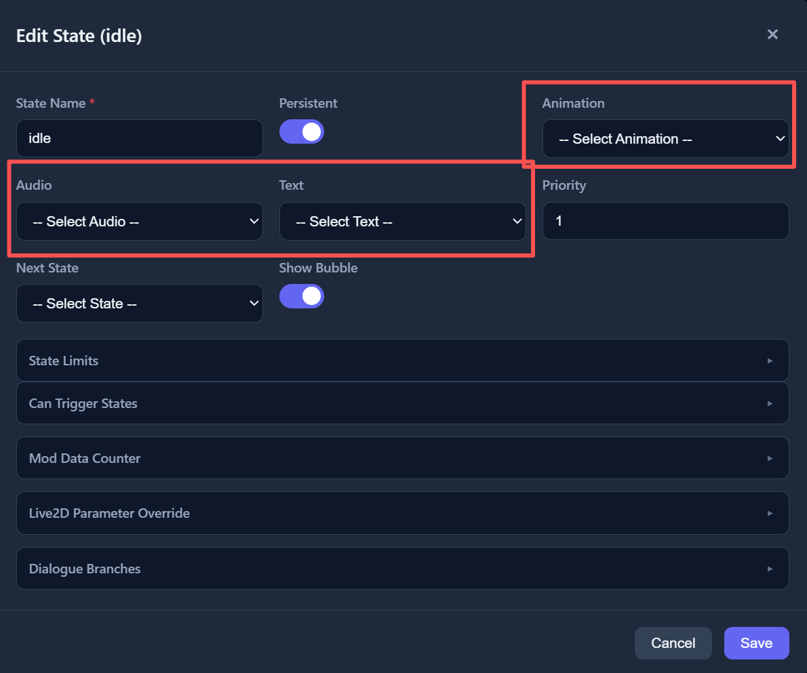

 

After adding content in **Multilingual Text**, **Multilingual Audio**, or **Animation** panels, you can use the dropdown menus to bind the added content to a state

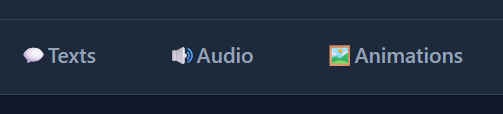

 

## Triggers

Once states are defined, different triggers cause the application to execute the corresponding states

You can find all currently supported trigger types at the bottom of the States and Triggers panel

Here we introduce the most common one: **Mouse Click**

You can find the **click** event under the **Triggers (Event Response)** category — it corresponds to left-clicking the character widget. Click to edit this event

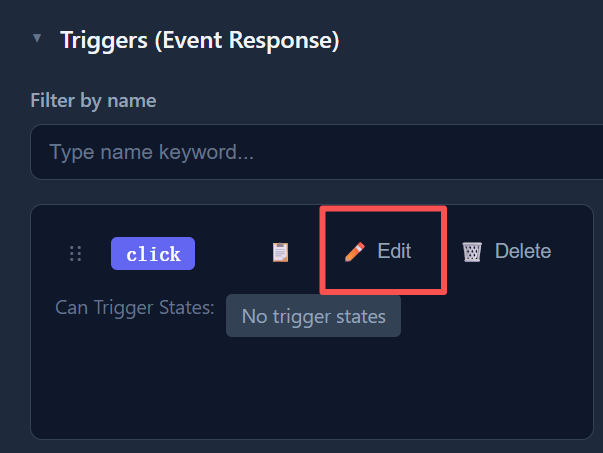

 

Click the **Add State Group** button

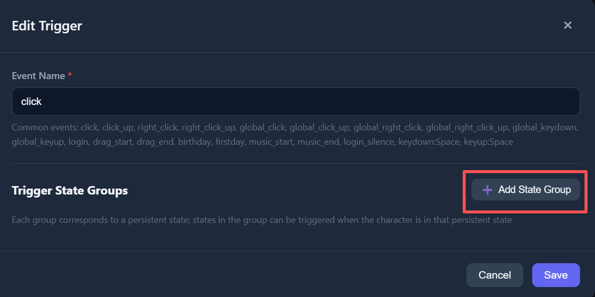

 

Ignore the "Select State" dropdown — leaving the persistent state empty means this can be triggered under any persistent state 
Click the **Add State** button directly

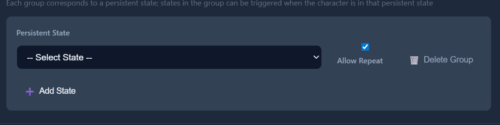

 

Select a state from the dropdown in the newly added entry to add it to the list of click-triggerable states, then click Save

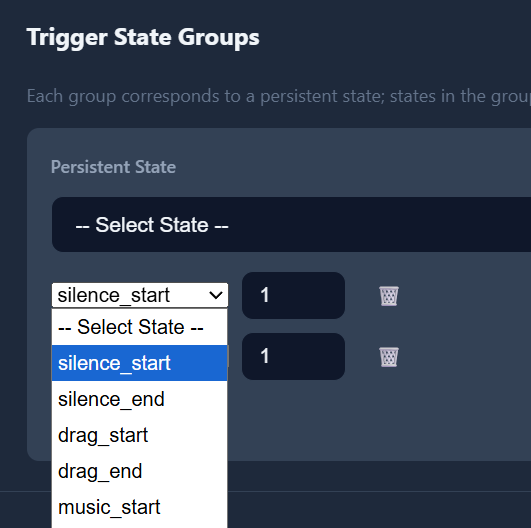

 

Now when you click your pet, it will play the new animation, audio, and text

Don't forget to click **Save** to save changes to your folder

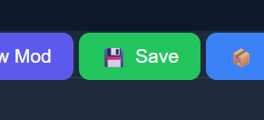

 

If your Mod is saved in the **mods folder inside the application installation directory**, you can launch the application directly to debug your Mod

 

> [!TIP] 
> **More content coming in future updates**

 

<a href="#top">⬆ Back to Top</a>

<!-- ======================================================= -->
<!-- 日本語-->
<!-- ======================================================= -->

<h1 align="center">状態とトリガー</h1>

> [!WARNING] 
> 本プロジェクトはまだ初期段階です。ご質問がございましたら、お気軽にお問い合わせください 
> お問い合わせ：QQグループ：<a href="mod-tool/imgs/QQ群.jpg" target="_blank" rel="noopener noreferrer">578258773</a>   Bilibili: <a href="https://b23.tv/ZKVKHH0" target="_blank" rel="noopener noreferrer">_Cafel_</a>

 

## 状態

本アプリケーションは基本的に有限状態マシンであり、状態とトリガーがその中核です

状態は **コア状態**、**重要状態**、**通常状態** の3種類に分かれます

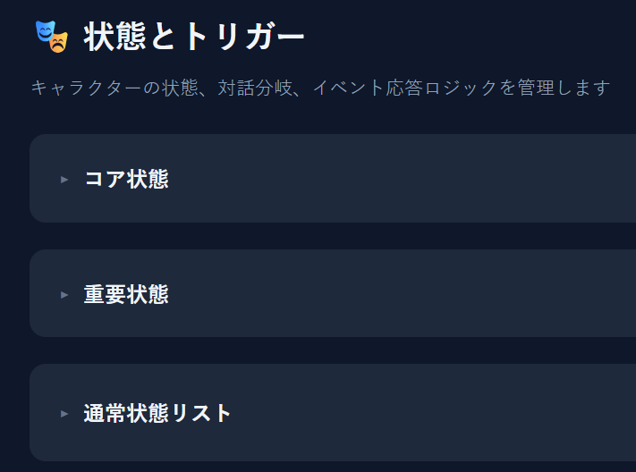

 

コア状態と重要状態は追加・削除できません（システムで固定）。通常状態は自由に追加・削除できます。

3種類の状態の設定は共通です。各状態には **関連音声**、**関連アニメーション**、**関連テキスト** をバインドできます

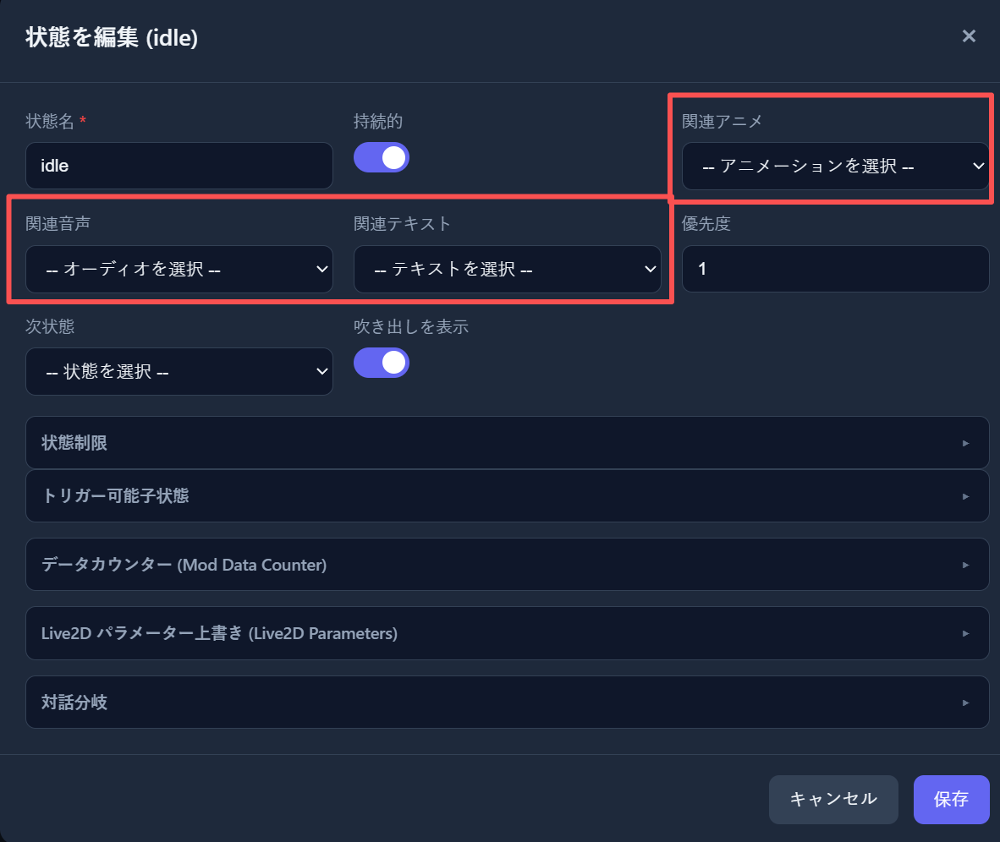

 

**多言語テキスト**、**多言語音声**、**アニメーション** パネルでコンテンツを追加すると、ドロップダウンメニューから追加したコンテンツを状態にバインドできます

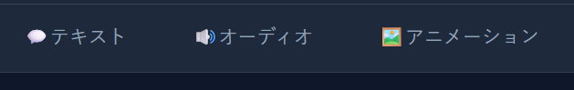

 

## トリガー

状態が定義されると、さまざまなトリガーによってアプリケーションが対応する状態を実行します

状態とトリガー画面の最下部で、現在サポートされているすべてのトリガータイプを確認できます

ここでは最も一般的な **マウスクリック** を紹介します

**トリガー（イベント応答）** カテゴリ内の **click** イベントを見つけてください。これはキャラクターウィジェットの左クリックに対応します。クリックしてイベントを編集します

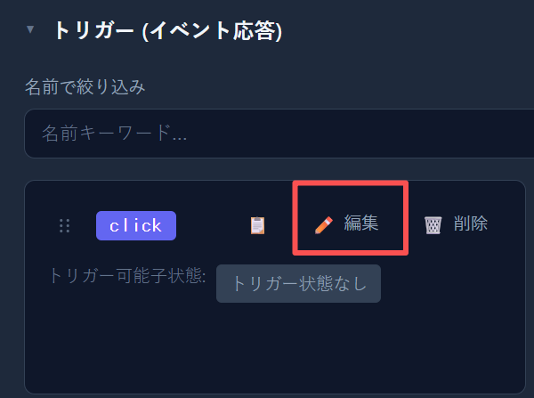

 

**状態グループを追加** ボタンをクリックしてください

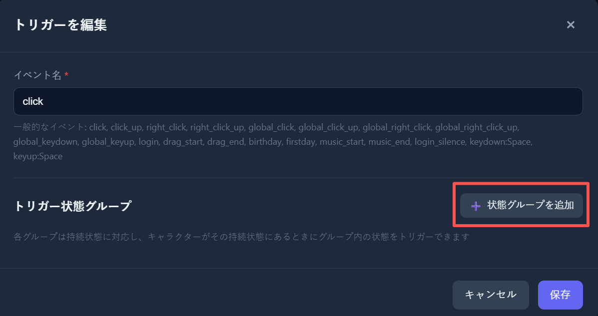

 

「状態を選択」ドロップダウンは無視してください。永続状態を空にすると、どの永続状態でもトリガーできます 
直接 **状態を追加** ボタンをクリックしてください

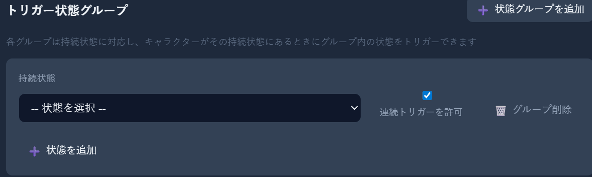

 

新しく追加された項目のドロップダウンから状態を選択すると、クリックでトリガー可能な状態リストに追加されます。その後、保存をクリックしてください

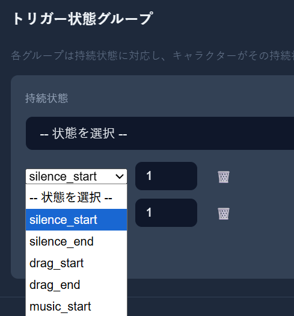

 

これで、ペットをクリックすると新しいアニメーション、音声、テキストが再生されるようになります

**保存** をクリックして変更をフォルダに保存することを忘れないでください

 

Mod が **アプリケーションのインストールディレクトリ内の mods フォルダ** に保存されている場合、アプリケーションを直接起動して Mod をデバッグできます

 

> [!TIP] 
> **今後のアップデートでさらにコンテンツを追加予定**

 

<a href="#top">⬆ トップに戻る</a>

