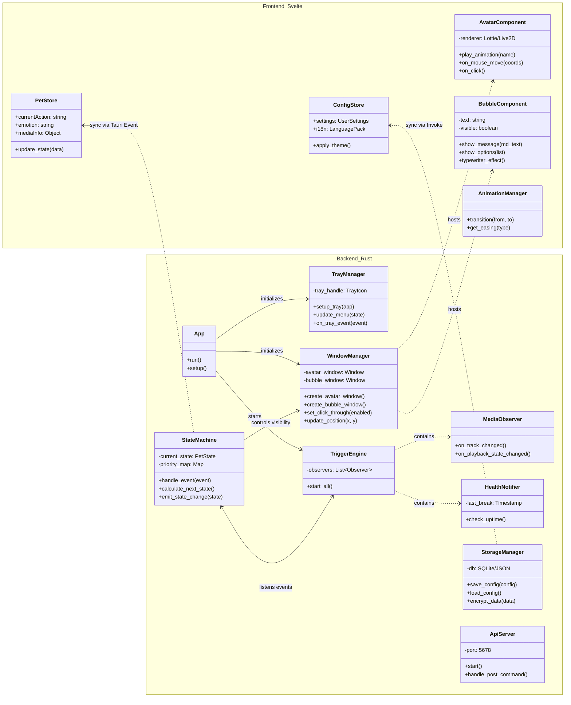

# TrayBuddy 详细设计文档

本文档基于 `需求设计.md` 与 `项目架构.md`，对 TrayBuddy 的模块实现、接口交互及资源结构进行详细定义。

## 1. 详细类图 (Class Diagram)



---

## 2. 模块职责与接口说明

### 2.1 后端核心 (Rust)
- **TrayManager**: 负责系统原生入口。
    - **接口**: `update_menu(state)`。当宠物状态改变（如进入“沉睡”模式）时，动态更新右键菜单选项。
- **StateMachine**: 整个应用的大脑。
    - **逻辑**: 接收来自 `TriggerEngine` 的信号（如 `TimeEvent`），对比当前权重，决定是否切换到 `P2 (System Event)` 状态。
- **WindowManager**: 负责窗口物理属性。
    - **接口**: `set_ignore_cursor_events(bool)`。实现点击穿透的关键：当鼠标在人物像素透明区域时设为 `true`。
- **ApiServer**: 暴露 `localhost:5678` 接口，允许外部 POST 指令驱动宠物动作。

### 2.2 前端表现 (Svelte)
- **PetStore**: 响应式状态中心。
    - **监听**: 监听 `state-changed` 事件，自动驱动 `AvatarComponent` 切换序列帧或模型动作。
- **AvatarComponent**: 渲染器抽象层。
    - **职责**: 封装 Lottie-web 或 Live2D SDK。通过 `requestAnimationFrame` 处理视线追踪鼠标的逻辑。
- **BubbleComponent**: 富文本表现。
    - **职责**: 接收 Markdown 字符串，解析为 Svelte 组件，并触发 CSS Spring 弹出动画。

---

## 3. 核心交互流程：多媒体联动 (Media Sync)

1. **监听**: `MediaObserver` 捕获到系统正在播放音乐。
2. **传输**: Rust 侧 `TriggerEngine` 将曲目信息发送给 `StateMachine`。
3. **决策**: `StateMachine` 判断当前为 `P4 (Idle)`，允许被 `P3 (Media)` 覆盖。
4. **同步**: Rust 发送 `emit("pet-state-update", { action: "dancing", bpm: 120 })`。
5. **渲染**: 前端 `PetStore` 更新，`AvatarComponent` 根据 `bpm` 调整动画播放速率，实现“随乐律动”。

---

## 4. 资源包规范 (.tbuddy)

资源加载器扫描 `mods/` 目录，通过 `manifest.json` 与各子目录下的 `.json` 索引文件建立资产映射。

### 4.1 目录结构
```text
mods/mod_name/
├── manifest.json            # mod主要信息清单
├── preview.png              # mod预览图
├── assets/                  # 动画图像资源
│   ├── img.json                # 杂图索引 (相对 img/ 目录)
│   ├── sequence.json           # 序列帧动画索引 (相对 sequence/ 目录)
│   ├── img/                    # 静态/杂图图片存放处
│   └── sequence/               # 序列帧/网格动画图片存放处
├── audio/                   # 音频资源 (分语言存储)
│   └── [lang]/                 # 语言代码 (如 jp, zh)
│       ├── speech.json             # 语音索引
│       └── speech/                 # 语音文件 (.wav, .mp3)
└── text/                    # 文本资源 (分语言存储)
    └── [lang]/                 # 语言代码
        ├── info.json               # 角色基础信息 (名称、语言名等)
        └── speech.json             # 对话/气泡文本内容
```

### 4.2 核心配置文件说明

#### 4.2.1 manifest.json 样例
```json
{
  "id": "com.traybuddy.ema",
  "version": "1.0.0",
  "author": "TrayBuddy Team", 
  "default_audio_lang_id": "jp",
  "important_actions": {
    "border": { "anima": "border" },
    "idle": { "anima": "idle" }
  },
  "actions": [],
  "triggers": []
}
```

#### 4.2.2 动画索引 (assets/img.json, assets/sequence.json)
定义如何解析对应的图像资源（支持单图或网格动画）：
- `name`: 动画名称。
- `img`: 对应文件名。
- `sequence`: 是否为序列帧（静态图设为 false）。
- `frame_time`: 每帧间隔时间（秒）。
- `size_x / size_y`: 单帧的宽高。
- `gridnum_x / gridnum_y`: 网格行列数。

#### 4.2.3 语言与文本 (text/[lang]/info.json)
- `id`: 语言代码标识。
- `lang`: 语言显示名称。
- `name`: 该语言下的角色名称。


